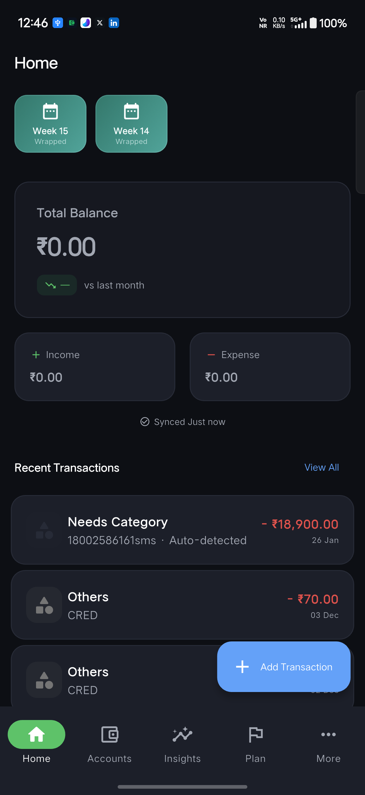
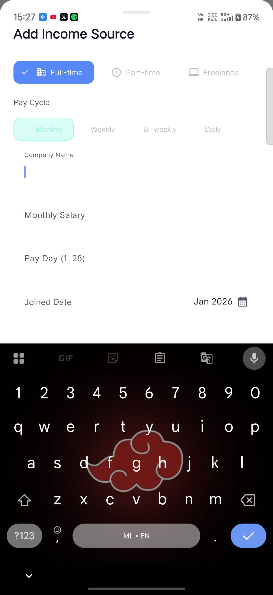
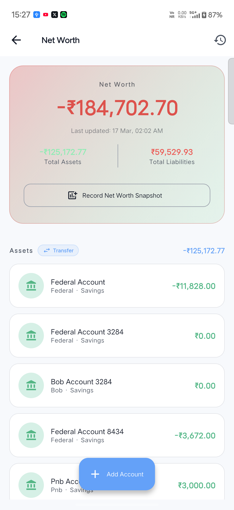
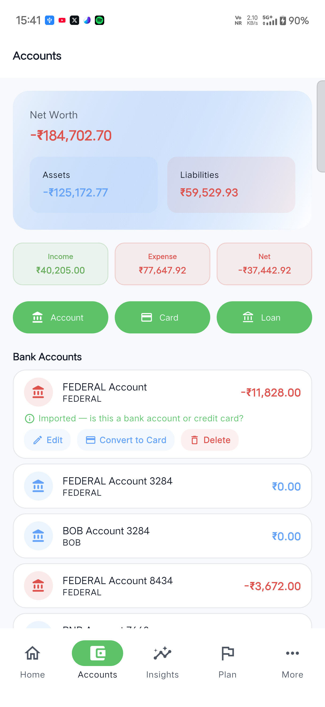
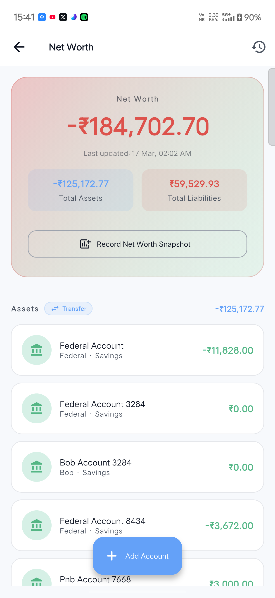

# SpendX

[](https://github.com/masheddesigns/SpendX/actions/workflows/flutter_ci.yml)
[](https://opensource.org/licenses/MIT)
[](https://makeapullrequest.com)
[](https://flutter.dev)

SpendX is a local-first Flutter personal finance app designed to help people manage daily money without subscriptions, cloud lock-in, or spreadsheet fatigue.

It combines transaction tracking, account management, budgeting, salary planning, financial goals, analytics, and import workflows into a single mobile experience.

## Overview

### Problem

Many personal finance apps are either too complex, too cloud-dependent, or too focused on paid subscriptions. Users who just want a reliable, privacy-friendly way to manage expenses, accounts, and financial planning often end up juggling multiple apps or spreadsheets.

### Solution

SpendX is built as a local-first finance product that helps users:

- track money across bank accounts, cards, loans, and lending
- understand spending through dashboards and analytics
- plan ahead with budgets, goals, salary flows, and reminders
- import data from statements, shared files, and OCR-assisted inputs

### Role

- Product Designer
- UX Designer
- Flutter Developer

## Features

### Core Money Management

- Transaction tracking for income, expenses, transfers, and reviews
- Bank account, credit card, loan, and lending management
- Categories, tags, search, and filter flows
- Local SQLite-backed storage for offline-first usage

### Planning and Financial Control

- Budget planning and spending visibility
- Financial goals for savings, limits, and debt payoff
- Salary setup and recurring financial workflows
- Reminders, alerts, and daily planning surfaces

### Insights and Reporting

- Analytics dashboard and financial summary views
- Net worth and report screens
- Financial health insights and money behavior nudges
- Timeline and digest-style summaries

### Smart Inputs

- Import/export workflows
- Statement and file-based smart import
- OCR-assisted text extraction
- Duplicate detection and merchant normalization helpers

### Extended Modules

- Vehicle and fuel expense tracking
- Wrapped summaries, streaks, and gamification layers
- Dark mode support

## Screenshots

### Dashboard



### Transactions



### Accounts



### Budgeting



### Analytics



## Tech Stack

- Flutter
- Dart
- Riverpod
- Provider
- SQLite via `sqflite`
- Google ML Kit text recognition
- Google Generative AI integration
- Local notifications
- Share intent handling

## Architecture

SpendX follows a modular Flutter structure with clear separation between UI, state, data access, and services.

```text
lib/
  core/          Config, logging, shared utilities
  data/          Database, repositories, app-wide providers
  features/      Feature modules and scoped state
  models/        Domain and persistence models
  screens/       Product flows and top-level pages
  services/      Business logic and integrations
  shared/        Reusable UI building blocks
  widgets/       App-specific reusable widgets
```

For deeper notes, see:

- [Architecture Notes](docs/architecture.md)
- [Design Decisions](docs/design-decisions.md)
- [Roadmap](docs/roadmap.md)

## Installation

### Prerequisites

- Flutter SDK 3.10+
- Dart SDK compatible with your Flutter installation
- Android Studio or VS Code with Flutter tooling
- Xcode for iOS builds on macOS

### Setup

```bash
git clone <your-repository-url>
cd SpendX
flutter pub get
cp .env.example .env
flutter run
```

## Release Build

To generate a release APK locally:

```bash
flutter build apk --release
```

Expected output:

```text
build/app/outputs/flutter-apk/app-release.apk
```

Suggested first public release:

- `v0.1.0-beta`

## Repository Notes

- Local env values belong in `.env`, which is ignored by Git.
- Screenshots live in `docs/screenshots/`.
- Reference SQL for the Supabase schema lives in `docs/reference/supabase-schema.sql`.

## Roadmap

- Improve onboarding and first-run setup
- Expand smart import validation and reconciliation
- Strengthen automated categorization confidence controls
- Add broader test coverage for providers, services, and import flows
- Package stable beta releases for public testing

## About the Designer

SpendX is also a product design case study. Beyond the code, the repository documents the UX direction, information architecture, and tradeoffs behind building a finance app that feels practical, personal, and approachable.

## License

This project is licensed under the MIT License. See the [LICENSE](LICENSE) file for details.
