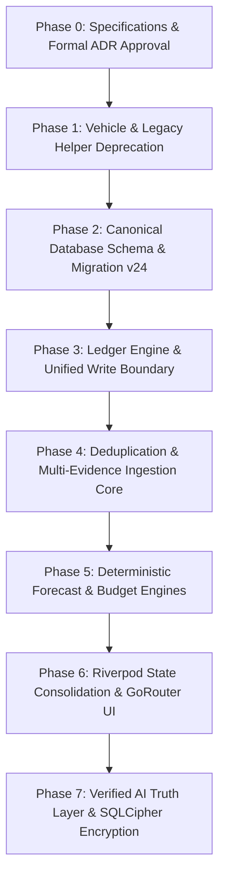

# SpendX 2.0 — Executive Architectural Decisions & Strategy

**Status**: PROPOSED & FORMALLY SPECIFIED  
**Phase**: Pre-Implementation Design Gate  
**Target Repository**: `/Users/sivek/Documents/SpendX`  
**Author**: Lead Financial Systems Architect

---

## 1. Executive Summary

SpendX 1.0 reached architectural exhaustion due to an uncoordinated evolution across 23 incremental SQLite migrations. The existing system suffers from:
1. **Four Competing Sources of Truth**: `bank_accounts.balance` (mutable scalar), `transactions` (flat single-account events), `ledger_transactions` (incomplete append-only journal), and `credit_cards.current_balance` (isolated debt scalar).
2. **Critical Accounting Flaws**:
   - Internal transfers log the receiving leg as `LedgerType.income` ([`financial_transaction_service.dart#L102`](file:///Users/sivek/Documents/SpendX/lib/services/financial_transaction_service.dart#L102)), falsely inflating income.
   - Credit card payments log the bank deduction as `LedgerType.expense` ([`credit_card_service.dart#L172`](file:///Users/sivek/Documents/SpendX/lib/domain/credit/credit_card_service.dart#L172)), double-counting monthly consumption.
   - Refunds are ignored in monthly analytics queries ([`transaction_repo.dart#L204`](file:///Users/sivek/Documents/SpendX/lib/data/repositories/transaction_repo.dart#L204)).
   - Soft-deleted transactions leak into category budgets because `WHERE is_deleted = 0` is omitted in SQL queries ([`budget_repo.dart#L48`](file:///Users/sivek/Documents/SpendX/lib/data/repositories/budget_repo.dart#L48)).
3. **Catastrophic Forecasting**: `ForecastEngine` computes projected income and expenses via naive linear extrapolation ($(\text{amount} / \text{daysElapsed}) \times \text{daysInMonth}$), multiplying early salary deposits into millions of rupees while projecting bankruptcy when salary arrives at month-end ([`forecast_engine.dart#L127`](file:///Users/sivek/Documents/SpendX/lib/services/forecast_engine.dart#L127)).
4. **Phantom Goals**: Goal contributions increment an isolated integer without debiting liquid bank accounts ([`goal_repo.dart#L95`](file:///Users/sivek/Documents/SpendX/lib/data/repositories/goal_repo.dart#L95)).

**SpendX 2.0 replaces this fractured state with a Canonical Double-Entry Event Model**. All balances, reports, and AI contexts are strictly derived from an immutable journal of balanced postings ($\sum \text{Debits} = \sum \text{Credits}$).

---

## 2. SpendX 1.0 vs. SpendX 2.0 Architectural Paradigm

| Architectural Dimension | SpendX 1.0 (Current Repository) | SpendX 2.0 (Proposed Canonical Model) | Status / Evidence |
| :--- | :--- | :--- | :--- |
| **Financial Core** | Hybrid flat transaction store + partial account movement log | Strict Double-Entry Ledger with balanced postings ($\sum \text{Debits} = \sum \text{Credits}$) | **PROPOSED** |
| **Financial Event Identity** | Tightly coupled to single ingestion channel (`tx.source`); in-memory heuristic dedup | Canonical `EconomicEvent` decoupled from ingestion; multi-evidence linking (SMS + OCR + Manual) | **PROPOSED** |
| **Account Balances** | Stored as mutable scalars on `bank_accounts.balance`; updated directly by reconciliations | Derived as $\text{Opening Balance} + \sum \text{Postings}$; materialized cache updated solely via DB triggers | **PROPOSED** |
| **Transfers** | Destination leg marked as `LedgerType.income` | Balanced asset exchange: Debit `Asset:Destination`, Credit `Asset:Source`. Income = 0, Expense = 0 | **PROPOSED** |
| **Credit Card Purchases** | Stored in isolated `credit_transactions` table | Debit `Expense:Category`, Credit `Liability:CreditCard`. Normal expense recognition | **PROPOSED** |
| **Credit Card Payments** | Bank leg logged as `LedgerType.expense`, causing double-counting | Balance sheet asset-liability exchange: Debit `Liability:Card`, Credit `Asset:Bank`. Expense = 0 | **PROPOSED** |
| **Refunds** | Stored as `refund`, but completely ignored in expense statistics queries | Credit `Expense:Category` (contra-expense), directly netting out against original expense | **PROPOSED** |
| **Loans** | Standalone amortization calculator detached from general ledger | Fully integrated Liability accounts; EMI payments split into Interest Expense and Principal Reduction | **PROPOSED** |
| **Salary Ingestion** | Untracked expectation; linear daily extrapolation in forecast | Explicit `SalaryContract` generating expected income events, reconciled against actual deposits | **PROPOSED** |
| **Forecasting** | Linear daily extrapolation: $(\text{amount} / \text{daysElapsed}) \times 30$ | Multi-tier deterministic forecast separating historical facts, known commitments, and discretionary models | **PROPOSED** |
| **Goals** | Phantom tally incrementing `goals.current_amount` without debiting liquid money | Explicit asset earmarks or dedicated savings accounts; real money is committed | **PROPOSED** |
| **Budgets** | Corrupted by soft-deleted transactions due to missing SQL filters | Clean reporting overlays over ledger-derived expense postings; soft-deletes excluded | **PROPOSED** |
| **AI Context Bridge** | Raw query over unverified mutable tables; exposes AI to double-counted expenses | Strict Read-Only Query Layer injecting verified financial domain facts into Gemini | **PROPOSED** |
| **Vehicle / Fuel Subsystem**| Heavy subsystem across 4 tables, 6 screens, and ledger enums | Fully deprecated and cleanly removed; Transport retained as ordinary expense category | **PROPOSED** |

---

## 3. High-Level Transition Roadmap

1. **Phase 0 (Current)**: Lock specifications, accounting invariants, and ADRs. Zero code changes.
2. **Phase 1**: Execute clean deprecation of Vehicle/Fuel subsystems per `docs/spendx2/16_VEHICLE_REMOVAL_BOUNDARY.md`.
3. **Phase 2**: Introduce SQLite migration v24 defining canonical tables (`economic_events`, `evidence`, `postings`, `accounts`). Backfill legacy rows.
4. **Phase 3**: Implement canonical `LedgerService` enforcing balanced postings and atomic write boundaries.
5. **Phase 4**: Refactor SMS, OCR, and manual ingestion to emit `Evidence` linked to `EconomicEvent`s.
6. **Phase 5**: Replace linear extrapolation with deterministic cashflow forecasting.
7. **Phase 6**: Purge Provider 6.1 from `main.dart`, consolidate on Riverpod 2.x streams, and introduce declarative GoRouter.
8. **Phase 7**: Connect Gemini AI to audited query interfaces and wrap database with SQLCipher.
