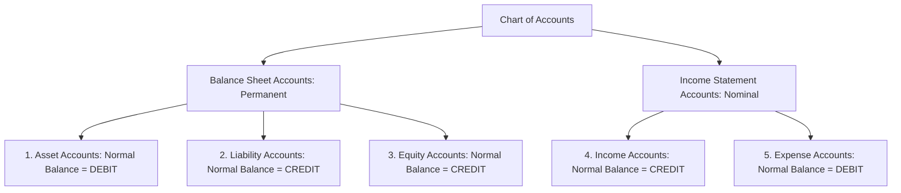
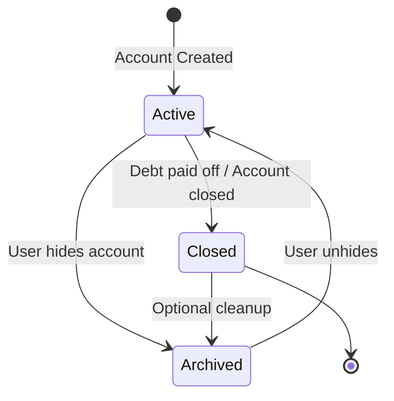

# SpendX 2.0 — Financial Domain Model Specification

**Status**: PROPOSED  
**Classification**: CANONICAL ARCHITECTURE SPECIFICATION  
**Scope**: Chart of Accounts, Account Types, Normal Balances, and Entity Lifecycles

---

## 1. The Five Fundamental Accounting Elements

SpendX 2.0 structures all financial reality around the standard five-category Chart of Accounts. Every account belongs to exactly one category:



### 1.1 Balance Sheet Accounts (Permanent / Cumulative)
1. **Asset (`asset`)**: Economic resources owned or controlled by the user that provide future economic benefit.
   - *Subtypes*: `cash`, `bank_checking`, `bank_savings`, `wallet`, `receivable_loan` (lending to others), `investment` (if enabled).
   - *Normal Balance*: **DEBIT** (+). Increases with Debits, decreases with Credits.
2. **Liability (`liability`)**: Present legal obligations arising from past transactions, settlement of which requires outflow of assets.
   - *Subtypes*: `credit_card`, `loan_mortgage`, `loan_auto`, `loan_personal`, `payable_borrowed` (borrowed from others).
   - *Normal Balance*: **CREDIT** (+). Increases with Credits, decreases with Debits.
3. **Equity (`equity`)**: Residual interest in assets after deducting all liabilities ($\text{Equity} = \text{Assets} - \text{Liabilities}$).
   - *Subtypes*: `opening_balance`, `retained_earnings`, `reconciliation_adjustment`.
   - *Normal Balance*: **CREDIT** (+). Increases with Credits, decreases with Debits.

### 1.2 Income Statement Accounts (Nominal / Period-Bound)
4. **Income (`income`)**: Gross inflows of economic benefits during an accounting period resulting in increases in equity, other than opening equity.
   - *Subtypes*: `salary`, `freelance`, `bonus`, `investment_return`, `interest_received`, `cashback`, `other_income`.
   - *Normal Balance*: **CREDIT** (+). Increases with Credits, decreases with Debits.
5. **Expense (`expense`)**: Decreases in economic benefits during an accounting period in the form of outflows or depletions of assets.
   - *Subtypes*: `food_groceries`, `food_dining`, `transport_fuel`, `utilities`, `housing_rent`, `loan_interest`, `bank_fees`, `entertainment`.
   - *Normal Balance*: **DEBIT** (+). Increases with Debits, decreases with Credits.

---

## 2. Normal Balances and Sign Conventions

To avoid the sign confusion that crippled SpendX 1.0 (where `_signed` assumed hardcoded negative sets and forced transfers into "income"):

### 2.1 The Fundamental Debit / Credit Rule
- **DEBIT (Dr)** always represents:
  - Increase in an **Asset** account
  - Increase in an **Expense** account
  - Decrease in a **Liability** account
  - Decrease in an **Equity** account
  - Decrease in an **Income** account
- **CREDIT (Cr)** always represents:
  - Decrease in an **Asset** account
  - Decrease in an **Expense** account (e.g. refunds / contra-expense)
  - Increase in a **Liability** account
  - Increase in an **Equity** account
  - Increase in an **Income** account

### 2.2 Storage Representation
In the database, every posting stores an amount as signed 64-bit SQLite INTEGER values representing minor currency units, with domain-level CHECK constraints where values must be non-negative (e.g. Paise/Cents), and a strict `direction` enum:
```dart
enum PostingDirection { debit, credit }
```
When calculating signed balances for display:
$$\text{Asset Balance} = \sum \text{Debits} - \sum \text{Credits}$$
$$\text{Liability Balance} = \sum \text{Credits} - \sum \text{Debits}$$
$$\text{Equity Balance} = \sum \text{Credits} - \sum \text{Debits}$$
$$\text{Net Income (Period)} = \sum \text{Income Credits} - \sum \text{Expense Debits} + \sum \text{Expense Credits (Refunds)}$$

---

## 3. Account Hierarchy & Taxonomy

SpendX 2.0 adopts a path-based hierarchical account tree:

```
Assets/
  Liquid/
    Bank/HDFC_Salary (ID: acc_hdfc_sal)
    Bank/SBI_Savings (ID: acc_sbi_sav)
    Cash/Physical_Wallet (ID: acc_cash_wal)
  Receivables/
    Lending/John_Doe (ID: acc_rec_john)

Liabilities/
  ShortTerm/
    CreditCards/ICICI_Amazon_Pay (ID: acc_icici_card)
  LongTerm/
    Loans/HDFC_Home_Loan (ID: acc_loan_home)

Equity/
  OpeningBalance (ID: acc_eq_opening)
  ReconciliationDiscrepancies (ID: acc_eq_adj)

Income/
  Earned/Salary (ID: acc_inc_sal)
  Earned/Freelance (ID: acc_inc_free)
  Passive/Interest (ID: acc_inc_int)

Expenses/
  Living/
    Housing/Rent (ID: acc_exp_rent)
    Food/Groceries (ID: acc_exp_groc)
    Food/Dining (ID: acc_exp_dine)
    Transport/Fuel (ID: acc_exp_fuel)
  Finance/
    LoanInterest/HomeLoan (ID: acc_exp_int_home)
    BankFees (ID: acc_exp_fees)
```

---

## 4. Account Lifecycle & State Machine



1. **Active**: Fully available for manual entry, SMS linking, recurring rules, and active dashboard widgets.
2. **Archived**: Hidden from daily entry dropdowns; historical ledger transactions remain 100% active and factored into Net Worth calculations.
3. **Closed**: Used for paid-off loans or canceled credit cards. Cannot accept new transactional postings; historical audit trail is frozen.
4. **Account Deletion Guard**: An account with existing ledger postings **cannot be physically deleted** from the database. It can only be closed or archived. Deleting an account with historical transactions is mathematically prohibited.
