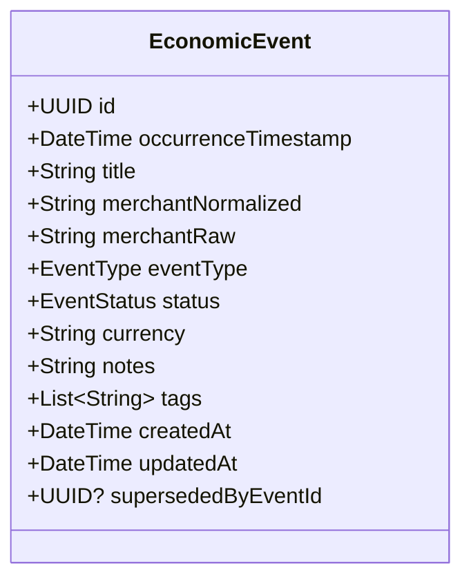
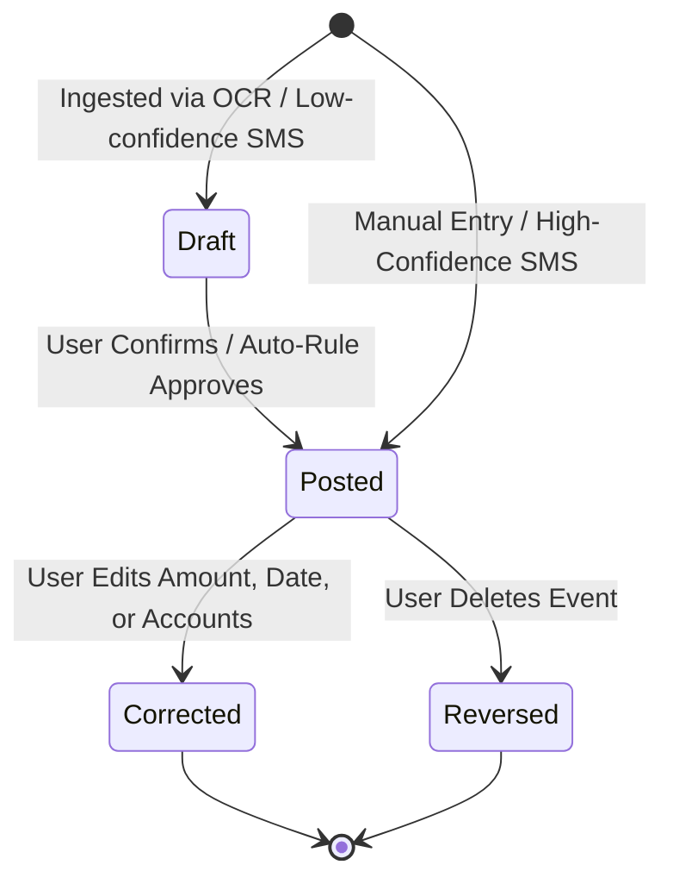

# SpendX 2.0 — Economic Event Model Specification

**Status**: PROPOSED  
**Classification**: CANONICAL ARCHITECTURE SPECIFICATION  
**Scope**: Real-World Event Modeling, Invariants, Statuses, and Mutation Boundaries

---

## 1. What is an Economic Event?

An **Economic Event** in SpendX 2.0 represents a single real-world financial transaction or agreement that occurred at a specific point in time.

> **Crucial Architectural Separation**:
> - The **Economic Event** stores the **human and narrative truth**: *"Where did I go, when did it happen, who did I pay, what receipts or SMS prove it, and why did I make this purchase?"*
> - The **Postings** store the **mathematical accounting truth**: Balanced debits and credits shifting monetary units between accounts.

An Economic Event can have one or more **Evidence** records (SMS, OCR image, bank notification) and one or more pairs of **Postings**.

---

## 2. Entity Attribute Specification



### 2.1 Attribute Mutability Matrix

| Field | Type | Mutability | Rationale & Rules |
| :--- | :--- | :--- | :--- |
| `id` | `UUID v4` | **IMMUTABLE** | Canonical global identity of the event. Generated once upon creation. |
| `occurrenceTimestamp`| `DateTime (UTC)` | **IMMUTABLE (Core)** / Editable via Reversal | The real-world timestamp when the event transpired. |
| `currency` | `String (ISO 4217)`| **IMMUTABLE** | Monetary denomination (e.g. `'INR'`, `'USD'`). Multi-currency requires explicit conversion event. |
| `merchantNormalized` | `String` | **MUTABLE (Metadata)** | Clean, human-friendly merchant name (e.g. `"Starbucks"`). Can be updated without altering accounting. |
| `merchantRaw` | `String` | **IMMUTABLE** | Original raw billing descriptor captured from bank SMS or OCR (e.g. `"POS 491023 STARB MUMBAI"`). |
| `eventType` | `EventType enum` | **IMMUTABLE** | Fundamental economic classification (`expense`, `income`, `transfer`, `refund`, `loan_payment`, etc.). |
| `status` | `EventStatus enum` | **STATE MACHINE** | Lifecycle phase (`draft`, `posted`, `reversed`, `corrected`). |
| `notes` | `String?` | **MUTABLE (Metadata)** | User comments, annotations, or personal memos. |
| `tags` | `List<String>` | **MUTABLE (Metadata)** | User-defined tags for cross-cutting reporting (e.g. `['vacation_2026', 'tax_deductible']`). |
| `supersededByEventId`| `UUID?` | **WRITE-ONCE** | If this event was edited or corrected, points to the replacement event ID. |

---

## 3. Event Status Lifecycle & State Machine



1. **`draft` (Pending Review)**:
   - Staged in the local database.
   - **Does NOT emit active postings to the general ledger**.
   - Shown in the "Pending Ingestion Review" inbox.
   - Does not affect account balances or financial health scores until confirmed.
2. **`posted` (Authoritative)**:
   - Committed to the general ledger.
   - Postings are active and included in all balance, net worth, and cashflow calculations.
3. **`corrected` (Superseded)**:
   - Event was modified.
   - The ledger engine automatically appends an immutable **reversal posting** for the original event and creates a new `posted` event with corrected postings.
   - `supersededByEventId` is linked.
4. **`reversed` (Tombstoned / Deleted)**:
   - Event was deleted by the user.
   - The ledger engine appends an immutable **reversal posting** that negates the account deltas.
   - The event remains in the audit trail but is hidden from active presentation lists.

---

## 4. Multi-Leg Split Events

A single real-world event often spans multiple categories or accounts. SpendX 2.0 natively supports split events without schema distortion:

### Example: Supermarket Receipt with Cash Back
- User visits Walmart, spends ₹3,500 on groceries, ₹1,500 on clothing, and requests ₹1,000 cash back from the cashier, paying ₹6,000 total via Debit Card:

```
EconomicEvent: "Walmart Supercenter" (Total: ₹6,000)
├── Posting 1: Debit  Expense:Food:Groceries   ₹3,500
├── Posting 2: Debit  Expense:Shopping:Apparel ₹1,500
├── Posting 3: Debit  Asset:Cash:Wallet        ₹1,000
└── Posting 4: Credit Asset:Bank:Checking      ₹6,000
    --------------------------------------------------
    Verification: Sum(Debits) ₹6,000 = Sum(Credits) ₹6,000
```
This is represented cleanly under a **single Economic Event** with four postings.
