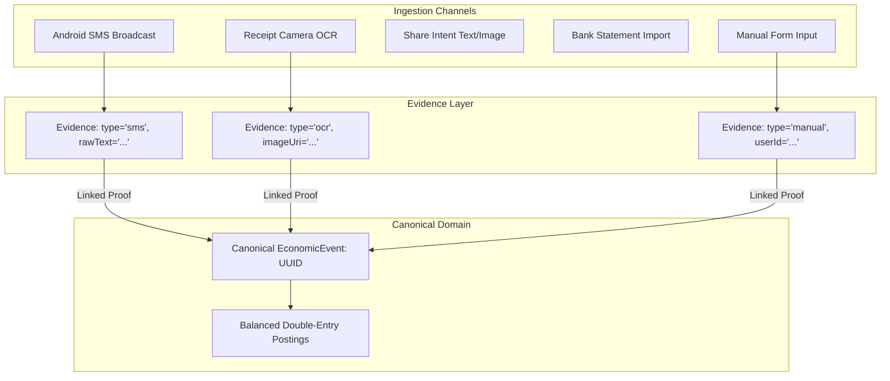
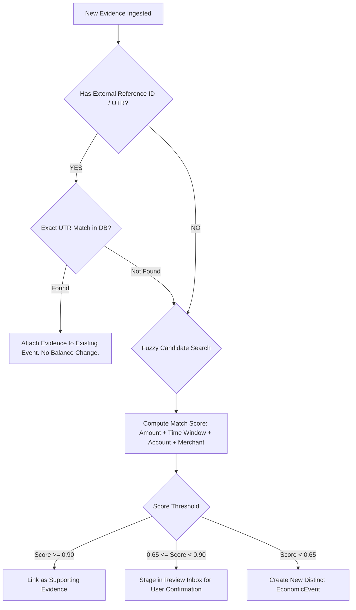

# SpendX 2.0 — Evidence & Event Identity Specification

**Status**: PROPOSED  
**Classification**: CANONICAL ARCHITECTURE SPECIFICATION  
**Scope**: Ingestion Evidence Streams, Multi-Proof Linking, and Deterministic Identity Matching

---

## 1. The Evidence Entity

In SpendX 2.0, ingestion channels do **not** create standalone uncoordinated transactions. Instead, they produce immutable **Evidence** artifacts that attach to an **Economic Event**.

### 1.1 Evidence Schema Specification
- `id`: `UUID v4` (Primary Key).
- `eventId`: `UUID?` (Nullable foreign key linking to `economic_events.id`).
- `sourceType`: `enum ('sms', 'ocr', 'manual', 'share_intent', 'csv_import', 'bank_pdf')`.
- `rawPayload`: `TEXT` (Immutable raw SMS body, CSV line text, or OCR parsed bounding boxes).
- `externalReference`: `TEXT?` (Bank UTR number, UPI transaction ID, or check number).
- `extractedAmount`: `INTEGER?` (Amount in minor units, e.g. Paise).
- `extractedTimestamp`: `DateTime?` (Timestamp parsed from raw payload).
- `extractedMerchant`: `String?` (Merchant descriptor extracted by regex or ML).
- `confidence`: `DOUBLE` (0.0 to 1.0 confidence score from parser).
- `mediaUri`: `TEXT?` (File path to local cropped receipt image or statement file).
- `createdAt`: `DateTime` (When evidence was captured on device).

---

## 2. Event Identity & Deduplication Engine

The core requirement is:
> **SpendX must recognize when multiple pieces of evidence describe ONE economic event, while strictly avoiding false-positive merges of distinct real-world purchases.**

### 2.1 Identity Matching Pipeline

---

## 3. Case-by-Case Matching Scenarios

### Case A: Exact Duplicate (Same UTR / Reference ID)
- **Scenario**: Bank sends two SMS messages for the same debit (or historical SMS scan re-reads an existing message).
- **Behavior**: Deterministic match on `externalReference`. The second SMS is recorded as secondary evidence on the existing event, or dropped. **Zero additional ledger postings are created**.

### Case B: Different Timestamps (Manual Entry at 08:30 vs. Bank Clearing at 14:45)
- **Scenario**: User logs ₹500 at 08:30. Bank clearing SMS arrives at 14:45 with UTR `491029`.
- **Behavior**: Same amount (₹500), same account, date within $\pm 24$ hours. System links the SMS evidence to the manual event, enriches the event with the bank UTR, and leaves the ledger balance intact.

### Case C: Different Merchant Strings (`STARBUCKS` vs. `UPI-549120-STARB`)
- **Scenario**: Receipt OCR reads `"Starbucks Coffee"`. Bank SMS reads `"UPI-549120-STARB-MUMBAI"`.
- **Behavior**: `MerchantNormalizer` strips UPI prefixes and bank codes, resolving both to normalized merchant `"Starbucks"`. Candidate match score exceeds 0.90. System links evidence.

### Case D: Same Amount & Merchant (Two Legitimate ₹500 Transactions on the Same Day)
- **Scenario**: User buys ₹500 groceries at 10:00 AM, and returns at 06:00 PM for ₹500 more groceries.
- **Strict Anti-Merge Rule**:
  - If external reference IDs differ $\rightarrow$ **Treated as two distinct events**.
  - If timestamps differ by $> 2$ hours and no unique reference ID exists $\rightarrow$ **Treated as two distinct events**.
  - The system **MUST NOT** merge two transactions simply because the amount and merchant match.

### Case E: Multi-Source Evidence (SMS + OCR + Manual Entry)
- **Scenario**: User enters manual expense for dinner (₹2,500). Later scans receipt (₹2,500). Later bank SMS arrives (₹2,500).
- **Behavior**: All three evidence records attach to **one Economic Event**. The ledger reflects exactly ₹2,500 in total debits.

### Case F: Two Purchases with Identical Merchant & Amount at Nearly the Same Time
- **Scenario**: User taps card twice at transit turnstile for two people: ₹40 at 08:14:02 and ₹40 at 08:14:35.
- **Behavior**: Bank issues distinct UTRs or sequence numbers. The engine detects unique bank reference IDs and generates two distinct economic events. If no UTR is present, the second transaction is placed in the "Pending Review" queue with a notification: *"Did you make two ₹40 payments at Metro, or is this a duplicate?"*
