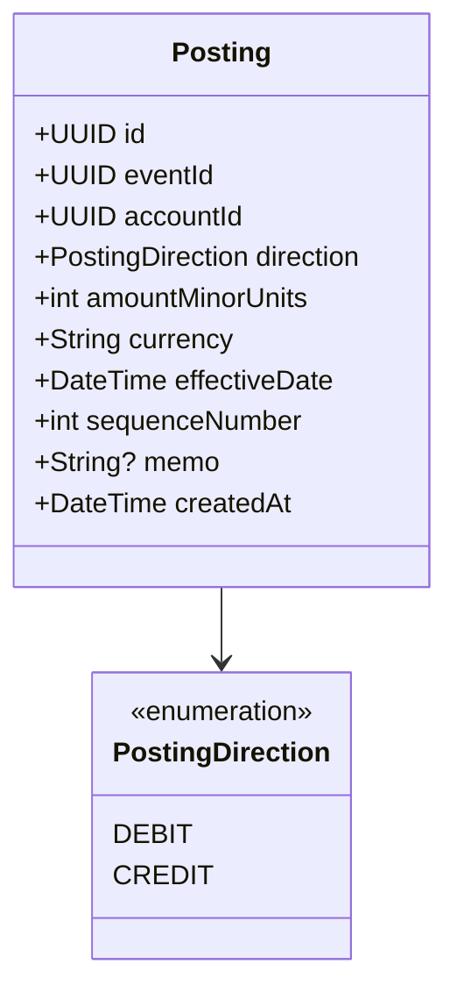
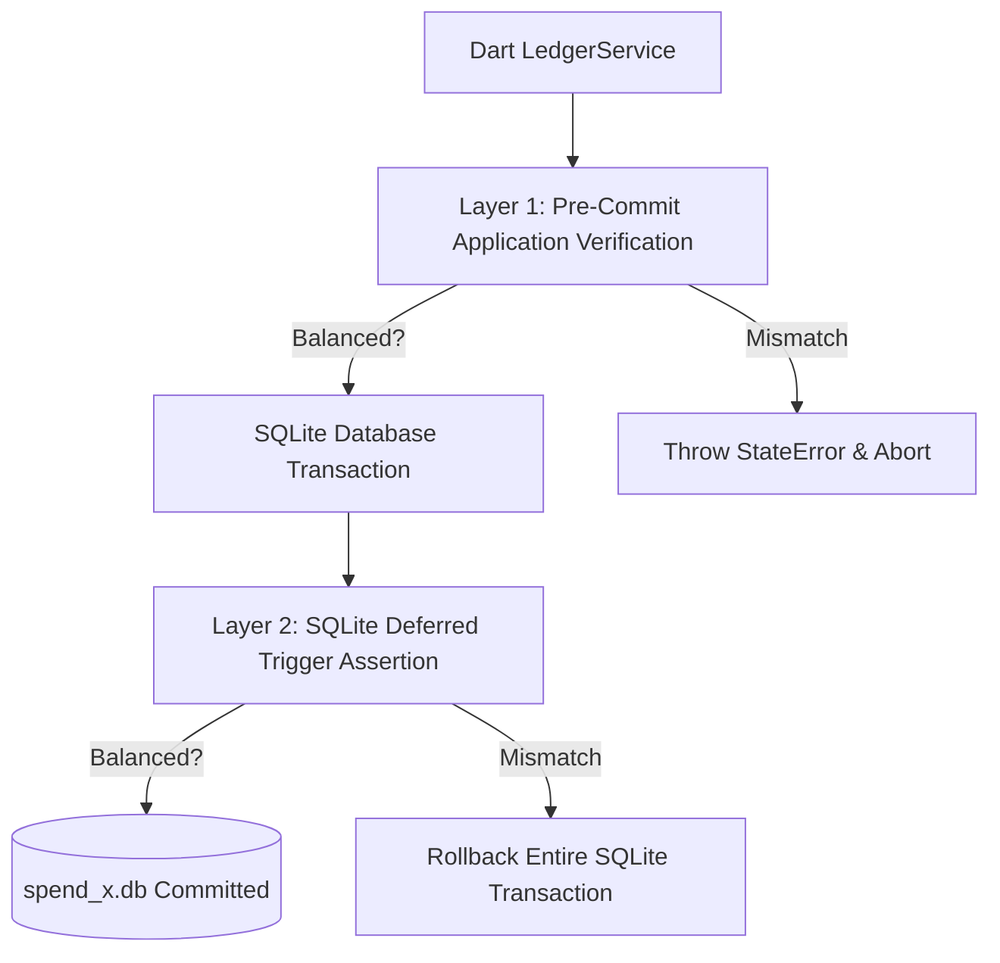

# SpendX 2.0 — Canonical Double-Entry Ledger Specification

**Status**: PROPOSED  
**Classification**: CANONICAL ARCHITECTURE SPECIFICATION  
**Scope**: Postings Model, Balanced Ledger Invariants, and Storage Architecture

---

## 1. The Canonical Posting Model

Every economic event committed to the SpendX 2.0 ledger consists of two or more **Postings** (legs).



### 1.1 Posting Schema Fields
- `id`: `UUID v4` (Primary Key).
- `eventId`: `UUID v4` (Foreign key to `economic_events.id`).
- `accountId`: `UUID v4` (Foreign key to `accounts.id`).
- `direction`: `TEXT NOT NULL` (`'debit'` or `'credit'`).
- `amountMinorUnits`: `INTEGER NOT NULL` (Absolute value $> 0$, e.g. ₹500.00 = `50000` paise).
- `currency`: `TEXT NOT NULL` (`'INR'`, `'USD'`).
- `effectiveDate`: `TEXT NOT NULL` (ISO-8601 UTC date for accounting period recognition).
- `sequenceNumber`: `INTEGER NOT NULL` (1, 2, 3... ordering legs within the event).
- `memo`: `TEXT?` (Optional line-item note).
- `createdAt`: `TEXT NOT NULL` (System creation timestamp).

---

## 2. The Non-Negotiable Ledger Invariant

> ### Fundamental Ledger Law:
> For every `eventId` committed to the ledger, the sum of all debit postings must exactly equal the sum of all credit postings:
> $$\sum_{\text{direction} = \text{'debit'}} \text{amountMinorUnits} \equiv \sum_{\text{direction} = \text{'credit'}} \text{amountMinorUnits}$$

If this condition evaluates to false by even 1 single minor unit (1 paisa / 1 cent), the entire database transaction **MUST ROLL BACK**.

---

## 3. Enforcement Strategy: Two-Layer Defense

SpendX 2.0 does not rely on a single layer to guarantee financial correctness. It implements a two-tier defense:



### Layer 1: Application-Level Service Enforcement (`LedgerService`)
Before issuing any SQL insert, `LedgerService.commitEvent()` validates:
1. Every posting has `amountMinorUnits > 0`.
2. All accounts exist in the `accounts` table.
3. Total debit sum equals total credit sum.
4. Currency matches across all legs (or a balancing exchange leg exists).

### Layer 2: SQLite Schema Trigger Assertion
To guard against rogue SQL executions or background plugins writing unbalanced data, a deferred check trigger runs inside SQLite:
```sql
CREATE TRIGGER IF NOT EXISTS trg_assert_event_balanced
AFTER INSERT ON postings
BEGIN
  -- Assertion verified at transaction boundary
  SELECT CASE
    WHEN (
      SELECT COALESCE(SUM(CASE WHEN direction = 'debit' THEN amountMinorUnits ELSE -amountMinorUnits END), 0)
      FROM postings
      WHERE eventId = NEW.eventId
    ) != 0
    THEN RAISE(ABORT, 'SpendX Invariant Violated: Event postings are not balanced')
  END;
END;
```

---

## 4. Ledger Immutability Contract

1. **Append-Only Policy**:
   - `UPDATE` and `DELETE` statements on the `postings` table are strictly forbidden.
   - SQLite triggers will abort any direct `UPDATE` or `DELETE` on existing posting rows.
2. **Reversals**:
   - To undo an event, the system appends a new set of balancing postings with inverted directions (all Debits become Credits, all Credits become Debits).
3. **Audit Completeness**:
   - At any point in time, running $\sum \text{Debits} - \sum \text{Credits}$ for an account from time $t_0$ to $t$ produces the mathematically indisputable historical balance.
