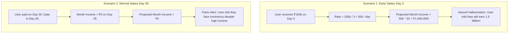
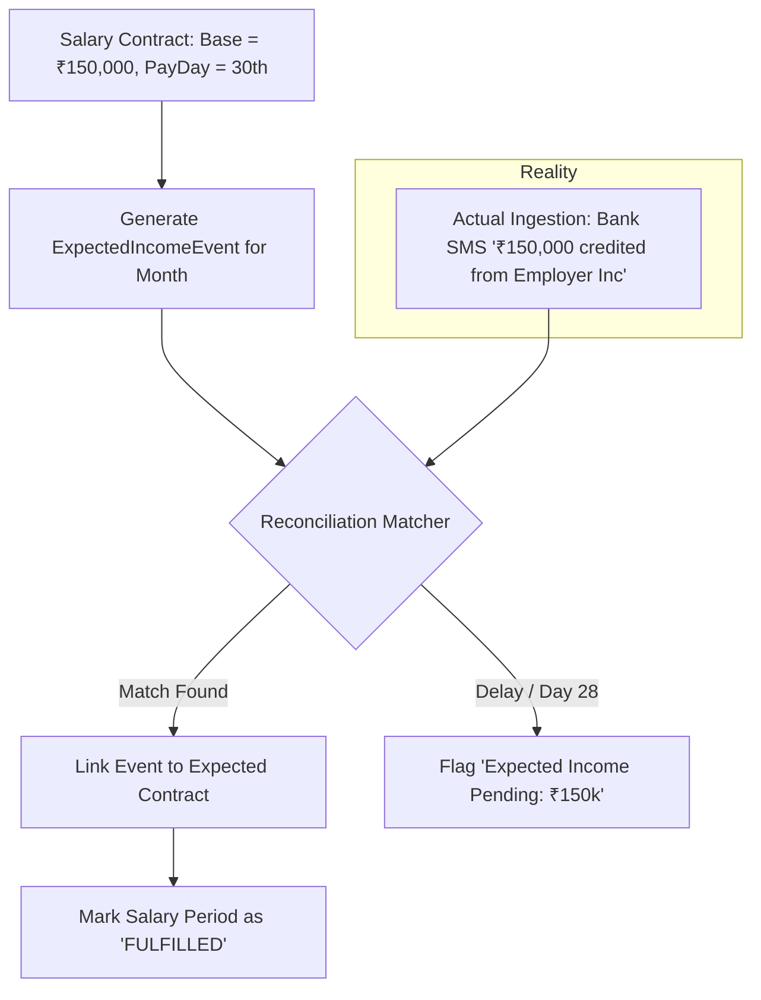

# SpendX 2.0 — Salary & Expected Income Specification

**Status**: PROPOSED  
**Classification**: CANONICAL ARCHITECTURE SPECIFICATION  
**Scope**: Income Contracts, Timing Anomaly Prevention, and Deterministic Salary Reconciliation

---

## 1. The Catastrophic Failure of Linear Income Velocity

In SpendX 1.0, [`ForecastEngine.compute()`](file:///Users/sivek/Documents/SpendX/lib/services/forecast_engine.dart#L128) computed projected income via:
$$\text{Projected Income} = \left(\frac{\text{Month-to-Date Income}}{\text{Days Elapsed}}\right) \times \text{Days in Month}$$

### Mathematical Failure Scenarios:

Linear daily extrapolation of periodic lump-sum earnings is fundamentally invalid.

---

## 2. The Salary Contract Architecture

SpendX 2.0 decouples **Expected Income** from **Received Income**:

### 2.1 Entity Specification: `SalaryContract`
- `id`: `UUID v4`.
- `employerName`: `String` (e.g. `"Google India"`).
- `baseAmount`: `int` (in minor units / paise).
- `payFrequency`: `enum ('monthly', 'bi_weekly', 'weekly')`.
- `expectedPayDay`: `int` (1–31, or specific weekday).
- `destinationAccountId`: `UUID` (Target bank account).
- `varianceThreshold`: `double` (Allowable difference for tax/deductions, e.g. $\pm 10\%$).

---

## 3. Handling Real-World Salary Edge Cases

| Real-World Scenario | System Reality | Expected SpendX 2.0 Behavior |
| :--- | :--- | :--- |
| **Salary Paid Early** | Expected Day 30, arrives on Friday Day 27 due to weekend bank holiday. | Matcher identifies employer name + amount match. Marks Day 30 expected salary as **FULFILLED early**. Forecast recognizes income has arrived; does not predict a second salary on Day 30. |
| **Salary Paid Late** | Expected Day 1, bank holiday delays deposit to Day 5. Date is Day 3. | Forecast treats salary as **EXPECTED (Pending)**. Displays projected month-end balance including expected salary, but tags it with warning: *"Salary 2 days overdue"*. |
| **Salary Missing / Unpaid** | Expected Day 1, still not deposited by Day 15. | After 7 days grace, forecast moves salary from `EXPECTED` to `AT_RISK`. Notifies user: *"Expected ₹150,000 salary from employer not detected. Did you receive this?"* |
| **Annual Bonus / Extra Pay** | Salary is ₹150,000; deposit is ₹250,000. | System matches base ₹150,000 to contract, categorizes excess ₹100,000 as `Income:Bonus`. Does not inflate future recurring salary baseline. |
| **Variable / Freelance Income** | Multiple unpredictable clients, no fixed contract. | Categorized under `Income:Freelance`. Excluded from deterministic contractual expectations; modeled strictly via trailing historical median rolling baseline. |
