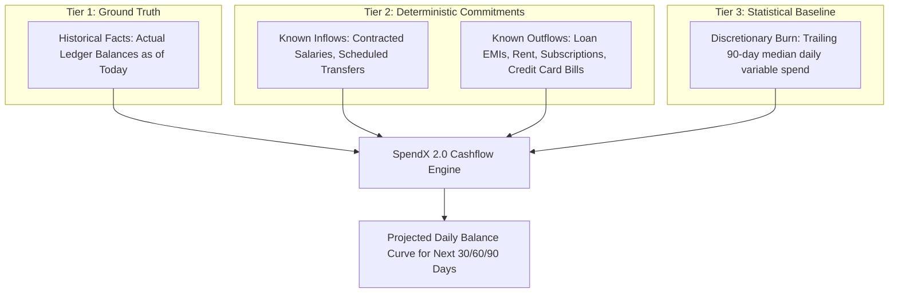

# SpendX 2.0 — Deterministic Cashflow Forecast Specification

**Status**: PROPOSED  
**Classification**: CANONICAL ARCHITECTURE SPECIFICATION  
**Scope**: Future Balance Modeling, Commitment Schedules, and Confidence Tiers

---

## 1. Core Architectural Principle

> **A cashflow forecast must answer: *"How much money am I likely to have on a future date?"* based on verified commitments, rather than multiplying past spending by remaining calendar days.**

SpendX 2.0 separates future projections into three distinct tiers:

---

## 2. Confidence Tier Taxonomy

Every projected inflow and outflow carries an explicit confidence level:

| Tier | Label | Criteria | Example |
| :--- | :--- | :--- | :--- |
| **1** | `ACTUAL` | Real event already posted in the double-entry ledger. | Past debit of ₹1,500 on Oct 1. |
| **2** | `CONFIRMED` | Contractual recurring bill or active loan EMI with exact due date and fixed amount. | Home Loan EMI of ₹32,450 due on Oct 10. |
| **3** | `EXPECTED` | Active salary contract or scheduled recurring bill with historical variance. | Salary of ₹120,000 expected on Oct 30 ($\pm 2$ days). |
| **4** | `PREDICTED` | Statistical extrapolation of variable living costs (groceries, dining, transit). | Estimated daily burn of ₹850/day. |
| **5** | `SCENARIO` | What-if simulation entered by the user (e.g. "If I buy a ₹80,000 bike next week"). | Discretionary capital purchase test. |

---

## 3. Forecast Algorithm Specification

For any target day $T$ in the next $H$ days (where $H \in \{30, 60, 90\}$):

$$\text{Balance}(T) = \text{Current Liquid Asset Balance} + \sum_{t=\text{today}}^{T} \text{KnownInflows}(t) - \sum_{t=\text{today}}^{T} \text{KnownCommitments}(t) - \sum_{t=\text{today}}^{T} \text{DiscretionaryDailyBurn}(t)$$

Where:
- $\text{KnownInflows}(t)$ sums active salary contracts and incoming recurring rules due on day $t$.
- $\text{KnownCommitments}(t)$ sums loan EMIs, credit card statement dues, rent, and subscriptions due on day $t$.
- $\text{DiscretionaryDailyBurn}(t)$ uses the **trailing 90-day median daily variable spend** (excluding one-off capital purchases, loan EMIs, rent, and transfers).

---

## 4. Evaluation of the Ten Adversarial Scenarios

| Scenario | System State & Inputs | SpendX 2.0 Forecast Behavior |
| :--- | :--- | :--- |
| **1. Salary Paid Early** | Expected on Day 30, received on Day 25. Date is Day 26. | Contract reconciliation marks October salary as fulfilled. Forecast does not predict another salary on Day 30. Projected curve reflects true current cash. |
| **2. Salary Paid Late** | Expected on Day 3, arrives on Day 7. Date is Day 4. | Displays salary as `EXPECTED (Overdue)`. Projects month-end balance with a dashed tolerance corridor. Alert: *"Salary delayed by 1 day"*. |
| **3. No Salary Yet** | Expected on Day 3. Date is Day 2. | Uses current actual cash for Day 2. Adds ₹150,000 cliff on Day 3. Does not extrapolate Day 1–2 zero income across the month. |
| **4. Salary Missing** | Expected on Day 3. Date is Day 10 (7 days late). | Engine flags salary as `AT_RISK`. Forecast drops salary from primary projected curve, showing alternative conservative curve: *"If salary is not received, cash runs out on Day 18"*. |
| **5. Large One-Time Purchase** | User buys ₹100,000 laptop on Day 5. | Outflow is tagged `is_one_off = true`. The ₹100,000 decreases liquid balance immediately, but is **excluded from daily burn velocity**, preventing the forecast from falsely assuming the user will buy laptops every day! |
| **6. Upcoming EMI** | ₹25,000 due next week. | Modeled as a sharp scheduled drop of ₹25,000 on the exact loan installment due date. |
| **7. Recurring Rent** | ₹20,000 due on the 1st of every month. | Modeled as a deterministic step drop of ₹20,000 on the 1st, regardless of variable spending trends. |
| **8. Irregular Income** | ₹40,000 freelance payment received with no schedule. | Recognized as liquid asset inflow. Because no contract exists, forecast **does not project another ₹40,000 next month**. |
| **9. Sparse History** | User has only 3 months of transaction data. | Engine uses 30-day median instead of 90-day. Adds confidence buffer badge: *"Forecast confidence: Moderate (Sparse history)"*. |
| **10. Brand New User** | Zero historical transactions. Initial bank balance = ₹50,000. | Forecast displays flat liquid line modified solely by any recurring rules or loans the user explicitly configured during onboarding. Does not invent phantom daily burn. |
