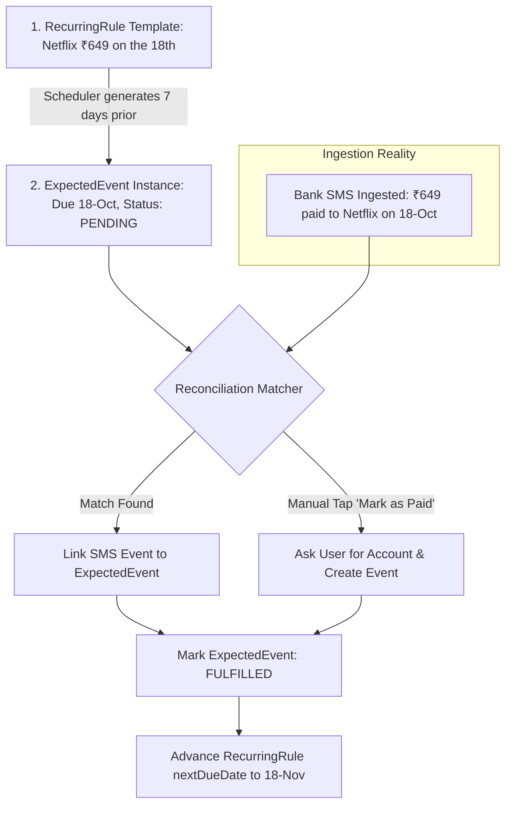

# SpendX 2.0 — Recurring & Expected Events Specification

**Status**: PROPOSED  
**Classification**: CANONICAL ARCHITECTURE SPECIFICATION  
**Scope**: Recurring Templates, Predictive Event Queues, and Ingestion Reconciliation

---

## 1. The Core Conceptual Boundary

In SpendX 1.0, recurring rules and actual transactions existed in disjoint tables without automated reconciliation, causing bills to be logged twice (once by bank SMS, and again when the user tapped "Mark as Paid").

SpendX 2.0 enforces a strict three-tier lifecycle:

---

## 2. Preventing Double-Counting

### The Hazard in SpendX 1.0:
1. Recurring rule expects ₹2,500 electricity bill.
2. User pays via UPI.
3. Bank SMS arrives $\rightarrow$ SpendX creates ₹2,500 expense in `transactions`.
4. Recurring screen still shows electricity bill as "Due".
5. User taps "Mark as Paid" $\rightarrow$ SpendX creates a *second* ₹2,500 expense in `transactions`.

### The SpendX 2.0 Solution:
1. **The Expected Instance**: An active recurring rule instantiates an `ExpectedEvent` with a unique ID: `exp_netflix_2026_10`.
2. **Automated Linking during Ingestion**:
   When `LedgerService` ingests a new transaction, it checks active `ExpectedEvent` records where:
   - Category matches
   - Amount matches within configured tolerance ($\pm 5\%$)
   - Transaction date is within $\pm 3$ days of expected due date
3. **If Linked**:
   - The transaction's `eventId` is recorded on the `ExpectedEvent`.
   - `ExpectedEvent.status` transitions from `PENDING` to `FULFILLED`.
   - The UI displays: *"Netflix bill fulfilled by SMS from HDFC Bank on Oct 18"*.
   - The "Mark as Paid" button disappears or changes to "View Transaction".
   - **Double-counting is mathematically impossible**.
