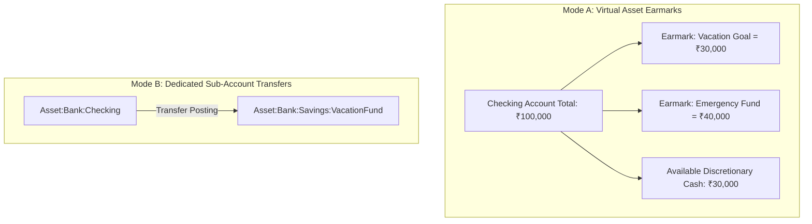

# SpendX 2.0 — Budgets & Goals Specification

**Status**: PROPOSED  
**Classification**: CANONICAL ARCHITECTURE SPECIFICATION  
**Scope**: Planning Overlays, Envelope Budgeting, Asset Earmarks, and Goal Fulfillment

---

## 1. Budgets: Pure Reporting & Planning Overlays

Budgets in SpendX 2.0 are **not accounting accounts** and **do not store mutable spent state**. A budget is a policy constraint applied over ledger-derived expense postings.

```mermaid
flowchart TD
    Ledger[(Double-Entry Ledger Postings)]
    Policy[Budget Policy: Dining Limit = ₹10,000 for October]

    Query[Deterministic Ledger Query: Sum of Debits - Sum of Credits on Expense:Food:Dining for Oct]
    
    Ledger --> Query
    Policy --> Evaluator{Budget Comparison Engine}
    Query --> Evaluator

    Evaluator --> UI[UI Progress Bar: ₹7,500 / ₹10,000 (75%)]
```

### 1.1 Strict Accounting Rules for Budget Calculations
1. **Refunds Automatically Reduce Budget Spending**: Because refunds are credited directly to expense accounts, querying $\sum \text{Debits} - \sum \text{Credits}$ automatically factors in returns. If user spent ₹5,000 on shopping and returned ₹2,000, budget consumption is correctly ₹3,000.
2. **Credit Card Payments Are Excluded**: Card bill payments debit liabilities, not expenses. They never touch category budgets.
3. **Internal Transfers Are Excluded**: Transfers move between assets; they never touch category budgets.
4. **Soft-Deleted / Reversed Transactions Are Excluded**: A reversed transaction has an offsetting debit/credit pair that cancels out in the sum.

---

## 2. Goals: Real Money Earmarks vs. Phantom Tallies

### The Hazard in SpendX 1.0:
In SpendX 1.0, [`GoalRepo.addLog`](file:///Users/sivek/Documents/SpendX/lib/data/repositories/goal_repo.dart#L95) incremented `goals.current_amount` without touching bank balances. Users accumulated ₹100,000 in "goal savings" while their bank account was empty.

### SpendX 2.0 Goal Architecture: Real Asset Allocation

SpendX 2.0 supports two rigorous modes for Goals:



### 2.1 Mode A: Asset Earmarks (Envelope Allocation Within an Account)
- When a user adds ₹10,000 to their Vacation Goal, they must select a liquid funding account (e.g. HDFC Bank).
- The system checks that $\text{Unallocated Cash} \ge ₹10,000$.
- An `Earmark` record is created linking ₹10,000 of `Asset:Bank:HDFC` to the goal.
- The dashboard displays:
  - Total Liquid Balance: ₹100,000
  - Goal Reserves (Locked): ₹70,000
  - **Available Safe-to-Spend Balance**: **₹30,000**
- If the checking balance drops below the total earmarks, the goal is flagged: *"Goal funding at risk due to checking account drawdown"*.

### 2.2 Mode B: Physical Sub-Account Transfer
- For high-value goals, users create a dedicated savings account.
- Contributing to the goal is executed as an **Internal Transfer**:
  ```
  Debit  Asset:Bank:Savings:EmergencyFund  ₹25,000
  Credit Asset:Bank:Checking               ₹25,000
  ```
- Goal progress is simply the verified ledger balance of that savings account.

---

## 3. Spending Out of a Goal

When the user finally purchases the goal item (e.g. pays ₹45,000 for vacation flight tickets):
1. User logs expense: Debit `Expense:Travel:Vacation` ₹45,000, Credit `Asset:Bank` ₹45,000.
2. User selects: *"Fulfill Goal: Summer Vacation"*.
3. The system releases the ₹45,000 earmark, marking the goal as **ACCOMPLISHED**.
