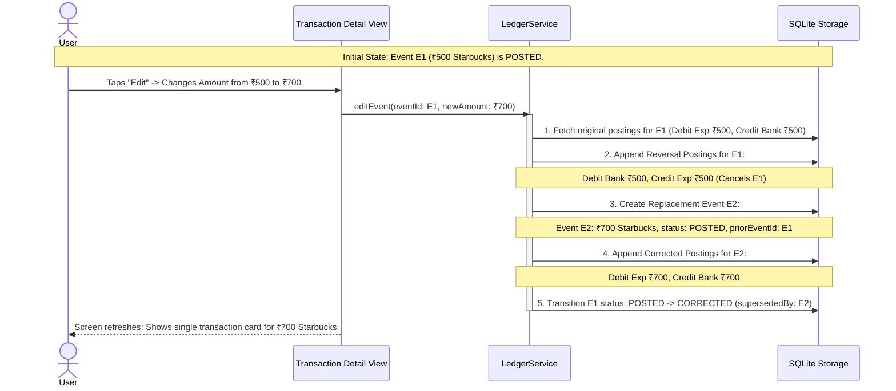

# SpendX 2.0 — Corrections & Audit Trail Specification

**Status**: PROPOSED  
**Classification**: CANONICAL ARCHITECTURE SPECIFICATION  
**Scope**: Append-Only Reversals, Event Versioning, and Materialized UI Projections

---

## 1. The Core Architectural Challenge

> **How does a user edit ₹500 Starbucks to ₹700 Starbucks without destroying accounting history, while preventing the user from seeing messy bookkeeping mechanics?**

Enterprise accounting engines display confusing strings of debit/credit adjustments. Personal finance users expect intuitive, seamless edits.

SpendX 2.0 resolves this through a **Two-Tier Model**:
1. **The Accounting Core**: Strictly append-only. Zero in-place mutations of past postings.
2. **The Presentation Projection**: Materialized views that present a clean, singular transaction card to the user.

---

## 2. Edit Lifecycle Trace: Editing ₹500 to ₹700



---

## 3. Database State vs. User-Facing View

### In the SQLite Database:
```sql
-- Original Postings (Event E1)
INSERT INTO postings VALUES ('p1', 'E1', 'Expense:Dining', 'debit',  50000);
INSERT INTO postings VALUES ('p2', 'E1', 'Asset:Bank:HDFC', 'credit', 50000);

-- Reversal Postings (Triggered by Edit)
INSERT INTO postings VALUES ('p3', 'E1', 'Expense:Dining', 'credit', 50000);
INSERT INTO postings VALUES ('p4', 'E1', 'Asset:Bank:HDFC', 'debit',  50000);

-- Replacement Postings (Event E2)
INSERT INTO postings VALUES ('p5', 'E2', 'Expense:Dining', 'debit',  70000);
INSERT INTO postings VALUES ('p6', 'E2', 'Asset:Bank:HDFC', 'credit', 70000);
```

### In the User Interface:
- Standard transaction queries filter: `WHERE status = 'posted'`.
- The user sees **exactly one transaction**:
  - `Starbucks` — `₹700.00` — `HDFC Bank`
- Tapping "View History" or "Audit Trail" reveals the complete provenance:
  - *Original entry: ₹500.00 on Oct 2 at 10:15 AM*
  - *Corrected to ₹700.00 on Oct 2 at 11:30 AM*

---

## 4. Deletion Lifecycle Trace

When a user deletes a transaction:
1. `LedgerService.deleteEvent(eventId)` is called.
2. The engine generates balancing **reversal postings** that negate the original debits and credits.
3. The event's status transitions from `POSTED` to `REVERSED`.
4. The event is automatically hidden from active UI lists, budget calculations, and monthly expense aggregates.
5. In the database, the complete transaction history remains permanently auditable.
