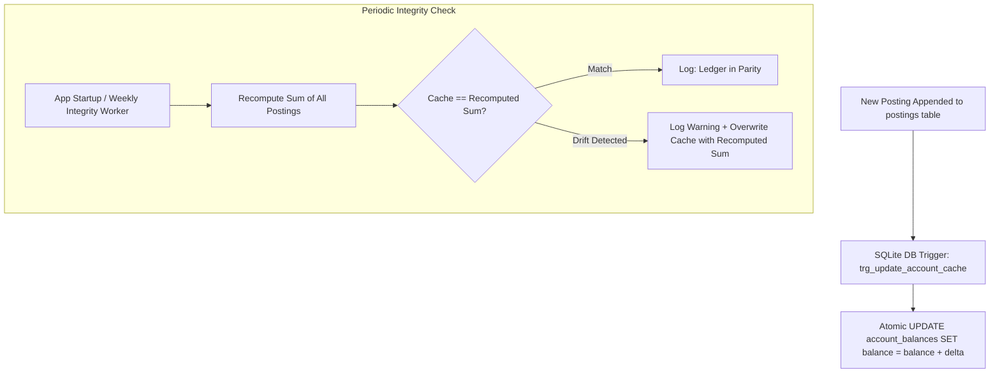

# SpendX 2.0 — Source vs. Derived Data Specification

**Status**: PROPOSED  
**Classification**: CANONICAL ARCHITECTURE SPECIFICATION  
**Scope**: Definitive State Classification and Caching Strategy

---

## 1. Definitive Data Classification Matrix

| Data Entity / Metric | Classification | Authoritative Rationale |
| :--- | :--- | :--- |
| **Economic Event** | **SOURCE** | Primary real-world occurrence captured from human activity or bank systems. |
| **Evidence** | **SOURCE** | Raw external proof artifacts (raw SMS text, OCR image bytes, bank UTR). |
| **Posting** | **SOURCE** | Fundamental atomic monetary entry committed to the append-only journal. |
| **Account Balance** | **DERIVED** | Mathematically derived as $\text{Opening Equity} + \sum \text{Debits} - \sum \text{Credits}$. Never an independent truth. |
| **Credit Card Balance** | **DERIVED** | Derived as $\sum \text{Credits} - \sum \text{Debits}$ on the credit card liability account. |
| **Loan Balance** | **DERIVED** | Derived from initial principal disbursement minus cumulative principal components of paid installments. |
| **Net Worth** | **DERIVED** | Derived dynamically as $\sum \text{Asset Balances} - \sum \text{Liability Balances}$. |
| **Monthly Income** | **DERIVED** | Aggregated dynamically as $\sum \text{Income Credits}$ for the calendar month. Internal transfers excluded. |
| **Monthly Expense** | **DERIVED** | Aggregated dynamically as $\sum \text{Expense Debits} - \sum \text{Expense Credits (Refunds)}$. |
| **Cash Flow** | **DERIVED** | Calculated as $\text{Monthly Income} - \text{Monthly Expense}$. |
| **Budget Progress** | **DERIVED** | Derived by comparing category budget limits against period-to-date net expense debits. |
| **Goal Progress** | **DERIVED** | Derived from explicit asset earmarks or dedicated goal savings account balances. |
| **Cashflow Forecast** | **DERIVED** | Computed projection combining current liquid assets, known commitments, and rolling daily burn. |
| **Financial Health** | **DERIVED** | Multi-factor mathematical formula evaluating savings rate, debt ratio, and emergency fund coverage. |

---

## 2. Materialized Balance Caches: Rules of Engagement

While balances are derived in principle, recalculating millions of postings on every frame would introduce mobile UI lag.

SpendX 2.0 allows a **Materialized Balance Cache** in the database under strict architectural rules:

### The Inviolable Cache Contract:
1. **The Cache is Disposable**: Dropping or wiping the cache table must have zero impact on financial truth. Replaying the ledger recreates the cache perfectly.
2. **Atomic Trigger Maintenance**: Cache updates are driven strictly by SQLite database triggers inside the same transaction as the posting insert. No application code can mutate cached balances directly.
3. **Automated Drift Repair**: On startup, an integrity auditor reconciles the cache against the raw sum of postings. Any drift is automatically logged and repaired from the ledger.
