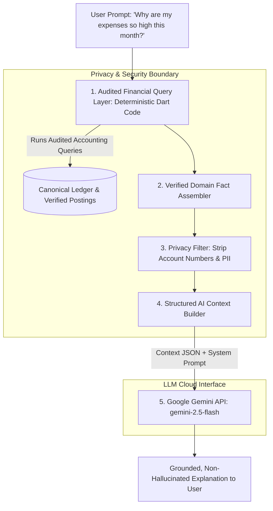

# SpendX 2.0 — AI Truth Boundary Specification

**Status**: PROPOSED  
**Classification**: CANONICAL ARCHITECTURE SPECIFICATION  
**Scope**: LLM Context Boundaries, Verified Query Layer, and Hallucination Prevention

---

## 1. The Core AI Safety Architecture

> **The LLM (Google Gemini) must NEVER independently aggregate or calculate financial metrics from raw SQLite tables. It must receive strictly verified domain facts produced by an audited financial query layer.**



---

## 2. Structured AI Context Specification

When constructing context for Gemini, the payload is structured as an immutable JSON data bundle:

```json
{
  "financial_period": "2026-10",
  "as_of_timestamp": "2026-10-03T12:00:00Z",
  "verified_metrics": {
    "total_liquid_assets": 12500000,
    "total_credit_liabilities": 2400000,
    "total_loan_principal_remaining": 45000000,
    "net_worth": 55100000,
    "month_to_date_earned_income": 15000000,
    "month_to_date_net_expenses": 3450000,
    "month_to_date_refunds_offset": 800000,
    "net_cash_flow": 11550000
  },
  "budget_health": [
    {"category": "Food:Groceries", "limit": 1500000, "spent": 1120000, "status": "on_track"},
    {"category": "Entertainment", "limit": 500000, "spent": 620000, "status": "overspent"}
  ],
  "upcoming_commitments_next_14_days": [
    {"title": "Home Loan EMI", "due_date": "2026-10-10", "amount": 3250000, "confidence": "confirmed"},
    {"title": "Internet Bill", "due_date": "2026-10-12", "amount": 149900, "confidence": "confirmed"}
  ],
  "recent_major_transactions": [
    {"date": "2026-10-02", "merchant": "IKEA Furniture", "amount": 1850000, "category": "Home", "is_one_off": true}
  ]
}
```

---

## 3. Explicit Guardrails: What is Strictly Blocked from Reaching AI

| Defect / Danger in SpendX 1.0 | Prevention Mechanism in SpendX 2.0 |
| :--- | :--- |
| **Transfer as Income** | Transfers are balance sheet movements. `month_to_date_earned_income` queries strictly `Income:Earned:*` accounts. Internal transfers never enter the AI context. |
| **Card Payment Double-Count** | Card bill payments debit liabilities, not expenses. `month_to_date_net_expenses` excludes debt service. Gemini will never advise cutting back on debt payments as an "expense spike". |
| **Ignored Refunds** | Net expenses provided to Gemini subtract credited refunds. Gemini accurately sees real consumption. |
| **Linear Velocity Hallucination** | Naive extrapolation is banned. Gemini is fed the verified output of the deterministic `CashFlowForecastEngine`. |
| **Raw PII & Full Account Numbers**| Account identifiers are anonymized (`"Account #1 (Checking)"`). Raw SMS sender phone numbers and OTPs are stripped. |
| **Direct Database Mutations** | The AI has **zero write permissions**. Any action suggested by the AI returns an `AIAction` intent that requires explicit manual user review and approval in the UI. |
