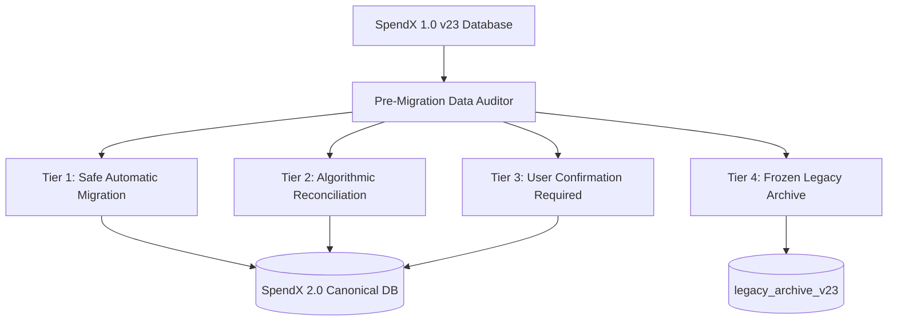

# SpendX 2.0 — Legacy Migration Strategy Specification

**Status**: PROPOSED  
**Classification**: CANONICAL ARCHITECTURE SPECIFICATION  
**Scope**: Migration Pathways, Reconciliation Heuristics, and Legacy Data Archival

---

## 1. Migration Risk & Feasibility Assessment

Migrating from SpendX 1.0 (SQLite v23) to SpendX 2.0 involves transitioning from an uncoordinated flat model to an immutable double-entry ledger.



---

## 2. Table-by-Table Migration Strategy

| Legacy Table (v23) | Trustworthiness | Migration Path | Target SpendX 2.0 Entity | Risk / Caveat |
| :--- | :--- | :--- | :--- | :--- |
| `bank_accounts` | High (structure) / Low (balance) | Extract account metadata (names, last4, icons). Calculate initial baseline from Phase 1B opening balance. | `accounts` (Asset accounts) | Discard mutable `balance` column; recompute balance from migrated postings. |
| `credit_cards` | Moderate | Migrate card names, limits, and billing cycles. | `accounts` (Liability:CreditCard) | Reconcile card debt against transaction history. |
| `transactions` | High (Expense/Income) / Low (Transfers) | 1. Expenses: Map to Debit `Expense:Category`, Credit `Asset:Account`.<br/>2. Incomes: Map to Debit `Asset:Account`, Credit `Income:Category`.<br/>3. Transfers: Re-pair into balanced asset exchanges. | `economic_events` + `postings` | Re-pairing transfers requires matching `account_id` and `related_entity_id`. |
| `ledger_transactions` | Incomplete / Mixed | Used as secondary validation proof. Do not copy blindly due to `income`-typed transfers and card payment expense bugs. | Migrated into new `postings` table after semantic sanitization. | Legacy `reversal` and `correction` legs must be preserved for audit continuity. |
| `loans` & `loan_installments`| High | Migrate principal, rate, tenure, and paid installments into `accounts` (Liability:Loan) and amortization schedules. | `accounts` (Liability:Loan) + `loan_contracts` | Cleanly split historical EMI payments into interest and principal. |
| `goals` & `goal_logs` | Low (Semantic Mismatch) | User has accumulated phantom numbers. Convert existing goal amounts into **Asset Earmarks** on user's primary bank account. | `goals` (Mode A Earmarks) | If primary bank account has less cash than goal total, present user with Goal Realignment prompt. |
| `recurring` | High | Migrate recurring rules as `RecurringRule` templates. | `recurring_rules` | Set initial `nextDueDate` cleanly to avoid immediate duplicate triggers. |
| `salary_contracts` | High | Migrate employer name, expected day, and base salary. | `salary_contracts` | High fidelity data; clean 1-to-1 migration. |
| `vehicles` & `fuel_logs` | N/A (Deprecated) | **DO NOT MIGRATE TO NEW CORE**. Historical fuel costs converted to ordinary `Expense:Transport:Fuel` transactions. | `Expense:Transport:Fuel` | Drop vehicle entity tables per deprecation boundary. |

---

## 3. The Opening Equity Baseline Reconciliation

Because historical transactions may not perfectly reconcile to the user's current bank balance on migration day, the migration engine calculates an **Opening Balance Offset**:

$$\text{Residual Delta} = \text{Current User-Reported Bank Balance} - \sum \text{Migrated Postings}$$

- If $\text{Residual Delta} \ne 0$:
  - The migration engine writes a single balancing posting:
    ```
    Debit  Asset:Bank:Account        Residual Delta
    Credit Equity:OpeningBalance     Residual Delta
    ```
  - This guarantees that the user's starting balance in SpendX 2.0 matches their real-world bank balance on Day 1 without corrupting historical income or expense statements.
