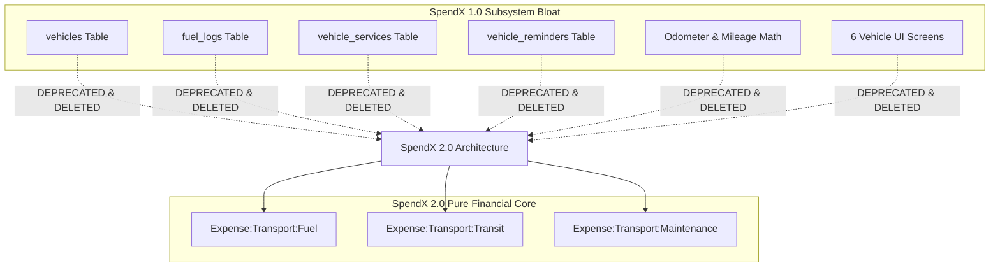

# SpendX 2.0 — Vehicle & Fuel Removal Boundary Specification

**Status**: PROPOSED  
**Classification**: CANONICAL ARCHITECTURE SPECIFICATION  
**Scope**: Boundary Demarcation, Category Mapping, and Safe Removal Sequence

---

## 1. Domain Boundary Demarcation

In SpendX 2.0, the dedicated vehicle management, fuel logging, and odometer tracking subsystems are **completely removed from the core product**.

SpendX 2.0 refocuses strictly on **Personal Financial Sovereignty & Double-Entry Wealth Tracking**.



---

## 2. Category Normalization & Mapping

All past and future fuel and vehicle spending is normalized into standard Chart of Accounts expense categories:

| Legacy Source / Concept | SpendX 2.0 Target Account | Explanation |
| :--- | :--- | :--- |
| `fuel_logs` total cost | `Expense:Transport:Fuel` | Regular expense posting. Liters, odometer readings, and full-tank flags are dropped. |
| `vehicle_services` cost | `Expense:Transport:Maintenance` | Ordinary maintenance expense (oil change, tire replacement, repairs). |
| `vehicle_reminders` | Dropped from core / Moved to General Reminders | Car service reminders become ordinary calendar tasks; no special vehicle engine. |
| `LedgerType.fuel_expense` | Replaced by `LedgerType.expense` | Unified under standard expense ledger posting with category `Transport:Fuel`. |

---

## 3. Exhaustive Removal Checklist for Implementation Phase

When the implementation phase is authorized, execute this exact sequence:

### 3.1 Presentation Layer Deletions
- Delete directory: `lib/screens/vehicle/` (all 6 screens).
- Remove `ListTile('Vehicles & Fuel')` from `lib/screens/more/more_screen.dart:142`.
- Remove vehicle report sections from `lib/screens/reports_screen.dart`.

### 3.2 Domain & Data Layer Deletions
- Delete models: `lib/models/vehicle.dart`, `lib/models/vehicle_reminder.dart`.
- Delete repository: `lib/data/repositories/vehicle_repo.dart`, `lib/data/repositories/vehicle_reminder_repo.dart`, `lib/data/repositories/maintenance_repo.dart`.
- Purge legacy SQL helpers in `lib/services/database_helper.dart`.

### 3.3 Database Table Purge (Migration v24)
Execute SQLite DDL:
```sql
DROP TABLE IF EXISTS vehicles;
DROP TABLE IF EXISTS fuel_logs;
DROP TABLE IF EXISTS vehicle_services;
DROP TABLE IF EXISTS vehicle_reminders;
```
