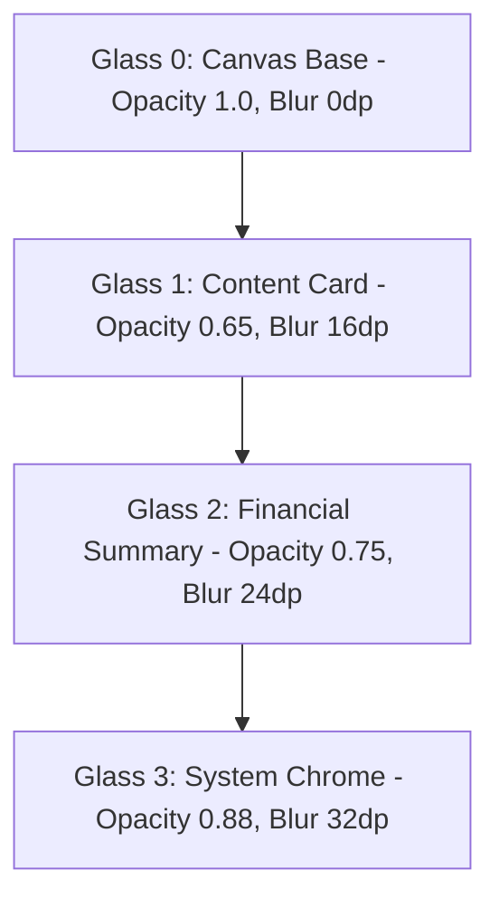

# SpendX 2.0 — Visual Design System Specification

**Document**: `19_VISUAL_DESIGN_SYSTEM.md`  
**Status**: APPROVED SPECIFICATION  
**Design Direction**: Apple-Inspired Precision Glassmorphism $\times$ Machine-Clean Systematic Android  
**Implementation Target**: Flutter Material 3 with Custom Translucent Compositing

---

## 1. Design Direction & Aesthetic Philosophy

SpendX 2.0 achieves a unique visual signature by blending two distinct design traditions:
1. **Apple-Inspired Depth & Translucency**: Controlled background blurs, layered material hierarchies, razor-thin translucent borders (`0.5dp`), soft specular highlights, and content-first typography.
2. **Machine-Clean Systematic Android**: Rigid geometric alignment, calm low-saturation palettes, high data density, tabular monetary figures, and deliberate omission of cartoonish fintech illustrations, childish avatars, or decorative blobs.

The app feels like a **precision financial instrument forged from smoked glass, dark titanium, and pure mathematical clarity**.

---

## 2. Semantic Color Token System

SpendX 2.0 uses strict semantic tokens. Hardcoded hex colors in UI code are strictly forbidden. Dark mode is the primary reference design; Light mode is an equally rigorous, high-contrast daylight equivalent.

### 2.1 Surface & Neutral Tokens

| Semantic Token | Dark Mode (Primary Baseline) | Light Mode (High Contrast) | Usage & Placement |
| :--- | :--- | :--- | :--- |
| `surface.canvas` | `#08090B` (Deep Space Obsidian) | `#F8F9FA` (Clean Off-White) | Root scaffold background behind all layers |
| `surface.elevated` | `#111317` (Deep Titanium) | `#FFFFFF` (Pure White) | Solid underlying cards and drawer bases |
| `surface.glass.base` | `rgba(22, 26, 33, 0.65)` | `rgba(255, 255, 255, 0.70)` | Standard Glass Card surface |
| `surface.glass.strong`| `rgba(30, 36, 46, 0.85)` | `rgba(255, 255, 255, 0.88)` | Modal sheets, AppBars, and Navigation Bars |
| `border.subtle` | `rgba(255, 255, 255, 0.08)` | `rgba(0, 0, 0, 0.06)` | Hairline dividers and internal card partitions |
| `border.highlight` | `rgba(255, 255, 255, 0.16)` | `rgba(0, 0, 0, 0.12)` | Glass card perimeter stroke with top specular rim |
| `text.primary` | `#F1F3F5` (High Contrast White) | `#121417` (Deep Charcoal) | Primary balances, merchant titles, headlines |
| `text.secondary` | `#9098A3` (Muted Steel Slate) | `#5A626E` (Neutral Gray) | Timestamps, categories, subtitles, labels |
| `text.tertiary` | `#58606D` (Subtle Gunmetal) | `#8C95A3` (Light Slate) | Metadata, unselected tab labels, footnote hints |

### 2.2 Domain & Accounting Semantic Tokens

| Semantic Token | Hex Code (Dark / Light) | Accounting Element | Visual Meaning |
| :--- | :--- | :--- | :--- |
| `financial.income` | `#10B981` (Emerald-500) | `Income:Earned:*` | Value earned, money into assets |
| `financial.expense` | `#F1F3F5` (Neutral White) / `#121417` | `Expense:Living:*` | Natural consumption; **NOT alarmist red** |
| `financial.transfer` | `#3B82F6` (Electric Cobalt) | `Asset:A` $\rightarrow$ `Asset:B` | Rebalancing between own accounts |
| `financial.liability`| `#EF4444` (Crimson Carmine) | `Liability:Debt:*` | Debts, loan principal, credit owed |
| `financial.refund` | `#F59E0B` (Warm Amber) | Contra-Expense Credit | Reversal of previous consumption |
| `financial.forecast`| `#8B5CF6` (Deep Violet) | Deterministic Curve | Projected future balance corridor |
| `financial.earmark` | `#06B6D4` (Cyan Horizon) | Goal Asset Allocation | Locked cash reserved for specific goal |

> **Critical FinTech UX Rule**: Natural living expenses are rendered in **neutral primary text** (`#F1F3F5`), not red! Red is strictly reserved for `financial.liability` and hard negative cashflow warnings. Painting ordinary coffee purchases in red induces user anxiety and destroys visual hierarchy.

---

## 3. Glassmorphism Elevation System

Glassmorphism is applied with strict architectural restraint across four levels:



### Glass Level Specifications:

| Glass Level | Fill Opacity | Backdrop Blur | Border Stroke | Shadow & Specular Highlight | Intended Usage |
| :--- | :--- | :--- | :--- | :--- | :--- |
| **Glass 0 (Opaque)** | `1.0` (Solid) | `0dp` | None | None | Root screen background; fallback for low-power devices |
| **Glass 1 (Subtle)** | `0.60` | `16dp` Gaussian | `0.5dp` subtle border (`border.subtle`) | None | Chronological activity list rows, category chips, secondary tiles |
| **Glass 2 (Standard)**| `0.75` | `24dp` Gaussian | `1.0dp` highlight border (`border.highlight`) | Soft ambient: `Y: 8dp, Blur: 24dp, rgba(0,0,0,0.30)` | Hero Financial Balance Card, Safe-to-Spend Gauge, Metric Cards |
| **Glass 3 (Prominent)**| `0.88` | `32dp` Gaussian | `1.0dp` highlight border + specular top edge | Strong ambient: `Y: 12dp, Blur: 36dp, rgba(0,0,0,0.50)` | Bottom Navigation Bar, Modal BottomSheets, Global Action Palette |

---

## 4. Typography Scale & Tabular Financial Figures

Financial amounts require mathematical scanability. All monetary figures use **Tabular Lining Numbers** (`fontFeatures: [FontFeature.tabularFigures()]`) to ensure that numbers align on identical character widths without horizontal jitter during transitions.

```
Font Family:
- Primary Display & Headings: Inter Display (or SF Pro / Roboto Display)
- Body & Labels: Inter (System Fallback: Roboto)
- Numeric Amounts: Inter (Enforced Tabular Figures & Zero Slash)
```

| Type Style | Size | Weight | Line Height | Letter Spacing | Applied To |
| :--- | :--- | :--- | :--- | :--- | :--- |
| **Display Hero** | `44sp` | SemiBold (600) | `52sp` | `-1.2sp` | Primary Dashboard Balance (`₹1,24,500`) |
| **Display Large** | `34sp` | SemiBold (600) | `40sp` | `-0.8sp` | Account Detail Balance, Modal Total |
| **Display Medium** | `26sp` | Medium (500) | `32sp` | `-0.5sp` | Safe-to-Spend Metric, Card Limit |
| **Title Primary** | `20sp` | SemiBold (600) | `26sp` | `-0.3sp` | Screen Titles, Sheet Headers |
| **Title Section** | `15sp` | Medium (500) | `20sp` | `+0.2sp` | Section Headers (`UPCOMING COMMITMENTS`) |
| **Body Primary** | `15sp` | Regular (400) | `22sp` | `0sp` | Merchant Names, Notes, Descriptions |
| **Body Medium** | `13sp` | Regular (400) | `18sp` | `+0.1sp` | Secondary Metadata, Account Names |
| **Numeric Large** | `18sp` | SemiBold (600) | `24sp` | `0sp` (Tabular) | Activity Feed Amounts (`-₹2,500.00`) |
| **Numeric Small** | `13sp` | Medium (500) | `18sp` | `0sp` (Tabular) | Supporting Breakdown Numbers |
| **Caption / Badge**| `11sp` | SemiBold (600) | `14sp` | `+0.5sp` | Category Badges, Evidence Chips (`SMS`) |

---

## 5. Spacing, Geometry & Corner Radius

The layout is constructed on an immutable **4dp / 8dp Systematic Grid**:

```
Spacing Scale:
- space.2xs:  2dp   (specular inset, hairline padding)
- space.xs:   4dp   (chip internal vertical padding)
- space.sm:   8dp   (icon-to-text spacing, tight gaps)
- space.md:   12dp  (card internal horizontal elements)
- space.base: 16dp  (standard card padding, screen margin)
- space.lg:   24dp  (section separation, header spacing)
- space.xl:   32dp  (primary group separation)
- space.2xl:  48dp  (hero top margin)
```

```
Corner Radius Scale:
- radius.xs:   6dp   (evidence badges, status tags)
- radius.sm:   10dp  (buttons, input text fields)
- radius.md:   16dp  (standard activity cards, account rows)
- radius.lg:   24dp  (Hero Balance Card, Safe-to-Spend card)
- radius.xl:   32dp  (Modal BottomSheet top corners)
- radius.full: 999dp (Floating Action Buttons, pill chips)
```

---

## 6. Motion & Systematic Transitions

Motion in SpendX 2.0 exists solely to **communicate state changes and spatial hierarchy**. Purely decorative animations are banned.

1. **Duration Standards**:
   - Micro-interactions (Button tap, checkbox toggle): `120ms` (Curve: `easeOutCubic`).
   - Component state transitions (Filter chip select, card expand): `220ms` (Curve: `easeInOutCubic`).
   - Page & Sheet Transitions: `320ms` (Curve: `fastOutSlowIn` / Material 3 Decelerated).
2. **Tabular Number Rollers**:
   - When a balance updates (e.g. after adding an expense), the digits transition using a smooth vertical sliding tabular roll over `350ms`, providing immediate tactile validation that the ledger updated.
3. **Android Haptic Feedback**:
   - `HapticFeedback.lightImpact()` on quick logging button taps.
   - `HapticFeedback.mediumImpact()` on successful biometric unlock and transaction commit.
   - `HapticFeedback.vibrate()` (Warning pulse) on duplicate detection alert or overspend warning.
