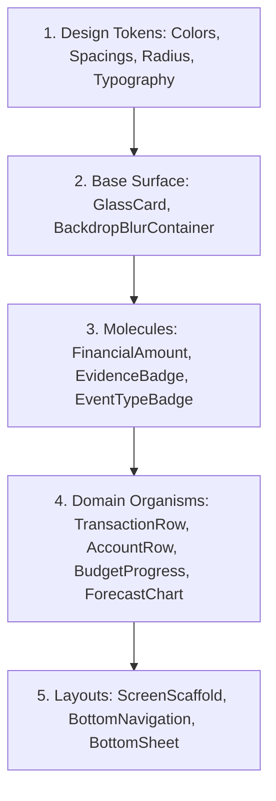

# SpendX 2.0 — Component System Specification

**Document**: `20_COMPONENT_SYSTEM.md`  
**Status**: APPROVED SPECIFICATION  
**Scope**: Component Visual Contracts, State Matrices, and Accessibility Properties

---

## 1. Architectural Component Hierarchy

SpendX 2.0 components adhere to a strict composability hierarchy:



---

## 2. Core Component Specifications

### 2.1 `GlassCard`
- **Purpose**: Foundational translucent container providing layered depth throughout the application.
- **Visual Contract**:
  - `glassLevel`: Enum (`glass1`, `glass2`, `glass3`).
  - `radius`: Defaults to `radius.md` (`16dp`) or `radius.lg` (`24dp`).
  - `padding`: Defaults to `space.base` (`16dp`).
  - `border`: `0.5dp` solid stroke (`border.highlight` on top edge, `border.subtle` on bottom/sides).
  - `backdropFilter`: Gaussian blur (`sigmaX: 16-32`, `sigmaY: 16-32`).
- **Interactive States**:
  - `idle`: Default glass level fill.
  - `pressed`: Fill opacity increases by `+0.08`, scale transforms to `0.985` over `120ms`.
  - `disabled`: Fill opacity reduces by `-0.20`, borders desaturate.

---

### 2.2 `FinancialAmount`
- **Purpose**: Standardized, high-legibility display for monetary values with guaranteed tabular alignment.
- **Visual Contract**:
  - `amountMinorUnits`: `int` (Paise / Cents).
  - `currency`: Defaults to `'₹'` (INR).
  - `direction`: Enum (`income`, `expense`, `transfer`, `liability`, `neutral`).
  - `style`: Enum (`heroDisplay`, `cardLarge`, `listNumeric`, `metadataSmall`).
  - `fontFeatures`: `[FontFeature.tabularFigures(), FontFeature.slashedZero()]`.
- **Formatting Contract**:
  - For India locale (`INR`): Indian Lakh/Crore grouping (`₹1,24,500.00`).
  - Fractional paise/cents are rendered in slightly dimmed `text.secondary` at `80%` font size to prioritize the integer magnitude.

---

### 2.3 `TransactionRow` (Canonical Event Tile)
- **Purpose**: Displays a verified `EconomicEvent` in activity feeds and account ledgers.
- **Visual Structure**:
  ```
  [ Category Icon Avatar (40x40dp) ]
  [ Merchant Title / Description (Body Primary) ]   [ Net Amount (Numeric Large) ]
  [ Account Name • Relative Time (Body Medium)  ]   [ Category Badge • Evidence Chip ]
  ```
- **Semantics**:
  - If event has attached evidence (e.g. Bank SMS or Receipt), renders discrete `EvidenceBadge` (`[SMS]` / `[OCR]`).
  - If event is in `draft` or `review` status, renders a subtle warning border and amber status chip.

---

### 2.4 `AccountRow`
- **Purpose**: Renders an asset, credit card, or loan balance in the Money pillar.
- **Visual Structure**:
  ```
  [ Bank/Card Institution Logo / Icon ]
  [ Account Name (e.g. "HDFC Salary") ]              [ Verified Ledger Balance ]
  [ Account Type • Last 4 (e.g. "Checking • 1234") ] [ Earmarked / Available Sub-label ]
  ```
- **Distinction Contract**:
  - For Credit Cards: Explicitly displays **Outstanding Balance** (`text.primary`) alongside **Available Limit** (`text.secondary`).
  - For Checking with Earmarks: Displays **Total Cash** alongside **Safe-to-Spend** (`financial.earmark`).

---

### 2.5 `EventTypeBadge`
- **Purpose**: Instant visual identification of the economic character of an event.
- **Visual Style**:
  - `Income`: Green background tint `rgba(16, 185, 129, 0.12)`, text `#10B981`, label `"INCOME"`.
  - `Expense`: Neutral slate tint `rgba(241, 243, 245, 0.08)`, text `#F1F3F5`, label `"EXPENSE"`.
  - `Transfer`: Blue tint `rgba(59, 130, 246, 0.12)`, text `#3B82F6`, label `"TRANSFER"`.
  - `Card Payment`: Purple tint `rgba(139, 92, 246, 0.12)`, text `#8B5CF6`, label `"CARD PAYMENT"`.
  - `Refund`: Amber tint `rgba(245, 158, 11, 0.12)`, text `#F59E0B`, label `"REFUND"`.

---

### 2.6 `ForecastChart`
- **Purpose**: Visualizes the deterministic cashflow corridor over the next 30/60/90 days without misleading stock-chart oscillations.
- **Visual Contract**:
  - **Solid Violet Line**: Confirmed cash position based on actual ledger balance and known commitments (EMIs, contractual salary, fixed subscriptions).
  - **Translucent Corridor Band**: Upper and lower bound incorporating trailing 90-day median discretionary variable burn.
  - **Event Step Pins**: Discrete markers on dates where known lump-sums drop or rise (e.g. PayDay `+₹150k`, Rent `-₹25k`, EMI `-₹32.5k`).
  - **Zero-Line Hazard Horizon**: If the lower corridor dips below ₹0, the curve highlights in subtle crimson warning tint with days-to-overdraft calculation.

---

### 2.7 `EvidenceBadge`
- **Purpose**: Communicates proof provenance attached to a financial event.
- **Variants**:
  - `[SMS]`: Monospace, gray pill with bank icon.
  - `[OCR]`: Monospace, camera icon indicating parsed paper receipt.
  - `[MANUAL]`: Monospace, pencil icon indicating manual entry.
  - `[CSV]`: Monospace, document icon indicating bank statement import.

---

### 2.8 `ReviewCard` (Pending Ingestion Tray)
- **Purpose**: Presents ambiguous or unreviewed financial evidence for user decision.
- **Visual Layout**:
  - Prominent glass card with an amber left accent indicator.
  - Clear, human-readable detection summary:
    *"₹1,250 debited at Amazon. SpendX detected this from an HDFC SMS."*
  - Extracted details (Account, Date, Proposed Category).
  - Clear dual action buttons: `[Confirm (✓)]` (Primary high-contrast button) and `[Edit (✎)]` (Subtle outlined glass button).
