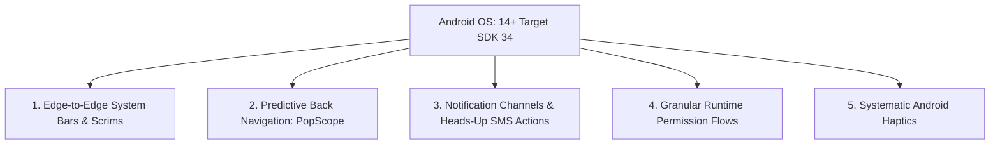

# SpendX 2.0 — Accessibility & Android Native Architecture Specification

**Document**: `24_ACCESSIBILITY_AND_ANDROID.md`  
**Status**: APPROVED SPECIFICATION  
**Platform Target**: Android (Min SDK 21, Target SDK 34) $\times$ Flutter Material 3  
**Accessibility Standard**: WCAG 2.1 Level AAA Compliance

---

## 1. Android Native Behavior & Integration

SpendX 2.0 combines the visual refinement of translucent Apple-inspired design with **authentic, uncompromised native Android behavior**. It is not a port of an iOS app; it is a premium Android-first citizen.



### 1.1 Edge-to-Edge System Bar Architecture
- **Status & Navigation Bars**: Fully transparent edge-to-edge drawing via `WindowCompat.setDecorFitsSystemWindows(window, false)`.
- **System Navigation**: Seamlessly integrates with Android gesture navigation bars and legacy 3-button navigation.
- **Top Inset Scrim**: Content scrolls smoothly beneath a translucent `Glass3` AppBar with dynamic blur.
- **Bottom Navigation Inset**: Navigation pill floats cleanly above the Android gesture handle with guaranteed `MediaQuery.of(context).viewPadding.bottom` clearance.

### 1.2 Predictive Back & Modal Dismissal
- Adheres to Android 14+ **Predictive Back** (`PopScope` in Flutter).
- Swiping from the left screen edge provides smooth spatial preview of the previous screen.
- BottomSheets support progressive downward drag-to-dismiss with velocity thresholds.

### 1.3 Android Notification Channels & Direct Actions
- **Channel 1: `spendx_live_sms` (High Priority)**:
  - Triggered immediately when native `SmsReceiver.kt` detects a financial debit/credit.
  - Features Android heads-up banner with direct inline actions:
    - `[Confirm (✓)]`: Immediately posts the transaction without launching the UI.
    - `[Edit Details]`: Cold boots app directly into `EditTransactionScreen`.
- **Channel 2: `spendx_commitments` (Default Priority)**:
  - Morning alerts for scheduled loan EMIs or upcoming rent.

---

## 2. Accessibility Specification (WCAG 2.1 AAA)

### 2.1 Touch Target Geometry
- Every interactive element (buttons, chips, list rows, form fields) possesses a **minimum touch target of $48 \times 48\text{dp}$**.
- Small visual chips (`28dp` height) enforce `padding: EdgeInsets.symmetric(vertical: 10dp)` to guarantee touch bounding box compliance.

### 2.2 Contrast Ratios (Dark & Light Modes)
- **Primary Text (`#F1F3F5` on `#08090B`)**: Contrast ratio exceeds **16.5:1** (far exceeding the 7:1 AAA standard).
- **Secondary Text (`#9098A3` on `#111317`)**: Contrast ratio is **7.4:1** (AAA compliant).
- **Glass Card Borders**: Provide `3:1` minimum graphical contrast against canvas background.

### 2.3 Screen Reader & Semantic Financial Labels
Raw monetary strings (`"-₹2500.00"`) are unhelpful when read literally by TalkBack (`"dash rupee two five zero zero point zero zero"`).

SpendX 2.0 wraps all financial figures in custom Flutter `Semantics`:
```dart
Semantics(
  label: "Expense of 2,500 rupees paid to Starbucks from HDFC Bank on October 2nd. Verified from SMS.",
  child: FinancialAmount(amountMinorUnits: 250000, direction: PostingDirection.debit),
)
```

### 2.4 Color-Independent Status Communication
Color is **never the sole indicator** of state:
- `Income`: Green color **+** explicit `+` prefix **+** upward-pointing chevron icon.
- `Expense`: Neutral text **+** explicit `-` prefix.
- `Transfer`: Blue color **+** horizontal bidirectional arrow `⇄`.
- `Overspent Budget`: Amber/crimson border **+** warning icon **+** text label: `"Exceeded by ₹1,200"`.

### 2.5 Motion Reduction
When the user enables **Remove Animations** in Android System Accessibility Settings (`MediaQuery.of(context).disableAnimations == true`):
- All backdrop blur Gaussian passes reduce to high-performance solid tinted surfaces.
- Tabular digit sliding rollers snap instantaneously to final values.
- Page slide transitions are replaced with instant `0ms` cross-fades.
