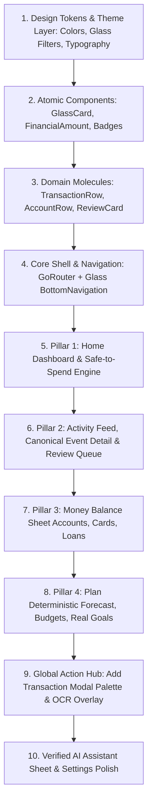

# SpendX 2.0 — Design Decisions, Anti-Patterns & Implementation Order

**Document**: `25_DESIGN_DECISIONS.md`  
**Status**: APPROVED SPECIFICATION  
**Scope**: UI Architectural Decision Records, Anti-Patterns, and Phased Implementation Roadmap

---

## 1. UI Architectural Decision Records (ADR-UI)

### ADR-UI-001: Four-Pillar Navigation Structure
- **Context**: SpendX 1.0 had 5 tabs that mixed accounts, wealth tools, and vehicle logs.
- **Decision**: Consolidate into 4 focused pillars: Home (State), Activity (Feed), Money (Balance Sheet), Plan (Forecast/Budgets/Goals).
- **Reasoning**: Creates clean alignment with the user's mental model: *Current State $\rightarrow$ Historical Events $\rightarrow$ Assets/Debts $\rightarrow$ Future Planning*.

### ADR-UI-002: Neutral Expense Coloring (Banning Alarmist Red)
- **Context**: Fintech apps paint ordinary living expenses in aggressive crimson red.
- **Decision**: Normal living expenses are rendered in clean neutral primary text (`#F1F3F5`). Red is reserved strictly for debt liabilities and hard cashflow insolvency warnings.
- **Reasoning**: Normal daily purchases (groceries, coffee) are not failures. Eliminating unnecessary red reduces user anxiety and restores visual hierarchy.

### ADR-UI-003: Tabular Number Typography
- **Context**: Standard variable-width fonts cause numbers to jitter horizontally during balance animations.
- **Decision**: Enforce `fontFeatures: [FontFeature.tabularFigures()]` across all financial amounts.
- **Reasoning**: Guarantees vertical alignment in tables and smooth, jitter-free count transitions.

### ADR-UI-004: Hierarchical Glassmorphism (Restraint over Novelty)
- **Context**: Poor glassmorphism blurs everything, making text unreadable and killing GPU performance.
- **Decision**: Restrict glass to four strict levels (`Glass 0` to `Glass 3`). Content rows remain mostly solid with subtle borders; glass is reserved for hero summaries and floating navigation chrome.
- **Reasoning**: Delivers depth and premium translucency without GPU stutter on low-end Android devices.

---

## 2. SpendX 2.0 Design Anti-Patterns Catalog

The implementation team must strictly reject the following anti-patterns:

```
[ BANNED DESIGN ANTI-PATTERNS IN SPENDX 2.0 ]
1. The Rainbow Fintech Dashboard: Neon gradients, purple-pink buttons, and rainbow category tags.
2. The Cartoon / Gamified Finance App: Avatars, leveling badges, XP bars, streak fire emojis, or celebratory confetti for logging expenses.
3. The Crypto Trading Terminal: Dark neon green/red charts with oscillating candlestick graphs that induce panic.
4. The Dense Accounting Spreadsheet: Exposing debit/credit postings, journal IDs, or double-entry terminology to everyday users.
5. The Fake AI Gimmick: Placing chat bots over core workflows or letting an LLM invent arbitrary financial numbers.
6. The Phantom Savings Deception: Visual goal bars that pretend money has been saved when checking account balances are unchanged.
```

---

## 3. Contradictions Audit: Financial Spec vs. UX Requirements

During this UX specification phase, an adversarial cross-check was conducted against the financial specifications (`docs/spendx2/00` to `17`):

| Potential Tension | Financial Requirement | UX Resolution | Status |
| :--- | :--- | :--- | :--- |
| **Editing an Event** | Financial spec enforces strictly append-only reversal postings (`tx:rev` + `tx:corr`). | Presentation layer queries active events (`WHERE status = 'posted'`) and renders a single updated card. Audit trail is available only upon tapping "View Provenance". | **RESOLVED & ALIGNED** |
| **Goal Contributions** | Financial spec forbids phantom balances (`goals.current_amount`). | UX introduces **Asset Earmarks**. Contributing to a goal displays a locked reserve on the funding account, explicitly reducing "Safe-to-Spend" cash. | **RESOLVED & ALIGNED** |
| **Credit Card Payments** | Financial spec dictates card payments have ₹0 expense impact. | UX explicitly tags card payments as `⇄ Card Payment` with supporting microcopy: *"Settles debt liability; does not increase monthly expenses"*. | **RESOLVED & ALIGNED** |
| **Internal Transfers** | Financial spec dictates transfers must not be counted as income. | UX groups transfers under neutral blue arrows (`⇄ ₹20,000`), completely excluded from monthly income and expense cards. | **RESOLVED & ALIGNED** |

**Zero unresolved contradictions remain between the financial truth model and the UX architecture.**

---

## 4. Proposed Implementation Order for Next Phase

When coding is authorized, implementation must strictly follow this dependency order:



1. **Step 1: Tokens & Theme Engine**: Implement `SpendXColors`, `SpendXTypography`, `SpendXGlass`, and `AppTheme`.
2. **Step 2: Base Components**: Build `GlassCard`, `FinancialAmount`, `EventTypeBadge`, `EvidenceBadge`.
3. **Step 3: Domain Molecules**: Build `TransactionRow`, `AccountRow`, `ReviewCard`, `BudgetProgress`.
4. **Step 4: Navigation Shell**: Implement declarative `GoRouter` with `AppScaffold` and floating glass bottom nav.
5. **Step 5: Home Pillar**: Build `HomeDashboardScreen` with Safe-to-Spend gauge and upcoming commitments.
6. **Step 6: Activity Pillar**: Build chronological feed, search, filter sheet, and `EventDetailScreen`.
7. **Step 7: Money Pillar**: Build balance sheet views for Checking, Credit Cards, and Amortized Loans.
8. **Step 8: Plan Pillar**: Build `CashflowForecastScreen`, `BudgetScreen`, and `GoalScreen` (with earmarks).
9. **Step 9: Ingestion & Action Hub**: Build `AddTransactionModal`, OCR camera overlay, and Review Queue.
10. **Step 10: Verified AI & Security**: Connect `AiChatScreen` to audited context layer; wrap database with SQLCipher.
