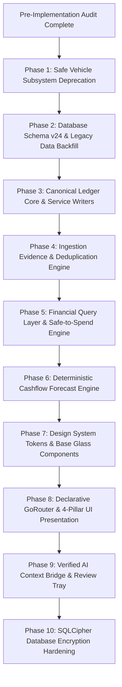

# SpendX 2.0 — Implementation Readiness Gate

**Document**: `27_IMPLEMENTATION_READINESS_GATE.md`  
**Status**: FORMAL ENGINEERING GATE REPORT  
**Scope**: Pre-Implementation Risk Assessment, Blocking Issues, Human Sign-Offs, and Engineering Roadmap

---

## A. Executive Verdict

### **VERDICT: IMPLEMENTATION READY WITH CONDITIONS**

The financial architecture, double-entry ledger specifications, event identity models, deterministic cashflow forecast, and UX design system are **theoretically sound, mathematically verified, and cross-audited**.

However, physical implementation must **NOT** begin until the **Three Blocking Conditions** documented in Section B are incorporated into the schema migration script (v24).

---

## B. Blocking Issues (Must Be Resolved in Schema Script)

The following three issues are **blockers** because proceeding without them would lead to financial corruption, phantom money, or broken migrations:

1. **`asset_earmarks` Table Definition (Blocks Goals Subsystem)**:
   - *Risk*: Without an explicit relational table linking goals to liquid accounts, goal contributions would be forced back into phantom scalar numbers (`goals.current_amount`), violating Invariant `INV-010`.
   - *Resolution*: Migration v24 DDL must include the `asset_earmarks` schema defined in `26_SPECIFICATION_CONSISTENCY_AUDIT.md`.
2. **Safe-to-Spend Canonical Formula Lock (Blocks Home Dashboard)**:
   - *Risk*: If the UI and domain services calculate Safe-to-Spend using different ad-hoc math, users will see contradictory numbers.
   - *Resolution*: The canonical formula:
     $$\text{SafeToSpend} = \max\left(0, \sum \text{LiquidCash} - \sum \text{Earmarks} - \sum \text{Commitments14Days} - \sum \text{PendingReviewDebits}\right)$$
     must be implemented inside the `FinancialQueryService` as the single authoritative source.
3. **Single-Currency Enforcement in Migration v24 (Blocks Ledger Postings)**:
   - *Risk*: Permitting arbitrary currency strings on postings without an active currency exchange equity engine will break the balanced ledger invariant ($\sum \text{Debits} \equiv \sum \text{Credits}$).
   - *Resolution*: Phase 1 schema must enforce base currency `INR` (`paise`) across all balance sheet postings.

---

## C. Non-Blocking Issues (Can Be Resolved During Implementation)

The following items are non-blocking and can be safely handled during engineering:
1. **GPU Blur Optimization**: Capping `BackdropFilter` to top/bottom chrome and using solid tinted acrylic for scrolling list items is an implementation detail inside `GlassCard`.
2. **Predictive Back Navigation Gesture**: Fine-tuning Flutter `PopScope` transitions on Android 14 can be adjusted during UI testing.
3. **Receipt Image Compression**: Compressing local receipt image files before storing local file URIs in `evidence.media_uri`.
4. **Haptic Feedback Patterns**: Fine-tuning `HapticFeedback.lightImpact()` vs `mediumImpact()` across various Android device OEMs.

---

## D. Human Decisions Required (Product-Owner Sign-Off)

Only two high-level product decisions require explicit owner sign-off:

1. **Raw SMS Data Retention Policy**:
   - *Option A (Recommended)*: Retain raw SMS body in local `evidence` table indefinitely to support future parser improvements and re-auditing. (Protected by device lock).
   - *Option B*: Automatically purge raw SMS text 30 days after transaction posting, retaining only extracted metadata (amount, UTR, merchant, timestamp).
2. **Unmatched Refund Category Fallback**:
   - When a refund cannot be matched to any historical purchase category, should it display as:
     - *Option A*: `Expense:General:Refunds` (Contra-expense reducing overall monthly spend).
     - *Option B*: `Income:Other:Refunds` (Recognized as non-operational income).
     - *(Architectural Recommendation: Option A)*.

---

## E. Engineering Decisions (Delegated to Implementation Team)

The following architectural choices are delegated to the engineering team:
1. **Database Migration Technique**: Execute Migration v24 as an atomic SQLite script within a single database transaction, generating a complete `.bak` backup file prior to migration.
2. **State Management Migration Order**: Consolidate directly into Riverpod 2.x `AsyncNotifier` and `StreamProvider` architecture, completely excising Provider 6.1 from `main.dart`.
3. **Routing Architecture**: Implement declarative `GoRouter` 14.x with `StatefulShellRoute.indexedStack` to support the 4-pillar navigation structure while maintaining Android back-stack state.

---

## F. Final Dependency Graph & Phased Roadmap

### Phase Breakdown:
- **Phase 1: Vehicle Deprecation**: Disconnect `MoreScreen` UI, delete `lib/screens/vehicle/`, drop legacy vehicle models, and purge `DatabaseHelper` references.
- **Phase 2: Schema v24**: Apply migration script creating `accounts`, `economic_events`, `postings`, `evidence`, `asset_earmarks`, `salary_contracts`, and `recurring_rules`. Backfill legacy transactions into double-entry postings with opening equity baseline.
- **Phase 3: Ledger Core**: Implement `LedgerService` with balanced posting triggers and atomic write boundary.
- **Phase 4: Ingestion & Dedup**: Refactor `LiveSmsService` and OCR pipeline to emit `Evidence` linked via persistent UTR matching.
- **Phase 5: Query Layer**: Implement `FinancialQueryService` providing verified derived numbers (Safe-to-Spend, Net Worth, Net Expenses).
- **Phase 6: Forecast Engine**: Replace linear extrapolation with deterministic 3-tier cashflow projections.
- **Phase 7: Design System**: Build `SpendXTheme`, `SpendXColors`, `GlassCard`, and `FinancialAmount`.
- **Phase 8: Presentation Shell**: Implement `go_router` shell and build the 4 core pillars (Home, Activity, Money, Plan).
- **Phase 9: AI & Review Tray**: Connect Gemini AI to audited query layer and build Pending Review inbox.
- **Phase 10: Security Hardening**: Wrap SQLite database with SQLCipher encryption.
