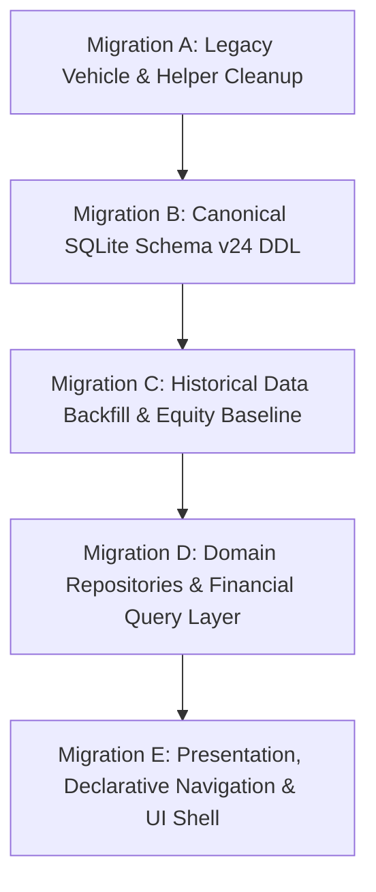

# SpendX 2.0 — Migration Boundary & Phasing Architecture

**Document**: `31_MIGRATION_BOUNDARY.md`  
**Status**: APPROVED CANONICAL SPECIFICATION  
**Scope**: Engineering Phasing, Migration Boundaries, Safety Rollbacks, and Risk Isolation

---

## 1. The Anti-Pattern of the "Mega-Migration"

> [!CAUTION]
> Combining vehicle deletion, a double-entry ledger rewrite, a navigation overhaul (`go_router`), state management consolidation (`riverpod`), and AI re-wiring into a single engineering sprint is **guaranteed to cause regressions and database corruption**.

SpendX 2.0 establishes **Five Isolated Migration Boundaries**. Each phase must compile, pass all unit and regression tests, and be committed as a clean standalone milestone before the next phase begins.

---

## 2. The Five Isolated Migration Milestones

### Milestone A: Legacy Vehicle Cleanup & Codebase Purge
- **Boundary**: Zero financial ledger changes. No schema modifications yet.
- **Actions Permitted**:
  1. Remove "Vehicles & Fuel" menu tile from `lib/screens/more/more_screen.dart`.
  2. Safely delete `lib/screens/vehicle/` (all 6 screens).
  3. Delete `vehicle_repo.dart`, `vehicle_reminder_repo.dart`, `maintenance_repo.dart`, and vehicle models.
  4. Purge legacy raw SQL helper methods in `lib/services/database_helper.dart`.
  5. Replace remaining vehicle queries with standard `Expense:Transport:Fuel` category queries.
- **Verification Gate**: App compiles cleanly (`flutter analyze`), existing tests pass (`flutter test`), and app launches on device without vehicle references.

---

### Milestone B: Canonical SQLite Schema Migration (v24 DDL)
- **Boundary**: Database schema expansion. Old tables are kept intact for data extraction.
- **Actions Permitted**:
  1. Register migration `v24` inside `AppDatabase.dart`.
  2. Execute DDL creating new canonical tables:
     - `accounts`
     - `economic_events`
     - `postings`
     - `evidence`
     - `asset_earmarks`
     - `salary_contracts`
     - `recurring_rules`
     - `expected_events`
  3. Install SQLite triggers:
     - `trg_assert_event_balanced` (Deferred double-entry check).
     - `trg_prevent_posting_mutations` (Abort direct `UPDATE` / `DELETE` on `postings`).
  4. Execute `DROP TABLE IF EXISTS` for legacy vehicle tables (`vehicles`, `fuel_logs`, `vehicle_services`, `vehicle_reminders`).
- **Verification Gate**: SQLite migration executes successfully on a copy of real user database; triggers reject unbalanced posting test inserts.

---

### Milestone C: Historical Data Backfill & Opening Equity Baseline
- **Boundary**: Data transformation from v23 tables into v24 canonical tables.
- **Actions Permitted**:
  1. Execute `LedgerBackfillService`:
     - Map existing `bank_accounts` and `credit_cards` into `accounts`.
     - Re-pair legacy `transfer` transactions into balanced cross-asset postings.
     - Reclassify card payment bank deductions from `expense` to liability settlements.
     - Convert legacy `fuel_logs` expenses into standard `Expense:Transport:Fuel` postings.
  2. Compute and insert `Equity:OpeningBalance` baseline postings for all accounts to absorb pre-v21 historical residuals.
  3. Transition legacy `transactions` table into a read-only frozen state.
- **Verification Gate**: Running $\sum \text{Postings}$ produces verified starting balances for all accounts that match the user's real-world cash balances.

---

### Milestone D: Domain Services & Financial Query Layer
- **Boundary**: Business logic and state management. UI remains on existing screens temporarily.
- **Actions Permitted**:
  1. Implement `LedgerService` as the single atomic writer of financial state.
  2. Implement `FinancialQueryService` providing verified derived streams (`total_liquid_cash`, `discretionary_cash`, `safe_to_spend`, `net_worth`).
  3. Implement `DeterministicCashflowForecastEngine`.
  4. Implement persistent UTR deduplication matcher in `SmsImportService`.
- **Verification Gate**: All 30+ adversarial tests in `13_ADVERSARIAL_TEST_MATRIX.md` pass against the new domain services.

---

### Milestone E: Presentation Layer & Declarative Navigation Shell
- **Boundary**: Flutter UI widgets and routing.
- **Actions Permitted**:
  1. Implement design tokens (`SpendXColors`, `SpendXTypography`, `SpendXGlass`).
  2. Build atomic components (`GlassCard`, `FinancialAmount`, `TransactionRow`).
  3. Introduce `go_router` shell and build the 4 primary pillar screens (Home, Activity, Money, Plan).
  4. Connect `AiChatScreen` strictly to `FinancialQueryService` JSON context bridge.
- **Verification Gate**: Full end-to-end visual review on physical Android device with predictive back navigation and edge-to-edge rendering.
