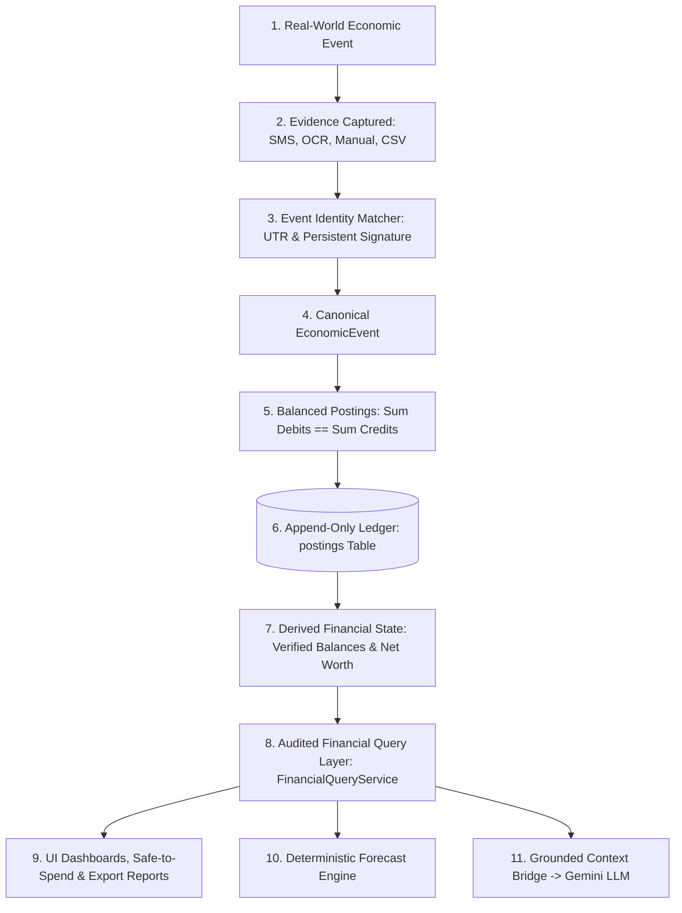

# SpendX 2.0 — Final Product Decision Lock & Architectural Contract

**Document**: `34_FINAL_PRODUCT_DECISION_LOCK.md`  
**Status**: IMMUTABLE ARCHITECTURAL LOCK  
**Scope**: Product Owner Decisions, Formal Rationale, Domain Invariants, Lifecycle Rules, and Audit Trail  
**Authority**: Product Owner Sign-Off (Locks Decisions DEC-001 through DEC-005)

---

## 1. The Five Immutable Product Decisions

The following five architectural decisions are formally **APPROVED and LOCKED**. They constitute immutable constraints for the SpendX 2.0 implementation and can only be altered by a new formal ADR explicitly superseding this document.

---

### Decision 1: Unmatched Refunds Classification
- **LOCKED POLICY**:
  - Unmatched refunds are classified strictly under `Expense:General:Refunds`.
  - They are treated as **contra-expense activity**, directly netting against total living expenses.
  - They **MUST NOT** be treated as ordinary personal `Income`.
  - When an incoming refund can be matched to an original purchase event, it must reference that original `EconomicEvent` and credit the original category account (e.g. `Expense:Shopping:Apparel`).
  - An unmatched refund must still produce balanced double-entry postings:
    ```
    Debit  Asset:Bank:Account        Amount (Asset increases)
    Credit Expense:General:Refunds   Amount (Contra-expense reduces total spend)
    ```
- **Rationale**: In personal finance, receiving a refund is a return of previously spent capital, not newly earned taxable income. Treating refunds as income distorts savings rate calculations and artificially inflates revenue.
- **Rejected Alternatives**:
  - *Rejected: Credit `Income:Other:Refunds`*: Rejected because it overstates both monthly income and monthly expenses by the refunded amount.

---

### Decision 2: Raw Bank SMS Body Retention & 30-Day Purge Lifecycle
- **LOCKED POLICY**:
  - Raw SMS body text (`evidence.raw_payload`) is retained locally on device for **exactly 30 days**.
  - After 30 days from creation, a background maintenance worker purges the raw message body (`UPDATE evidence SET raw_payload = '' WHERE source_type = 'sms' AND created_at < ?`).
  - **Surviving Audit Facts**: The purge drops *only* the raw SMS text bytes. The following structured facts survive indefinitely in `evidence`:
    1. `id` (Evidence UUID)
    2. `event_id` (Link to canonical `EconomicEvent`)
    3. `source_type` (`'sms'`)
    4. `external_reference` (Bank UTR / Transaction ID)
    5. `extracted_amount` (Minor units / paise)
    6. `extracted_timestamp` (Original transaction date/time)
    7. `extracted_merchant` (Normalized merchant name)
    8. `sender_address` (e.g. `"VK-HDFCBK"`)
    9. `confidence` (Parser confidence score)
    10. `created_at` & `updated_at` (Audit timestamps)
  - **Duplicate Detection Decoupling**: Deduplication algorithms **MUST NOT** depend on raw SMS text. Deduplication operates strictly on `external_reference` (UTR) and the normalized signature tuple `(extracted_amount, extracted_merchant, extracted_timestamp)`.
- **Rationale**: Banking SMS messages often contain sensitive account balance disclosures or one-time snippets. Purging raw strings after 30 days eliminates long-term privacy and security exposure while preserving 100% of mathematical and forensic auditability.
- **Rejected Alternatives**:
  - *Rejected: Indefinite Raw Text Storage*: Creates unnecessary local privacy exposure.
  - *Rejected: Immediate Deletion of Raw Text*: Prevents 30-day parser diagnostics and immediate user verification.

---

### Decision 3: Goal Funding via Asset Earmarks
- **LOCKED POLICY**:
  - The default goal-funding mechanism is **Asset Earmarks** recorded in `asset_earmarks`.
  - Contributing to a goal **DOES NOT** create a ledger transaction or move money between accounts.
  - An earmark represents an internal reservation of existing liquid assets against a goal:
    ```sql
    INSERT INTO asset_earmarks (id, goal_id, account_id, amount_minor_units, ...)
    ```
  - Earmarks reduce `discretionary_cash` and `safe_to_spend` calculations.
  - **Dedicated Physical Savings Accounts**: Users may independently maintain separate dedicated savings accounts in the real world (e.g. `Asset:Bank:EmergencySavings`). These remain ordinary Asset accounts.
  - **Anti-Double-Counting Invariant**: If a dedicated savings account is used for a goal, its balance **MUST NOT** also have an earmark applied against it for the same goal. Earmarks are reserved for ring-fencing funds within unsegregated liquid accounts (e.g. primary checking).
- **Rationale**: Personal finance software must not invent money. Earmarks reflect real-world consumer behavior where savings are partitioned virtually inside a single bank account.
- **Rejected Alternatives**:
  - *Rejected: Phantom Goal Scalars (`goals.current_amount`)*: Caused disconnected fantasy money in SpendX 1.0.
  - *Rejected: Forcing Physical Bank Account Creation*: Unrealistic friction for everyday users.

---

### Decision 4: Phase 1 Single Base Currency (`INR` ₹)
- **LOCKED POLICY**:
  - SpendX 2.0 Phase 1 operates strictly in base currency **INR (`₹`)**.
  - All monetary values in `postings`, `accounts`, `evidence`, `asset_earmarks`, and `budgets` are stored as signed 64-bit SQLite INTEGER values representing minor currency units, with domain-level CHECK constraints where values must be non-negative (e.g., paise in INR: 1 INR = 100 paise).
  - **Future Extension Boundary**: The `currency` string field is retained across all schema entities (`currency TEXT NOT NULL DEFAULT 'INR'`).
  - **Scope Boundary**: Zero FX rate feeds, zero cross-currency conversion engines, and zero multi-currency UI selectors belong in Phase 1.
- **Rationale**: Eliminates cross-currency posting imbalance risks and guarantees mathematical ledger stability for core launch. Preserves full database compatibility for Phase 2 multi-currency expansion.
- **Rejected Alternatives**:
  - *Rejected: Multi-Currency Engine in Phase 1*: Adds massive premature complexity (live forex feeds, currency exchange equity accounts) before core domestic double-entry stability is proven.

---

### Decision 5: Forecast Horizon & Non-Linear Velocity
- **LOCKED POLICY**:
  - Default cashflow forecast horizon is **30 days**.
  - The UI may expose alternative toggle views for **60 days** and **90 days**.
  - The underlying `CashFlowForecastEngine` must compute all three horizons using identical deterministic logic:
    $$\text{Balance}(T) = \text{CurrentCash} + \text{KnownInflows}(T) - \text{KnownCommitments}(T) - \text{DiscretionaryDailyBurn}(T)$$
  - Contractual salary and recurring income **MUST NEVER** be derived from naive daily velocity ($(\text{income} / \text{daysElapsed}) \times \text{daysInMonth}$). Contractual income enters the forecast strictly through `SalaryContract` schedules.
- **Rationale**: 30 days matches the billing and payroll cycle of 95% of consumers with maximum confidence. Long-term horizons (60/90 days) remain available for quarterly planning without distorting ground-truth commitments.
- **Rejected Alternatives**:
  - *Rejected: Naive Elapsed-Day Extrapolation*: Produced catastrophic hallucinations (₹1.5M early salary projection / Day 28 bankruptcy panic) in SpendX 1.0.

---

## 2. Inviolable Financial Truth Architecture

The canonical data flow from physical reality to presentation layers is strictly locked:



### Architectural Contract:
No UI component, background notification worker, or AI service may execute ad-hoc SQL calculations or bypass `FinancialQueryService` for authoritative financial metrics.

---

## 3. Safe-to-Spend & Discretionary Cash Contract

The mathematical separation between signed truth and clamped display is locked:

1. **Signed Discretionary Cash (`discretionary_cash`)**:
   $$\text{DiscretionaryCash} = \sum_{a \in \text{LiquidAssets}} \text{Balance}(a) - \sum \text{AssetEarmarks} - \sum \text{KnownCommitments14Days} - \sum \text{HighConfidencePendingDebits}$$
   *(May legitimately be negative; exposes true liquidity deficits to query layer and AI)*.
2. **User-Facing Safe-to-Spend (`safe_to_spend`)**:
   $$\text{SafeToSpend} = \max(0, \text{DiscretionaryCash})$$
3. **Cashflow Shortfall (`cashflow_shortfall`)**:
   $$\text{CashflowShortfall} = \max(0, -\text{DiscretionaryCash})$$
   *(When a deficit exists, UI explicitly communicates: `Safe to Spend: ₹0.00 • Shortfall: ₹5,000.00`)*.

---

## 4. Review Queue & Accounting Truth Boundary

- **Draft and unreviewed items (SMS, OCR, duplicate candidates) ARE NOT accounting truth**:
  - They emit **zero ledger postings**.
  - They do not alter official bank balances, net worth, or tax statements.
  - High-confidence unconfirmed SMS debits are conservatively subtracted from `discretionary_cash` for safety, but never touch the ledger.
  - Low-confidence OCR and suspected duplicate candidates do not affect `discretionary_cash`.
  - Rejection purges the candidate cleanly from `evidence` without creating reversal postings.

---

## 5. Vehicle/Fuel Isolation Boundary

- The Vehicle and dedicated Fuel Log subsystem (`vehicles`, `fuel_logs`, `vehicle_services`, `vehicle_reminders`) is **completely outside the SpendX 2.0 financial truth model**.
- Ordinary fuel purchases remain supported as standard expense postings: `Expense:Transport:Fuel`.
- Vehicle code deletion will be executed as an isolated **Milestone A** cleanup without altering banking, ledger, or budget code.

---

## 6. References & Document Traceability

This lock formalizes, reconciles, and finalizes the complete specification set:
- Executive Strategy: [`docs/spendx2/00_EXECUTIVE_DECISIONS.md`](file:///Users/sivek/Documents/SpendX/docs/spendx2/00_EXECUTIVE_DECISIONS.md)
- Domain Model: [`docs/spendx2/01_FINANCIAL_DOMAIN_MODEL.md`](file:///Users/sivek/Documents/SpendX/docs/spendx2/01_FINANCIAL_DOMAIN_MODEL.md)
- Ledger Postings: [`docs/spendx2/04_DOUBLE_ENTRY_LEDGER.md`](file:///Users/sivek/Documents/SpendX/docs/spendx2/04_DOUBLE_ENTRY_LEDGER.md)
- Display Contract: [`docs/spendx2/28_FINANCIAL_DISPLAY_CONTRACT.md`](file:///Users/sivek/Documents/SpendX/docs/spendx2/28_FINANCIAL_DISPLAY_CONTRACT.md)
- Domain Contract: [`docs/spendx2/29_DOMAIN_CONTRACT.md`](file:///Users/sivek/Documents/SpendX/docs/spendx2/29_DOMAIN_CONTRACT.md)
- Invariant Lock: [`docs/spendx2/30_FINAL_INVARIANT_LOCK.md`](file:///Users/sivek/Documents/SpendX/docs/spendx2/30_FINAL_INVARIANT_LOCK.md)
- Migration Boundaries: [`docs/spendx2/31_MIGRATION_BOUNDARY.md`](file:///Users/sivek/Documents/SpendX/docs/spendx2/31_MIGRATION_BOUNDARY.md)
- Human Register (Approved): [`docs/spendx2/32_HUMAN_DECISION_REGISTER.md`](file:///Users/sivek/Documents/SpendX/docs/spendx2/32_HUMAN_DECISION_REGISTER.md)
- Readiness Gate: [`docs/spendx2/33_FINAL_PRE_MIGRATION_GATE.md`](file:///Users/sivek/Documents/SpendX/docs/spendx2/33_FINAL_PRE_MIGRATION_GATE.md)
