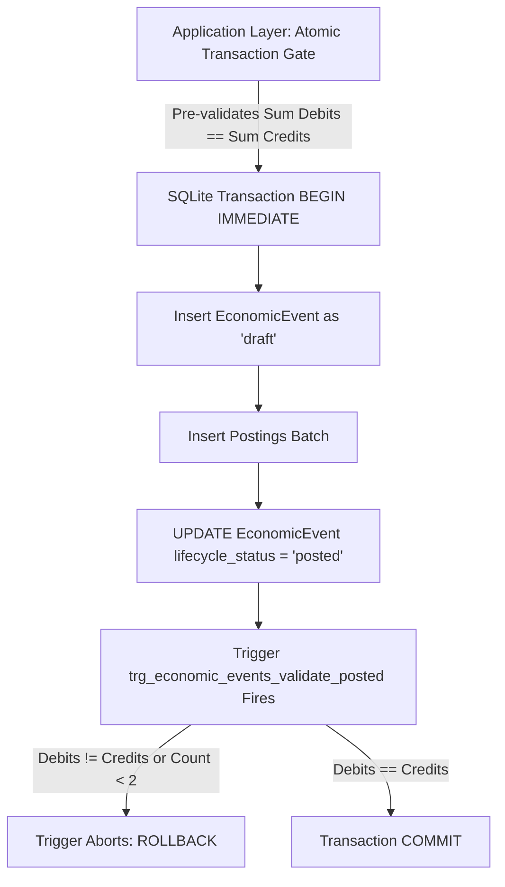

# SpendX 2.0 — Migration v24 Physical Schema Specification

**Document**: `39_MIGRATION_V24_SCHEMA_SPEC.md`  
**Status**: APPROVED CANONICAL DDL SPECIFICATION  
**Scope**: Physical SQLite DDL for SpendX 2.0 Canonical Double-Entry Financial Engine  
**Cross-References**: `01_FINANCIAL_DOMAIN_MODEL.md`, `02_ECONOMIC_EVENT_MODEL.md`, `03_EVIDENCE_AND_EVENT_IDENTITY.md`, `04_DOUBLE_ENTRY_LEDGER.md`, `29_DOMAIN_CONTRACT.md`, `34_FINAL_PRODUCT_DECISION_LOCK.md`

---

## 1. Executive Summary & Design Principles

Migration v24 establishes the physical foundation for SpendX 2.0.
1. **Mathematical Ledger Integrity**: The double-entry equation ($\sum \text{Debits} = \sum \text{Credits}$) is enforced physically at the database layer via deferred triggers and atomic application gates.
2. **Integer Minor Currency Units**: Every monetary amount is stored as a signed 64-bit SQLite `INTEGER` representing **paise (1 INR = 100 paise)**. Floating-point `REAL` is prohibited for all financial balances and postings.
3. **Many-to-One Evidence Architecture**: Economic events are decoupled from ingestion evidence. Multiple pieces of evidence (e.g., an SMS message, a push notification, and an exported CSV row) link to a single `economic_events` record without duplicating ledger postings.
4. **Strict Privacy & SMS Retention Boundary**: Raw SMS body text is retained locally for 30 days maximum, while canonical event identity, extracted metadata, financial amounts, and cryptographic hashes survive indefinitely.

---

## 2. DDL Specification: Canonical Tables

```sql
-- ============================================================================
-- 1. ACCOUNTS TABLE
-- Canonical chart of accounts across all 5 standard accounting roots:
-- Asset, Liability, Equity, Income, Expense.
-- ============================================================================
CREATE TABLE IF NOT EXISTS accounts (
    id TEXT PRIMARY KEY,
    account_type TEXT NOT NULL CHECK(account_type IN ('asset', 'liability', 'equity', 'income', 'expense')),
    subtype TEXT NOT NULL,
    name TEXT NOT NULL,
    currency TEXT NOT NULL DEFAULT 'INR',
    is_active INTEGER NOT NULL DEFAULT 1 CHECK(is_active IN (0, 1)),
    is_system INTEGER NOT NULL DEFAULT 0 CHECK(is_system IN (0, 1)),
    parent_account_id TEXT REFERENCES accounts(id) ON DELETE RESTRICT,
    
    -- Preserved metadata from legacy bank_accounts, credit_cards, and loans:
    institution_name TEXT,
    account_number_last4 TEXT,
    color_hex TEXT,
    icon_name TEXT,
    
    -- Credit Card specific terms:
    credit_limit_minor_units INTEGER CHECK(credit_limit_minor_units >= 0),
    billing_cycle_day INTEGER CHECK(billing_cycle_day BETWEEN 1 AND 31),
    payment_due_day INTEGER CHECK(payment_due_day BETWEEN 1 AND 31),
    
    -- Loan specific terms:
    principal_original_minor_units INTEGER CHECK(principal_original_minor_units >= 0),
    interest_rate_basis_points INTEGER CHECK(interest_rate_basis_points >= 0),
    tenure_months INTEGER CHECK(tenure_months > 0),
    monthly_installment_minor_units INTEGER CHECK(monthly_installment_minor_units >= 0),
    start_date TEXT,
    
    created_at TEXT NOT NULL,
    updated_at TEXT NOT NULL
);

CREATE INDEX IF NOT EXISTS idx_accounts_type_subtype ON accounts(account_type, subtype);
CREATE INDEX IF NOT EXISTS idx_accounts_parent ON accounts(parent_account_id);


-- ============================================================================
-- 2. ECONOMIC EVENTS TABLE
-- Immutable records of real-world financial occurrences.
-- An EconomicEvent owns one or more pieces of Evidence and exactly N balanced Postings.
-- ============================================================================
CREATE TABLE IF NOT EXISTS economic_events (
    id TEXT PRIMARY KEY,
    event_type TEXT NOT NULL CHECK(event_type IN (
        'expense',
        'income',
        'transfer',
        'credit_purchase',
        'liability_settlement',
        'refund',
        'lending_disbursement',
        'lending_repayment',
        'borrowing_disbursement',
        'borrowing_repayment',
        'loan_disbursement',
        'loan_payment',
        'salary_receipt',
        'opening_balance',
        'adjustment'
    )),
    lifecycle_status TEXT NOT NULL DEFAULT 'posted' CHECK(lifecycle_status IN ('draft', 'posted', 'reversed', 'deleted')),
    timestamp TEXT NOT NULL,
    currency TEXT NOT NULL DEFAULT 'INR',
    description TEXT NOT NULL,
    merchant_normalized TEXT,
    category_id TEXT REFERENCES accounts(id) ON DELETE RESTRICT,
    notes TEXT,
    
    -- Traceability and correction linkage:
    reversal_of_event_id TEXT REFERENCES economic_events(id) ON DELETE RESTRICT,
    corrected_by_event_id TEXT REFERENCES economic_events(id) ON DELETE RESTRICT,
    
    created_at TEXT NOT NULL,
    updated_at TEXT NOT NULL
);

CREATE INDEX IF NOT EXISTS idx_events_timestamp ON economic_events(timestamp);
CREATE INDEX IF NOT EXISTS idx_events_type_status ON economic_events(event_type, lifecycle_status);
CREATE INDEX IF NOT EXISTS idx_events_category ON economic_events(category_id);


-- ============================================================================
-- 3. EVIDENCE TABLE
-- Supports many pieces of evidence mapping to a single EconomicEvent.
-- Contains the physical 30-day raw SMS retention boundary.
-- ============================================================================
CREATE TABLE IF NOT EXISTS evidence (
    id TEXT PRIMARY KEY,
    economic_event_id TEXT REFERENCES economic_events(id) ON DELETE CASCADE,
    source_type TEXT NOT NULL CHECK(source_type IN ('sms', 'ocr', 'manual', 'import_csv', 'backup', 'system')),
    
    -- Ingestion facts that survive retention purge:
    extracted_amount_minor_units INTEGER NOT NULL CHECK(extracted_amount_minor_units >= 0),
    extracted_timestamp TEXT NOT NULL,
    sender_address TEXT,
    external_reference TEXT,
    body_sha256 TEXT NOT NULL,
    
    -- Physical 30-day retention boundary fields:
    raw_payload_encrypted TEXT,
    retention_expires_at TEXT,
    is_payload_purged INTEGER NOT NULL DEFAULT 0 CHECK(is_payload_purged IN (0, 1)),
    
    created_at TEXT NOT NULL
);

CREATE INDEX IF NOT EXISTS idx_evidence_event_id ON evidence(economic_event_id);
CREATE INDEX IF NOT EXISTS idx_evidence_external_ref ON evidence(external_reference);
CREATE INDEX IF NOT EXISTS idx_evidence_body_hash ON evidence(body_sha256);
CREATE INDEX IF NOT EXISTS idx_evidence_retention ON evidence(retention_expires_at, is_payload_purged);


-- ============================================================================
-- 4. POSTINGS TABLE
-- The atomic double-entry legs of an EconomicEvent.
-- Model Decision: Non-negative minor units with explicit direction.
-- ============================================================================
CREATE TABLE IF NOT EXISTS postings (
    id TEXT PRIMARY KEY,
    economic_event_id TEXT NOT NULL REFERENCES economic_events(id) ON DELETE CASCADE,
    account_id TEXT NOT NULL REFERENCES accounts(id) ON DELETE RESTRICT,
    sequence_number INTEGER NOT NULL DEFAULT 1 CHECK(sequence_number >= 1),
    
    direction TEXT NOT NULL CHECK(direction IN ('debit', 'credit')),
    amount_minor_units INTEGER NOT NULL CHECK(amount_minor_units > 0),
    currency TEXT NOT NULL DEFAULT 'INR',
    
    created_at TEXT NOT NULL
);

CREATE INDEX IF NOT EXISTS idx_postings_event ON postings(economic_event_id);
CREATE INDEX IF NOT EXISTS idx_postings_account ON postings(account_id);
CREATE INDEX IF NOT EXISTS idx_postings_account_direction ON postings(account_id, direction);


-- ============================================================================
-- 5. ASSET EARMARKS TABLE
-- Virtual goal reservations on asset accounts.
-- Never alters ledger balances; governs "Safe to Spend" derived liquidity.
-- ============================================================================
CREATE TABLE IF NOT EXISTS asset_earmarks (
    id TEXT PRIMARY KEY,
    goal_id TEXT NOT NULL REFERENCES goals(id) ON DELETE CASCADE,
    asset_account_id TEXT NOT NULL REFERENCES accounts(id) ON DELETE RESTRICT,
    amount_minor_units INTEGER NOT NULL CHECK(amount_minor_units >= 0),
    created_at TEXT NOT NULL,
    updated_at TEXT NOT NULL,
    CONSTRAINT uq_goal_account_earmark UNIQUE (goal_id, asset_account_id)
);

CREATE INDEX IF NOT EXISTS idx_earmarks_goal ON asset_earmarks(goal_id);
CREATE INDEX IF NOT EXISTS idx_earmarks_asset_account ON asset_earmarks(asset_account_id);


-- ============================================================================
-- 6. RECURRING RULES & EXPECTED EVENTS TABLES
-- Deterministic commitments and cashflow forecast schedule engine.
-- ============================================================================
CREATE TABLE IF NOT EXISTS recurring_rules (
    id TEXT PRIMARY KEY,
    title TEXT NOT NULL,
    category_account_id TEXT REFERENCES accounts(id) ON DELETE RESTRICT,
    target_account_id TEXT REFERENCES accounts(id) ON DELETE RESTRICT,
    amount_minor_units INTEGER NOT NULL CHECK(amount_minor_units > 0),
    cadence TEXT NOT NULL CHECK(cadence IN ('daily', 'weekly', 'monthly', 'quarterly', 'yearly')),
    day_of_month INTEGER CHECK(day_of_month BETWEEN 1 AND 31),
    day_of_week INTEGER CHECK(day_of_week BETWEEN 1 AND 7),
    next_due_date TEXT NOT NULL,
    is_active INTEGER NOT NULL DEFAULT 1 CHECK(is_active IN (0, 1)),
    created_at TEXT NOT NULL,
    updated_at TEXT NOT NULL
);

CREATE TABLE IF NOT EXISTS expected_events (
    id TEXT PRIMARY KEY,
    rule_id TEXT REFERENCES recurring_rules(id) ON DELETE CASCADE,
    due_date TEXT NOT NULL,
    amount_minor_units INTEGER NOT NULL CHECK(amount_minor_units > 0),
    status TEXT NOT NULL DEFAULT 'pending' CHECK(status IN ('pending', 'fulfilled', 'overdue', 'dismissed')),
    fulfilled_event_id TEXT REFERENCES economic_events(id) ON DELETE SET NULL,
    created_at TEXT NOT NULL
);

CREATE INDEX IF NOT EXISTS idx_expected_due_status ON expected_events(due_date, status);


-- ============================================================================
-- 7. REVIEW CANDIDATES TABLE
-- Separates unreviewed SMS/OCR suggestions from accounting truth.
-- ============================================================================
CREATE TABLE IF NOT EXISTS review_candidates (
    id TEXT PRIMARY KEY,
    source_type TEXT NOT NULL,
    raw_payload TEXT,
    suggested_event_type TEXT NOT NULL,
    suggested_amount_minor_units INTEGER NOT NULL,
    suggested_account_id TEXT REFERENCES accounts(id) ON DELETE SET NULL,
    suggested_category_id TEXT REFERENCES accounts(id) ON DELETE SET NULL,
    confidence_score REAL NOT NULL,
    status TEXT NOT NULL DEFAULT 'pending' CHECK(status IN ('pending', 'approved', 'rejected')),
    created_at TEXT NOT NULL
);
```

---

## 3. Postings Table Design: Option A vs. Option B Evaluation

### Option A: Separate Debit and Credit Columns vs. Direction Enum
We evaluated two industry conventions for the canonical `postings` table:
1. **Option 1: Two non-negative columns (`debit_amount`, `credit_amount`)**.
2. **Option 2: Signed convention (`amount` where positive = debit, negative = credit)**.
3. **Option 3 (Selected): Non-negative `amount_minor_units` with explicit `direction` enum (`debit`, `credit`)**.

### Selection Rationale:
- **Zero Ambiguity**: In signed integer representations (Option 2), developers frequently confuse whether positive denotes account growth (e.g. Assets grow on Debit, but Liabilities grow on Credit). Option 2 leads to inverted signs during liability settlements.
- **Physical Non-Negative Invariant**: `amount_minor_units INTEGER NOT NULL CHECK(amount_minor_units > 0)` physically prevents negative transaction values.
- **Auditing Clarity**: An explicit direction string (`'debit'` or `'credit'`) allows readable SQL reports without requiring custom sign-inversion logic in application code.

---

## 4. Balanced Event Enforcement Architecture

SQLite does not support table-level CHECK constraints across multiple rows, nor does it support deferred triggers. To physically guarantee $\sum \text{Debits} = \sum \text{Credits}$ without race conditions, SpendX 2.0 implements a strict **Lifecycle State Machine + Native SQLite Trigger Suite**:



### Physical SQLite Trigger Suite:
```sql
-- 1. Prevent inserting an event directly as 'posted'
CREATE TRIGGER IF NOT EXISTS trg_economic_events_prevent_direct_posted_insert
BEFORE INSERT ON economic_events
FOR EACH ROW
WHEN NEW.lifecycle_status = 'posted'
BEGIN
    SELECT RAISE(ABORT, 'EconomicEvents must be created with lifecycle_status = "draft".');
END;

-- 2. Validate balance when transitioning from 'draft' to 'posted'
CREATE TRIGGER IF NOT EXISTS trg_economic_events_validate_posted
BEFORE UPDATE OF lifecycle_status ON economic_events
FOR EACH ROW
WHEN NEW.lifecycle_status = 'posted' AND OLD.lifecycle_status != 'posted'
BEGIN
    SELECT CASE
        WHEN (
            SELECT COUNT(*) FROM postings WHERE economic_event_id = NEW.id
        ) < 2
        THEN RAISE(ABORT, 'Accounting Invariant Violation: Event must have at least 2 postings before commit.')
        
        WHEN (
            SELECT COALESCE(SUM(CASE WHEN direction = 'debit' THEN amount_minor_units ELSE -amount_minor_units END), 0)
            FROM postings
            WHERE economic_event_id = NEW.id
        ) != 0
        THEN RAISE(ABORT, 'Accounting Invariant Violation: Sum(Debits) != Sum(Credits).')
    END;
END;

-- 3. Prevent inserting postings into an already-posted event
CREATE TRIGGER IF NOT EXISTS trg_postings_prevent_insert_on_posted
BEFORE INSERT ON postings
FOR EACH ROW
WHEN (SELECT lifecycle_status FROM economic_events WHERE id = NEW.economic_event_id) = 'posted'
BEGIN
    SELECT RAISE(ABORT, 'Cannot add postings to an already-posted EconomicEvent.');
END;

-- 4. Prevent updating postings belonging to a posted event
CREATE TRIGGER IF NOT EXISTS trg_postings_prevent_update_on_posted
BEFORE UPDATE ON postings
FOR EACH ROW
WHEN (SELECT lifecycle_status FROM economic_events WHERE id = OLD.economic_event_id) = 'posted'
BEGIN
    SELECT RAISE(ABORT, 'Postings of a posted EconomicEvent are immutable.');
END;

-- 5. Prevent deleting postings belonging to a posted event
CREATE TRIGGER IF NOT EXISTS trg_postings_prevent_delete_on_posted
BEFORE DELETE ON postings
FOR EACH ROW
WHEN (SELECT lifecycle_status FROM economic_events WHERE id = OLD.economic_event_id) = 'posted'
BEGIN
    SELECT RAISE(ABORT, 'Postings of a posted EconomicEvent cannot be deleted.');
END;
```

---

## 5. Raw SMS Retention Boundary Contract

1. **At Ingestion**:
   - `raw_payload_encrypted` stores the encrypted message body.
   - `retention_expires_at` is set to `date(timestamp, '+30 days')`.
   - `body_sha256` stores SHA-256 hash of the normalized message body.
   - `extracted_amount_minor_units`, `extracted_timestamp`, `sender_address`, and `external_reference` are populated.
2. **At Purge Expiry (After 30 Days)**:
   - `UPDATE evidence SET raw_payload_encrypted = NULL, is_payload_purged = 1 WHERE retention_expires_at <= datetime('now') AND is_payload_purged = 0;`
3. **Survival Invariant**:
   - The purge sets `raw_payload_encrypted` to `NULL`.
   - **All financial fields (`extracted_amount_minor_units`, `timestamp`, `external_reference`, `body_sha256`, `economic_event_id`) remain intact**.
   - Event identity, duplicate detection, and accounting ledger postings are 100% unaffected by the purge.
