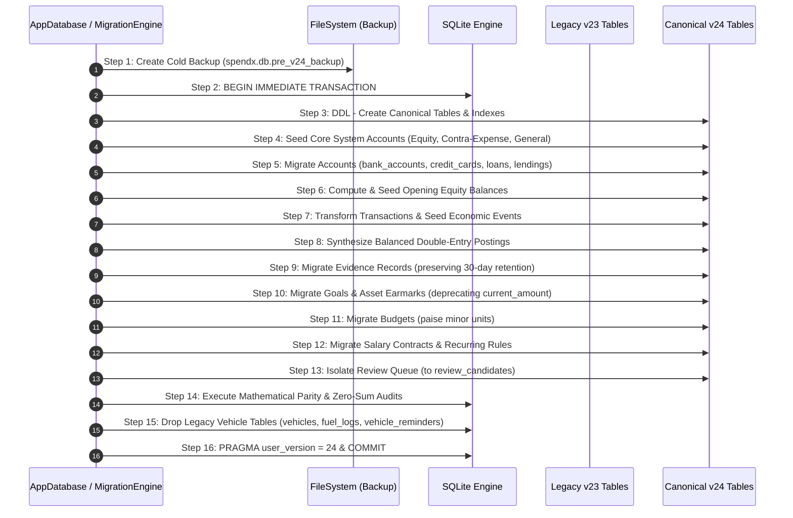

# SpendX 2.0 — Migration v24 Step-by-Step Execution Blueprint

**Document**: `40_MIGRATION_V24_EXECUTION_PLAN.md`  
**Status**: APPROVED EXECUTION BLUEPRINT  
**Scope**: Deterministic, Atomic, Restart-Safe Execution Sequence for Migration v24  
**Cross-References**: `15_LEGACY_MIGRATION_STRATEGY.md`, `31_MIGRATION_BOUNDARY.md`, `36_PHYSICAL_SCHEMA_BASELINE.md`, `39_MIGRATION_V24_SCHEMA_SPEC.md`

---

## 1. Executive Migration Guarantees

Migration v24 transitions existing user databases from schema v23 to the canonical double-entry architecture.
1. **Atomicity**: The entire migration executes inside a single `BEGIN IMMEDIATE ... COMMIT` SQL transaction. Any failure triggers an immediate `ROLLBACK`, leaving the v23 database completely intact.
2. **Cold Snapshot Pre-Backup**: Before acquiring the database write lock, the migration engine copies `spendx.db` to `spendx.db.pre_v24_backup` with a SHA-256 checksum.
3. **Mathematical Balance Parity**: For every asset and liability account:
   $$\text{LegacyBalance} = \text{OpeningBalance} + \sum \text{Postings}$$
   If any account has $|\text{LegacyBalance} - \text{TargetBalance}| > 0 \text{ paise}$, the migration aborts unless an explicit discrepancy equity absorption rule applies.
4. **Idempotency & Restart Safety**: The migration checks `PRAGMA user_version`. If already $\ge 24$, execution exits immediately without re-processing.
5. **Vehicle Elimination**: Obsolete legacy vehicle tables (`vehicles`, `fuel_logs`, `vehicle_reminders`) are dropped as the final schema cleanup step after all legitimate fuel expenses have been verified in the canonical ledger.

---

## 2. Deterministic 16-Step Dependency Order



---

## 3. Detailed Step-by-Step Execution Sequence

### Step 1: Cold Snapshot Pre-Backup
- Create a physical byte-for-byte copy: `spendx.db.pre_v24_backup`.
- Compute and verify SHA-256 checksum of the backup file.
- If storage is insufficient or copying fails, **abort immediately** before touching the database.

### Step 2: Acquire Write Lock & Begin Transaction
- `BEGIN IMMEDIATE;`
- Read `PRAGMA user_version`. If `user_version >= 24`, commit and return `ALREADY_MIGRATED`.

### Step 3: Create Target v24 Schema (DDL)
- Execute `CREATE TABLE IF NOT EXISTS` for:
  - `accounts`
  - `economic_events`
  - `evidence`
  - `postings`
  - `asset_earmarks`
  - `recurring_rules`
  - `expected_events`
  - `review_candidates`
- Do not install deferred triggers yet to allow bulk batch insertion during steps 5–13.

### Step 4: Provision Core System Accounts
- Seed foundational system accounts required for balancing transfers, contra-expenses, and opening baselines:
  - `Equity:OpeningBalance` (`id: 'sys_equity_opening'`)
  - `Equity:ReconciliationAdjustment` (`id: 'sys_equity_adj'`)
  - `Expense:General:Refunds` (`id: 'sys_exp_refunds'`)
  - `Expense:General:Miscellaneous` (`id: 'sys_exp_misc'`)
  - `Income:General:Miscellaneous` (`id: 'sys_inc_misc'`)
  - `Expense:Financial:Interest` (`id: 'sys_exp_interest'`)

### Step 5: Migrate Accounts
1. **Bank Accounts**:
   ```sql
   INSERT INTO accounts (id, account_type, subtype, name, currency, is_active, institution_name, account_number_last4, created_at, updated_at)
   SELECT id, 'asset', 'liquid_cash', name, 'INR', 1, bank, last4, created_at, updated_at
   FROM bank_accounts;
   ```
2. **Credit Cards**:
   ```sql
   INSERT INTO accounts (id, account_type, subtype, name, currency, is_active, institution_name, account_number_last4, credit_limit_minor_units, billing_cycle_day, payment_due_day, created_at, updated_at)
   SELECT id, 'liability', 'credit_card', name, 'INR', 1, bank, last4, CAST(ROUND(credit_limit * 100) AS INTEGER), billing_day, due_day, created_at, created_at
   FROM credit_cards;
   ```
3. **Loans**:
   ```sql
   INSERT INTO accounts (id, account_type, subtype, name, currency, is_active, institution_name, principal_original_minor_units, interest_rate_basis_points, tenure_months, monthly_installment_minor_units, start_date, created_at, updated_at)
   SELECT id, 'liability', 'loan', name, 'INR', 1, bank, CAST(ROUND(principal_amount * 100) AS INTEGER), CAST(ROUND(interest_rate * 100) AS INTEGER), tenure_months, CAST(ROUND(monthly_installment * 100) AS INTEGER), start_date, datetime('now'), datetime('now')
   FROM loans;
   ```
4. **Categories**:
   ```sql
   INSERT INTO accounts (id, account_type, subtype, name, currency, is_active, color_hex, icon_name, created_at, updated_at)
   SELECT id, type, 'category', name, 'INR', 1, color, icon, datetime('now'), datetime('now')
   FROM categories;
   ```

### Step 6: Compute & Seed Opening Equity Balances
For every asset and liability account:
1. Calculate the sum of historical transactions that will be migrated ($\sum \text{HistoricalPostings}$).
2. Determine the required opening baseline:
   $$\text{OpeningEquityPaise} = \text{round}(\text{LegacyBalance} \times 100) - \sum \text{HistoricalPostings}$$
3. If $\text{OpeningEquityPaise} \ne 0$:
   - Insert an `economic_events` record of type `opening_balance`.
   - Insert balancing postings:
     - For Asset: `DEBIT Asset:Account` $\text{OpeningEquityPaise}$, `CREDIT Equity:OpeningBalance` $\text{OpeningEquityPaise}$.
     - For Liability: `DEBIT Equity:OpeningBalance` $\text{OpeningEquityPaise}$, `CREDIT Liability:Account` $\text{OpeningEquityPaise}$.

### Step 7 & 8: Transform Transactions & Insert Balanced Postings
- Process `transactions` joined with `ledger_transactions` according to the mapping matrix in `37_LEGACY_TRANSACTION_MAPPING.md`.
- Soft-deleted rows (`is_deleted = 1`) are inserted with `lifecycle_status = 'deleted'` and generate **0 postings**.
- Active rows generate an `economic_events` record and 2 (or more) balancing `postings` with `amount_minor_units = round(amount * 100)`.

### Step 9: Migrate Evidence Records
- For each migrated transaction having an `external_ref`, notes, or raw SMS origin:
  - Generate an `evidence` record linked to the `economic_event_id`.
  - Compute `body_sha256 = sha256(external_ref ?? id)`.
  - Set `retention_expires_at = datetime(date, '+30 days')`.
  - Set `is_payload_purged = CASE WHEN datetime(date, '+30 days') <= datetime('now') THEN 1 ELSE 0 END`.
  - Set `raw_payload_encrypted = NULL` if expired.

### Step 10: Migrate Goals & Asset Earmarks
- Insert records from `goals` into canonical `goals` table.
- Convert `goal_logs` into `asset_earmarks`:
  ```sql
  INSERT INTO asset_earmarks (id, goal_id, asset_account_id, amount_minor_units, created_at, updated_at)
  SELECT id, goal_id, (SELECT account_id FROM goals WHERE id = goal_logs.goal_id), CAST(ROUND(amount * 100) AS INTEGER), created_at, created_at
  FROM goal_logs;
  ```
- Deprecate mutable `goals.current_amount`. The UI now derives goal progress via $\sum \text{asset\_earmarks}$.

### Step 11: Migrate Budgets
- Convert `budgets` rows to integer minor units:
  ```sql
  UPDATE budgets SET limit_amount = CAST(ROUND(limit_amount * 100) AS INTEGER);
  ```

### Step 12: Migrate Salary & Recurring Rules
- Map active `salary_contracts` base salary to integer paise:
  ```sql
  UPDATE salary_contracts SET base_salary = CAST(ROUND(base_salary * 100) AS INTEGER);
  ```
- Map `recurring_templates` into canonical `recurring_rules` with cadence and minor units.

### Step 13: Isolate Review Queue
- Copy `review_queue` rows to `review_candidates`.
- Verify zero records from `review_queue` entered `economic_events` or `postings`.

### Step 14: Mathematical Parity & Zero-Sum Invariant Verification
Execute pre-commit assertion checks:
1. **Event Balance Check**:
   ```sql
   SELECT economic_event_id, SUM(CASE WHEN direction = 'debit' THEN amount_minor_units ELSE -amount_minor_units END) AS delta
   FROM postings
   GROUP BY economic_event_id
   HAVING delta != 0;
   ```
   *Expectation*: Zero rows returned. Any row aborts the migration.
2. **Account Parity Check**:
   Verify for every bank account that:
   $$\text{LegacyBalancePaise} = \sum_{\text{debits}} \text{amount} - \sum_{\text{credits}} \text{amount}$$
   Any unapproved difference aborts the transaction.

### Step 15: Drop Legacy Vehicle Tables
Once all fuel expenses are verified in canonical postings:
```sql
DROP TABLE IF EXISTS fuel_logs;
DROP TABLE IF EXISTS vehicle_reminders;
DROP TABLE IF EXISTS vehicles;
```

### Step 16: Install Trigger Suite, Update Version & Commit
- Install 5-trigger lifecycle validation & immutability suite (`trg_economic_events_prevent_direct_posted_insert`, `trg_economic_events_validate_posted`, `trg_postings_prevent_insert_on_posted`, `trg_postings_prevent_update_on_posted`, `trg_postings_prevent_delete_on_posted`).
- Update existing migrated events from `'draft'` to `'posted'`.
- Freeze legacy tables (`transactions`, `ledger_transactions`) as read-only or dropped.
- `PRAGMA user_version = 24;`
- `COMMIT;`

---

## 4. Failure Modes & Rollback Strategy

| Failure Stage | Potential Cause | Immediate Action | Database State After Rollback |
|---|---|---|---|
| Step 1 (Backup) | Disk full / permissions error | Halt immediately; throw exception | Untouched v23 database |
| Step 3–4 (DDL) | Syntax error / table conflict | SQL engine triggers automatic rollback | Clean v23 database (zero new tables) |
| Step 5–12 (Data Transformation) | Type mismatch / corrupt legacy row | Log to `migration_exceptions`; rollback | Clean v23 database |
| Step 14 (Invariant Check) | Debit-Credit sum mismatch / Balance drift | Assert fails; trigger rollback | Clean v23 database; error report generated |
| App Crash / Power Loss mid-transaction | Device power off | SQLite WAL journal automatically rolls back uncommitted transaction on restart | Clean v23 database |
