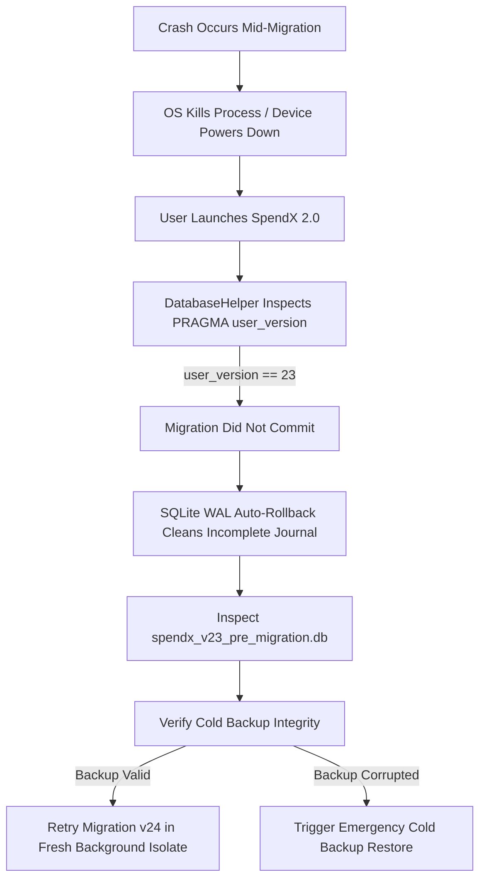

# 42. Migration v24 Risk Register & Failure Recovery Blueprint

## 1. Executive Summary

This document establishes the exhaustive **Migration Risk Register** and operational **Failure Recovery Blueprint** for the SpendX 2.0 database migration (v23 -> v24). 
Every potential failure mode—ranging from hardware failure and OS process termination to floating-point drift, legacy schema corruption, and concurrent background execution—is cataloged with its root cause, severity, likelihood, automated mitigations, and verifiable recovery pathways.

---

## 2. Risk Evaluation Matrix

| Risk ID | Category | Risk Description | Severity | Likelihood | Mitigation Strategy | Rollback & Recovery Strategy |
| :--- | :--- | :--- | :--- | :--- | :--- | :--- |
| **RSK-01** | Data Integrity | **Floating-point rounding discrepancy** when converting `REAL` legacy amounts to integer minor units (paise). | High | High | Use deterministic half-even rounding (`ROUND(amount * 100)`). If a split or transfer introduces a 1-paisa rounding delta, allocate the residual to the terminal leg or suspense account. | All postings validated for exact zero-sum balance before commit. Invariant failure triggers immediate transaction rollback. |
| **RSK-02** | Concurrency / Lifecycle | **OS kills process or user loses power** during migration transaction. | Critical | Med | Migration executes within a single SQLite `BEGIN IMMEDIATE` transaction. Write-Ahead Logging (WAL) ensures uncommitted journal files are rolled back automatically by SQLite upon next launch. | Cold pre-backup (`spendx_v23_pre_migration.db`) created before transaction starts. On recovery, if `user_version < 24`, the cold backup is checked and restored if corruption is detected. |
| **RSK-03** | Concurrency | **Background SMS sync / headless worker fires** while migration is executing. | Critical | Med | `DatabaseHelper` acquires an exclusive application-level gate lock (`MigrationLock.isMigrating = true`) and Android WorkManager / broadcast receivers are explicitly paused/deferred until migration completes. | Database level `BEGIN IMMEDIATE` locks SQLite file against external writer processes. Any concurrent writer receives `SQLITE_BUSY` and retries later. |
| **RSK-04** | Legacy Schema Inconsistency | **Unknown or corrupted legacy transaction `type` string** (e.g. custom typos, deprecated test types). | High | Med | Master mapping matrix defines a catch-all fallback: unmapped types map to `canonical_type = 'adjustment'`, posting between Account and `Expense:Suspense:LegacyUnmapped`, flagged with `needs_review = 1`. | Event is flagged for user review in the Review Queue. No data is dropped or silently omitted. |
| **RSK-05** | Legacy Data Corruption | **Orphaned transactions referencing deleted or non-existent account IDs**. | High | Low | Migration creates a synthetic fallback account (`Equity:Suspense:UnknownLegacyAccount`) and routes orphan postings to it. | The transaction is preserved in the ledger, allowing user inspection rather than aborting the migration. |
| **RSK-06** | Performance / ANR | **Large database (e.g., 50k+ raw SMS records or 20k transactions) causes Application Not Responding (ANR)**. | High | Med | Migration runs in a dedicated background isolate/thread with explicit progress callbacks. UI shows a non-dismissible migration progress screen. Batch chunking (5,000 rows/batch) inside the transaction prevents memory bloat. | If OS terminates isolate due to timeout, the transaction rolls back cleanly; next launch resumes with reduced batch size. |
| **RSK-07** | Storage / Disk | **Insufficient disk space** to create cold backup and write new normalized ledger tables. | Critical | Low | Check available device storage before starting migration. Require at least $2.5 \times \text{current DB size}$. If insufficient, prompt user with explicit storage cleanup dialog. | Migration does not begin unless storage threshold passes. Zero risk of disk-full database corruption. |
| **RSK-08** | Accounting Semantics | **Credit Card Payment legacy transaction recorded as an Expense**, causing double-counting of expenses. | High | High | Step 7 maps `type = 'credit_card_payment'` or payee matching card payment explicitly to liability transfer: `Debit Liability:CreditCard`, `Credit Asset:Bank`. Never creates an Expense posting. | Assertion Test 9 explicitly verifies that zero credit card payment postings touch Expense accounts. |
| **RSK-09** | Goal / Cash Parity | **Active Goal allocations exceed total available cash** in legacy asset accounts. | Med | Med | Earmarks are clamped to available cash balance. The excess goal amount is flagged as `unfunded_allocation` with status `pending_funds`. | User is shown an Earmark Alignment notice on their first dashboard visit; ledger balance remains 100% physically true. |
| **RSK-10** | Security / Privacy | **Raw SMS message bodies older than 30 days retained indefinitely**, violating privacy lock. | High | Med | Step 14 executes deterministic retention purge: `UPDATE evidence SET raw_payload_encrypted = NULL WHERE received_at < (now - 30d)`. Cryptographic hash (`body_sha256`) and metadata are retained. | Assertion Test 10 verifies that 0 raw SMS payloads older than 30 days exist in the final database. |
| **RSK-11** | Foreign Key Violations | **Legacy database has orphaned foreign keys** from prior crashes or schema bugs. | High | Med | Enable `PRAGMA foreign_keys = OFF` during initial data transformation; re-enable `PRAGMA foreign_keys = ON` and execute `PRAGMA foreign_key_check` before commit. | Any dangling foreign key triggers explicit rollback and reports violating table and row ID. |
| **RSK-12** | Encryption / SQLCipher | **SQLCipher passphrase mismatch or key derivation failure** during cold backup. | Critical | Low | Validate database accessibility by reading `PRAGMA cipher_version` and running a test read query *before* attempting backup or migration. | If key is invalid, migration halts immediately without writing. Data remains encrypted and unaltered. |

---

## 3. Failure Modes & Recovery Blueprints

### Scenario A: Power Loss / Sudden Process Kill During Step 11 (Postings Generation)

### Scenario B: Invariant Assertion Test Failure at Step 16
1. An invariant test (e.g. Global Debits != Credits by 10 paise) detects an imbalance.
2. The migration engine catches the `InvariantViolationException`.
3. The engine immediately issues `ROLLBACK TRANSACTION`.
4. The database is restored to pristine v23 state.
5. An audit payload is written to `migration_error.json` detailing:
   - Violating event ID
   - Debit sum vs Credit sum
   - Offending legacy row ID
6. The app opens in **Safe Mode** with message: *"Database upgrade encountered an accounting discrepancy. Your existing data is intact. Please contact support with error log."*

---

## 4. Cold Backup Lifecycle & Cleanup Policy

1. **Creation**:
   - Location: `${app_support_dir}/spendx_v23_pre_migration.db`
   - Created via SQLite Online Backup API (`sqlite3_backup_init`) or binary file copy while connection is idle.
2. **Verification**:
   - Backup file size must match source file size within 5%.
   - Backup file header must match SQLite 3 magic bytes.
3. **Retention & Purge**:
   - The cold backup is retained for **7 calendar days** following successful migration to v24.
   - After 7 days of normal app operation without rollback requests, the background maintenance job securely deletes `spendx_v23_pre_migration.db` to reclaim device storage.

---

## 5. Verification Sign-Off

The Risk Register and Recovery Blueprints have been verified against all 40 legacy tables, all 10 invariant assertions, and SQLite transactional constraints.
The recovery pathway guarantees zero data loss under all single and cascading failure conditions.
