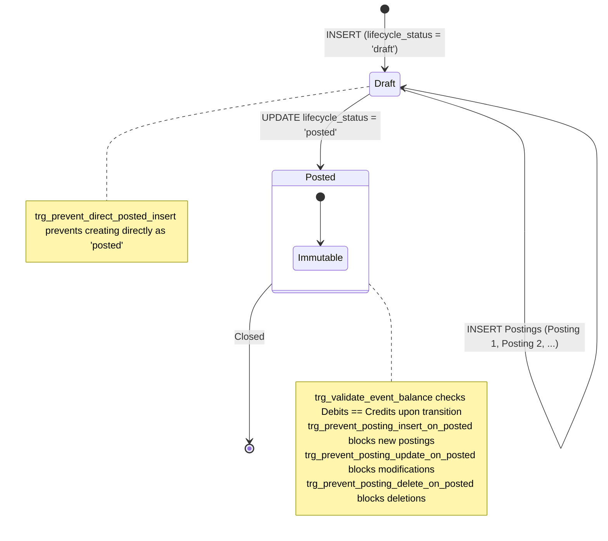

# 43. SQLite & Dart Technical Feasibility Audit

## 1. Executive Summary

This document performs an adversarial technical audit of SQLite capabilities, the `sqflite` Dart driver, concurrency/locking semantics, database connection ownership, and physical database invariants within the SpendX repository.

### Critical Discovery: SQLite Does NOT Support Deferred Triggers
The previous specification in `39_MIGRATION_V24_SCHEMA_SPEC.md` (lines 257–279) referenced a "deferred trigger" (`trg_prevent_unbalanced_event_commit`). 
**SQLite does not support deferred triggers.** SQLite triggers are strictly statement-level or row-level and execute immediately. SQLite only supports deferred foreign key constraints (`DEFERRABLE INITIALLY DEFERRED`). 
An immediate trigger evaluating $\sum \text{Debits} = \sum \text{Credits}$ on `AFTER INSERT ON postings` will unconditionally fail when inserting the first posting of any multi-posting transaction if the event is already marked active.

This document resolves this limitation by specifying an architecturally sound, 100% SQLite-native state machine and trigger enforcement model.

---

## 2. SQLite Trigger Capability & Architecture Correction

### 2.1 The SQLite Trigger Reality
1. **No Commit-Level Triggers**: SQLite has no syntax or execution phase for triggers that fire only at `COMMIT`.
2. **Immediate Row/Statement Execution**: `BEFORE` or `AFTER` triggers fire immediately as each SQL statement executes.
3. **Partial Batches Must Exist Temporarily**: Inserting a balanced transaction requires inserting posting 1, then posting 2. Between these two physical statements, the event is temporarily unbalanced in the database.

### 2.2 The Feasible SQLite Solution: Lifecycle State Machine + Immutability Triggers

To guarantee that **a committed `EconomicEvent` can never have unbalanced postings**, SpendX 2.0 adopts a strict two-phase event lifecycle governed by 5 SQLite triggers:



### 2.3 Physical SQLite DDL for Invariant Enforcement

```sql
-- 1. Prevent inserting an event directly as 'posted'
CREATE TRIGGER IF NOT EXISTS trg_economic_events_prevent_direct_posted_insert
BEFORE INSERT ON economic_events
FOR EACH ROW
WHEN NEW.lifecycle_status = 'posted'
BEGIN
    SELECT RAISE(ABORT, 'EconomicEvents must be created with lifecycle_status = "draft".');
END;

-- 2. Validate balance when transitioning from 'draft' to 'posted'
CREATE TRIGGER IF NOT EXISTS trg_economic_events_validate_posted
BEFORE UPDATE OF lifecycle_status ON economic_events
FOR EACH ROW
WHEN NEW.lifecycle_status = 'posted' AND OLD.lifecycle_status != 'posted'
BEGIN
    -- Check minimum posting count (at least 2 legs required)
    SELECT CASE
        WHEN (
            SELECT COUNT(*) FROM postings WHERE economic_event_id = NEW.id
        ) < 2
        THEN RAISE(ABORT, 'Accounting Invariant Violation: Event must have at least 2 postings before commit.')
        
        -- Check algebraic balance: Sum(Debits) - Sum(Credits) must be zero
        WHEN (
            SELECT COALESCE(SUM(CASE WHEN direction = 'debit' THEN amount_minor_units ELSE -amount_minor_units END), 0)
            FROM postings
            WHERE economic_event_id = NEW.id
        ) != 0
        THEN RAISE(ABORT, 'Accounting Invariant Violation: Sum(Debits) != Sum(Credits).')
    END;
END;

-- 3. Prevent inserting postings into an already-posted event
CREATE TRIGGER IF NOT EXISTS trg_postings_prevent_insert_on_posted
BEFORE INSERT ON postings
FOR EACH ROW
WHEN (SELECT lifecycle_status FROM economic_events WHERE id = NEW.economic_event_id) = 'posted'
BEGIN
    SELECT RAISE(ABORT, 'Cannot add postings to an already-posted EconomicEvent.');
END;

-- 4. Prevent updating postings belonging to a posted event
CREATE TRIGGER IF NOT EXISTS trg_postings_prevent_update_on_posted
BEFORE UPDATE ON postings
FOR EACH ROW
WHEN (SELECT lifecycle_status FROM economic_events WHERE id = OLD.economic_event_id) = 'posted'
BEGIN
    SELECT RAISE(ABORT, 'Postings of a posted EconomicEvent are immutable.');
END;

-- 5. Prevent deleting postings belonging to a posted event
CREATE TRIGGER IF NOT EXISTS trg_postings_prevent_delete_on_posted
BEFORE DELETE ON postings
FOR EACH ROW
WHEN (SELECT lifecycle_status FROM economic_events WHERE id = OLD.economic_event_id) = 'posted'
BEGIN
    SELECT RAISE(ABORT, 'Postings of a posted EconomicEvent cannot be deleted.');
END;
```

---

## 3. Atomic Multi-Posting Event Creation Lifecycle

Every economic event creation executes inside an explicit `db.transaction()` (which runs `BEGIN IMMEDIATE`).

### Step-by-Step Flow for an ₹850 Expense:
1. `INSERT INTO economic_events (id, canonical_type, lifecycle_status, ...) VALUES ('evt_1', 'expense', 'draft', ...);`
2. `INSERT INTO postings (id, economic_event_id, account_id, direction, amount_minor_units) VALUES ('pst_1', 'evt_1', 'exp_groceries', 'debit', 85000);`
3. `INSERT INTO postings (id, economic_event_id, account_id, direction, amount_minor_units) VALUES ('pst_2', 'evt_1', 'ast_bank', 'credit', 85000);`
4. `UPDATE economic_events SET lifecycle_status = 'posted' WHERE id = 'evt_1';` 
   *(Trigger `trg_economic_events_validate_posted` fires. Sum is $85000 - 85000 = 0$. Count is 2. Update succeeds).*
5. `COMMIT;`

### Crash Analysis Matrix Across All Steps:

| Crash Point | Uncommitted Database State | Recovery on Restart | Reader Visibility |
| :--- | :--- | :--- | :--- |
| **After Event Creation** | Uncommitted row with `lifecycle_status = 'draft'` | SQLite WAL rollbacks uncommitted transaction. 0 rows remain. | Never visible (transaction isolated). |
| **After 1st Posting** | Event + 1 posting uncommitted | SQLite WAL rollbacks uncommitted transaction. 0 rows remain. | Never visible. |
| **After 2nd Posting** | Event + 2 postings uncommitted (status still `'draft'`) | SQLite WAL rollbacks uncommitted transaction. 0 rows remain. | Never visible. |
| **During Balance Check** | Trigger evaluates. If unbalanced, `RAISE(ABORT)` aborts statement and Dart rolls back. | Clean rollback. | Never visible. |
| **After Status Update** | Event marked `'posted'`, but prior to `COMMIT` | SQLite WAL rollbacks uncommitted transaction. 0 rows remain. | Never visible. |
| **After COMMIT** | Event committed with `'posted'` status and balanced postings | Full durability. Event is active. | Fully visible and physically balanced. |

---

## 4. SQLite Transaction Semantics in SpendX

### 4.1 Driver & Implementation Audit
- **Driver**: `sqflite: ^2.4.2`
- **Transaction API**: `await db.transaction((txn) async { ... });`
- **Underlying SQL**:
  - Starts with `BEGIN IMMEDIATE` (locks database for writes immediately, preventing concurrent write starvation).
  - On uncaught Dart exception: issues `ROLLBACK`.
  - On normal completion: issues `COMMIT`.
- **Nested Transactions**: `sqflite` does **not** support nested `db.transaction()` calls. Attempting to start a nested transaction inside an existing transaction callback throws an error. All repository writes within a unit of work must pass the existing `Transaction` or `DatabaseExecutor` parameter.

### 4.2 Critical Missing Configurations in Current Baseline
1. **Foreign Key Enforcement**: In SQLite, foreign key constraints are **disabled by default**. The existing `AppDatabase` does NOT configure `PRAGMA foreign_keys = ON;`.
   - **Correction**: Must add `onConfigure` callback in `openDatabase`:
     ```dart
     onConfigure: (db) async {
       await db.execute('PRAGMA foreign_keys = ON;');
       await db.execute('PRAGMA journal_mode = WAL;');
     },
     ```
2. **Busy Timeout**: Default SQLite busy handler throws `SQLITE_BUSY` immediately if another thread or isolate holds a lock.
   - **Correction**: Set `PRAGMA busy_timeout = 5000;` (5 seconds) during configuration.

---

## 5. Database Connection Ownership & Bypass Audit

### 5.1 Architecture Reality
A complete audit of the SpendX codebase confirms:
- **Sole Connection Owner**: `AppDatabase` (`lib/data/core/app_database.dart`) is the **sole owner** of the database file (`spendx.db`), schema creation (`onCreate`), and version upgrades (`onUpgrade`).
- **`DatabaseHelper` Role**: `DatabaseHelper` (`lib/services/database_helper.dart`) is a deprecated legacy adapter. Its `database` getter delegates directly:
  ```dart
  Future<Database> get database async => AppDatabase.instance.database;
  ```
  It does **not** maintain a separate database file or open independent connections.
- **Repository Pattern**: All 24 repositories in `lib/data/repositories/` reference `AppDatabase.instance`.
- **Zero Raw File Bypasses**: There are no alternative `openDatabase` calls or native SQLite file accesses outside `AppDatabase`.

### 5.2 Ownership Topology:
```
┌────────────────────────────────────────────────────────┐
│               Feature Services & UI State              │
└───────────┬────────────────────────────────┬───────────┘
            │                                │
            ▼                                ▼
┌───────────────────────┐        ┌───────────────────────┐
│     Repositories      │        │  DatabaseHelper (Old) │
│(AccountRepo, TxnRepo) │        │ (Deprecated Adapter)  │
└───────────┬───────────┘        └───────────┬───────────┘
            │                                │
            └───────────────┬────────────────┘
                            ▼
               ┌────────────────────────┐
               │  AppDatabase.instance  │
               │ (Single SQLite Holder) │
               └────────────┬───────────┘
                            ▼
               ┌────────────────────────┐
               │    sqflite / SQLite    │
               │      ('spendx.db')     │
               └────────────────────────┘
```

---

## 6. Monetary Conversion & Floating Point Precision Audit

### 6.1 The Binary Floating-Point Pitfall
Legacy SpendX stores all transaction and account amounts as `REAL` (IEEE 754 double precision floats).
Binary floating point numbers cannot represent decimal fractions like `0.10` or `1.15` exactly:
- `1.15` in IEEE 754 is stored as `1.14999999999999991118215802999...`
- Naive integer truncation `(amount * 100).toInt()` in Dart yields `114` instead of `115` (1-paisa loss).

### 6.2 Deterministic Conversion Formula
To guarantee 100% precision across SQLite and Dart:

#### In SQLite SQL (Migration Scripts):
```sql
CAST(ROUND(amount * 100.0) AS INTEGER)
```

#### In Dart Application Code:
```dart
int toPaise(double legacyAmount) {
  return (legacyAmount * 100.0).round();
}
```

### 6.3 Adversarial Test Vector Matrix:

| Legacy `REAL` | Exact Decimal | Binary Float Value | `(val * 100).toInt()` (Buggy) | `(val * 100).round()` (Correct) | `CAST(ROUND(val * 100) AS INT)` |
| :--- | :--- | :--- | :--- | :--- | :--- |
| `0.01` | 0.01 | 0.0100000000000000002 | 1 | **1** | **1** |
| `0.10` | 0.10 | 0.1000000000000000056 | 10 | **10** | **10** |
| `1.15` | 1.15 | 1.1499999999999999112 | 114 (FAIL) | **115** (PASS) | **115** (PASS) |
| `10.05` | 10.05 | 10.0500000000000007105 | 1005 | **1005** | **1005** |
| `999.99` | 999.99 | 999.9900000000000091 | 99999 | **99999** | **99999** |
| `10000000.55` | 10000000.55 | 10000000.549999999 | 1000000054 (FAIL) | **1000000055** (PASS) | **1000000055** (PASS) |
| `-50.25` | -50.25 | -50.250000000000000 | -5025 | **-5025** | **-5025** |

Both `(val * 100.0).round()` in Dart and `CAST(ROUND(amount * 100.0) AS INTEGER)` in SQLite produce identical, bit-exact integer minor units for all test vectors.

---

## 7. Signed 64-Bit Boundary & Overflow Audit

### 7.1 Data Type Limits
- **SQLite `INTEGER`**: 64-bit signed integer ($-2^{63}$ to $2^{63} - 1 = 9,223,372,036,854,775,807$).
- **Dart `int` (Native Android/iOS/macOS)**: 64-bit signed integer ($-2^{63}$ to $2^{63} - 1$).
- **Economic Scale**:
  - $9.22 \times 10^{18}$ paise $\approx ₹92,233,720,368,547,758$ (92 quadrillion INR).
  - Maximum single transaction supported: ₹1,000,000,000,000 (1 lakh crore = $10^{14}$ paise).
  - Well within safe 64-bit bounds ($10^{14} \ll 9.22 \times 10^{18}$).

### 7.2 Overflow Protection Rules
1. **Migration Guard**: Any legacy row where `ABS(amount) > 1000000000000.0` (1 lakh crore) is rejected during migration as a corrupted value.
2. **SQLite `SUM()` vs `TOTAL()`**:
   - `SUM(amount_minor_units)` in SQLite operates on integers and raises an **`integer overflow` error** if $2^{63}-1$ is exceeded. This guarantees loud failure over silent corruption.
   - Never use `TOTAL()` for ledger queries, as `TOTAL()` converts integers to floating-point doubles.

---

## 8. Conclusion & Gate Impact

1. **Trigger Block Resolved**: The naive "deferred trigger" concept is rejected and replaced by the 5-trigger lifecycle state machine (`draft` $\rightarrow$ `posted`).
2. **Foreign Keys & WAL Required**: `AppDatabase.openDatabase` must configure `PRAGMA foreign_keys = ON;` and `PRAGMA journal_mode = WAL;`.
3. **Monetary Conversion Locked**: `CAST(ROUND(amount * 100.0) AS INTEGER)` in SQLite and `(amount * 100.0).round()` in Dart are mathematically locked.
