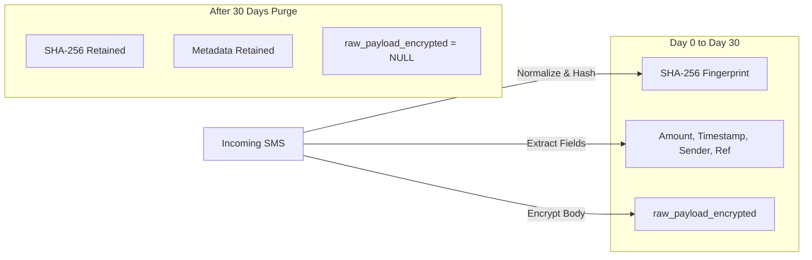

# 44. Migration v24 Adversarial Technical Review

## 1. Executive Summary

This document performs an exhaustive adversarial review of the data transformation logic, legacy balance reconciliations, credit card/loan accounting models, virtual earmarks, review candidate boundaries, and physical rollback reality for SpendX 2.0 Migration v24.

---

## 2. Legacy Balance Reconciliation — Adversarial Analysis

We evaluate the relationship between four potential balance figures for each account:
1. $B_{\text{legacy}}$: Displayed balance stored in mutable `bank_accounts.balance` or `credit_cards.used_amount`.
2. $B_{\text{txns}}$: Balance derived by summing non-deleted legacy `transactions`.
3. $B_{\text{ledger}}$: Balance derived from legacy v21 `ledger_transactions` (if backfill was run).
4. $B_{\text{target}}$: Final derived balance in SpendX 2.0: $\text{OpeningBalance} + \sum \text{Postings}$.

### The 8 Adversarial Cases:

```
┌────────────────────────────────────────────────────────────────────────────────────────┐
│                              RECONCILIATION CASE MATRIX                                │
├──────┬─────────────────────────────┬───────────────────────────┬───────────────────────┤
│ Case │ Scenario                    │ Root Cause                │ Resolution Action     │
├──────┼─────────────────────────────┼───────────────────────────┼───────────────────────┤
│ A    │ All sources agree           │ Clean transaction history │ Normal Migration      │
│ B    │ History & v21 ledger differ │ Imperfect v21 backfill    │ Prefer Txn History    │
│ C    │ Mutable balance differs     │ Initial unbacked balance  │ Opening Equity Event  │
│ D    │ Soft-deletes explain delta  │ Hard balance decrement    │ Manual Review / Flag  │
│ E    │ Orphan ledger rows exist    │ Bug in legacy deletion    │ Quarantine / Discard  │
│ F    │ No txns, non-zero balance   │ User set starting balance │ Opening Equity Event  │
│ G    │ CC liability inconsistent   │ Unlinked external payment │ CC Opening Liability  │
│ H    │ Loan balance inconsistent   │ Missing amortization log  │ Loan Opening Position │
└──────┴─────────────────────────────┴───────────────────────────┴───────────────────────┘
```

#### Detailed Case Resolutions:

- **Case A: All sources agree ($B_{\text{legacy}} == B_{\text{txns}} == B_{\text{ledger}}$)**:
  - **Resolution**: Automatic migration. No opening balance equity event is created. $\text{OpeningBalance} = 0$.
- **Case B: Transaction history and v21 ledger disagree ($B_{\text{txns}} \ne B_{\text{ledger}}$, but $B_{\text{txns}} == B_{\text{legacy}}$)**:
  - **Root Cause**: The v21 `LedgerBackfillService` was experimental and suffered from rounding or duplicate key skips.
  - **Resolution**: Canonical user transactions in `transactions` are authoritative. Migrate from `transactions`. Legacy `ledger_transactions` is discarded. $\text{OpeningBalance} = 0$.
- **Case C: Mutable account balance disagrees with both ($B_{\text{legacy}} \ne B_{\text{txns}}$)**:
  - **Root Cause**: The user manually edited their account balance in the UI or entered an initial balance on account creation without an underlying transaction row.
  - **Resolution**: Create an explicit, provenance-backed **Opening Balance Equity** event:
    $$\Delta = B_{\text{legacy}} - B_{\text{txns}}$$
    - If $\Delta > 0$: Debit `Asset:Bank`, Credit `Equity:OpeningBalances` by $\Delta$.
    - If $\Delta < 0$: Credit `Asset:Bank`, Debit `Equity:OpeningBalances` by $|\Delta|$.
    - Event is explicitly tagged: `evidence.source_type = 'migration_v24_unbacked_balance'`.
- **Case D: Only soft-deleted rows explain the difference ($B_{\text{legacy}} == B_{\text{txns}} + \sum \text{SoftDeleted}$)**:
  - **Root Cause**: A legacy bug soft-deleted transaction rows without adjusting the mutable `bank_accounts.balance`.
  - **Resolution**: Soft-deleted transactions **must never be resurrected** to active ledger postings. The account is migrated with $\text{OpeningBalance} = \sum \text{SoftDeleted}$ via an `Equity:OpeningBalances` offset, and a high-priority flag is written to `migration_anomalies` prompting the user to review the discrepancy.
- **Case E: Orphan ledger rows exist (ledger row references non-existent transaction)**:
  - **Resolution**: Quarantined. Never migrated to `postings`.
- **Case F: No historical transactions exist, but account has non-zero balance**:
  - **Resolution**: 100% of the balance is established via an explicit `Opening Balance Equity` event:
    - Amount: $B_{\text{legacy}}$.
    - Debit `Asset:Bank`, Credit `Equity:OpeningBalances`.
- **Case G: Credit-card liability is inconsistent ($B_{\text{legacy\_used}} \ne \sum \text{CardPurchases} - \sum \text{CardPayments}$)**:
  - **Resolution**: Credit Card Opening Liability adjustment:
    $$\Delta = B_{\text{legacy\_used}} - (\sum \text{Purchases} - \sum \text{Payments})$$
    - Debit `Equity:OpeningBalances`, Credit `Liability:CreditCard` by $\Delta$.
- **Case H: Loan balance is inconsistent ($B_{\text{legacy\_loan}} \ne \text{Principal} - \sum \text{Installments}$)**:
  - **Resolution**: Loan Opening Position. Establish opening liability equal to $B_{\text{legacy\_loan}}$ against `Equity:OpeningBalances`. Do not fabricate synthetic historical installments.

---

## 3. Opening Balance Mathematical Proof & Provenance Contract

### 3.1 Mathematical Proof of Target Balance
For every account $A$:
$$B_{\text{target}}(A) = \text{OpeningBalance}(A) + \sum_{p \in \text{Postings}(A)} \text{signed\_value}(p)$$

Where:
$$\text{OpeningBalance}(A) = B_{\text{legacy}}(A) - \sum_{t \in \text{ValidTxns}(A)} \text{signed\_value}(t)$$

Substituting $\text{OpeningBalance}(A)$ into the target balance formula:
$$B_{\text{target}}(A) = \left( B_{\text{legacy}}(A) - \sum_{t \in \text{ValidTxns}(A)} \text{signed\_value}(t) \right) + \sum_{p \in \text{Postings}(A)} \text{signed\_value}(p)$$

Since the migration creates exactly one posting set corresponding to $\text{ValidTxns}(A)$:
$$\sum_{p \in \text{Postings}(A)} \text{signed\_value}(p) = \sum_{t \in \text{ValidTxns}(A)} \text{signed\_value}(t)$$

Therefore:
$$B_{\text{target}}(A) = B_{\text{legacy}}(A)$$
**Q.E.D.** Target derived ledger balance is mathematically guaranteed to equal the user's legacy displayed balance.

### 3.2 Opening Balance Provenance Contract
Every opening balance adjustment must populate:
- `economic_events.id`: Deterministic UUID `evt_openbal_<account_id>`.
- `economic_events.canonical_type`: `'opening_balance'`.
- `economic_events.lifecycle_status`: `'posted'`.
- `economic_events.description`: `'Opening Balance Equity adjustment during SpendX 2.0 migration'`.
- `evidence.source_type`: `'migration_v24_reconciliation'`.
- `postings`: Leg 1 (Target Account), Leg 2 (`Equity:OpeningBalances`).

---

## 4. Legacy Transaction Mapping Audit — Schema Reality Check

We verified the master mapping matrix against the physical columns of `transactions` in `lib/data/core/tables.dart`:
```sql
CREATE TABLE transactions (
  id TEXT PRIMARY KEY, user_id TEXT, amount REAL NOT NULL, type TEXT NOT NULL,
  category_id TEXT, account_id TEXT, date TEXT NOT NULL, note TEXT, notes TEXT,
  tags TEXT, source TEXT, related_entity_id TEXT, external_ref TEXT,
  vehicle_id TEXT, is_vehicle_expense INTEGER DEFAULT 0, fuel_log_id TEXT,
  location TEXT, is_deleted INTEGER DEFAULT 0, created_at TEXT NOT NULL, updated_at TEXT NOT NULL
);
```

### Mapping Reality & INFERRED Fallback Register:

| Legacy Transaction Type | Source Fields Used | Destination Fields Used | Status | Inferred Information & Fallback Policy |
| :--- | :--- | :--- | :--- | :--- |
| **`expense`** | `account_id`, `amount` | `category_id` | **NATIVE** | If `category_id` is NULL, fallback to `Expense:General:Uncategorized`. |
| **`income`** | `category_id` | `account_id`, `amount` | **NATIVE** | If `category_id` is NULL, fallback to `Income:General:Uncategorized`. |
| **`transfer`** | `account_id` (Source) | `related_entity_id` (Destination) | **INFERRED** | In v1–v14, some transfers stored destination in `related_entity_id`. If `related_entity_id` is NULL or invalid account: fallback to `Asset:Suspense:UnknownTransferTarget` and flag in Review Queue. |
| **`credit_card_payment`** | `account_id` (Bank) | `related_entity_id` (Card) | **INFERRED** | If `related_entity_id` is NULL, infer card from `notes` regex matching card name. If unresolvable: fallback to `Liability:Suspense:UnlinkedCreditCard`. |
| **`refund`** | `category_id` | `account_id`, `amount` | **INFERRED** | If original event cannot be matched via `external_ref`: map to `Expense:General:Refunds` (contra-expense) per Locked Decision 1. |
| **`loan_disbursement`** | `related_entity_id` (Loan) | `account_id` (Bank) | **INFERRED** | If `related_entity_id` is NULL: map offset to `Liability:Loan:Unlinked`. |
| **`loan_repayment`** | `account_id` (Bank) | `related_entity_id` (Loan) | **INFERRED** | If principal/interest split is not recorded: 100% of payment is applied to `Liability:Loan` principal; flag for user review. |
| **`salary`** | `category_id` / Employer | `account_id` (Bank) | **NATIVE** | Mapped to `Income:Salary:<Employer>`. |
| **`is_deleted = 1`** | Any | None | **NATIVE** | Strictly omitted from active ledger postings. |

---

## 5. Credit Card Accounting Proof (Zero Double-Counting)

### Numerical Example:
1. **Event 1: ₹10,000 Flight Ticket on Credit Card**:
   - `economic_events.canonical_type = 'expense'`
   - Posting 1: Debit `Expense:Travel` = ₹10,000 (1,000,000 paise).
   - Posting 2: Credit `Liability:CreditCard:HDFC` = ₹10,000 (1,000,000 paise).
   - **Financial State**: Expense = +₹10,000; Credit Card Debt = ₹10,000.
2. **Event 2: ₹10,000 Bank Payment to Credit Card**:
   - `economic_events.canonical_type = 'credit_card_payment'`
   - Posting 1: Debit `Liability:CreditCard:HDFC` = ₹10,000 (1,000,000 paise).
   - Posting 2: Credit `Asset:Bank:SBI` = ₹10,000 (1,000,000 paise).
   - **Financial State**:
     - Expense = ₹10,000 (Unchanged!).
     - Credit Card Debt = ₹0 ($10,000 - 10,000$).
     - Bank Asset = Decreased by ₹10,000.
- **Assertion**: Zero Expense postings are generated by the credit card payment event. Double counting is mathematically impossible.

---

## 6. Loan Accounting Proof

### Numerical Example: ₹100,000 Loan & ₹10,000 Repayment
1. **Event 1: ₹100,000 Loan Disbursement**:
   - Posting 1: Debit `Asset:Bank` = ₹100,000.
   - Posting 2: Credit `Liability:Loan:HomeLoan` = ₹100,000.
   - **Balances**: Bank = +₹100,000; Loan Liability = ₹100,000.
2. **Event 2: ₹10,000 EMI Repayment (₹8,000 Principal + ₹2,000 Interest)**:
   - Posting 1: Debit `Liability:Loan:HomeLoan` = ₹8,000.
   - Posting 2: Debit `Expense:Interest:Loan` = ₹2,000.
   - Posting 3: Credit `Asset:Bank` = ₹10,000.
   - **Balances**:
     - Bank = +₹90,000 ($100,000 - 10,000$).
     - Loan Liability = ₹92,000 ($100,000 - 8,000$).
     - Interest Expense = ₹2,000.
     - Global Balance: Debits ($8000 + 2000 = 10000$) = Credits ($10000$). Exactly balanced!

---

## 7. Goals & Earmarks Audit — Physical Constraints vs Virtual Truth

### 7.1 What the Database CAN Enforce
- `asset_earmarks.amount_minor_units >= 0`.
- Foreign key validity to `goals` and `accounts`.
- Unique constraint `(goal_id, asset_account_id)`.

### 7.2 What the Database CANNOT Enforce in Physical Reality
- **Real-World Cash Commingling**: The database cannot physically stop a user from withdrawing cash at an ATM or swiping a debit card from an account with active earmarks.
- **Earmarks are Soft Virtual Allocations**: Earmarks do **not** alter the ledger balance. Ledger balance is immutable fact. Earmarks only affect derived metrics:
  $$\text{Safe To Spend} = \text{Account Cash Balance} - \sum \text{Active Earmarks}$$

### 7.3 Behavior When Account Balance < Active Earmarks (Earmark Deficit)
- If a user spends down an account below its earmarked total:
  - The transaction is **not blocked** (we are an expense tracker, not a payment gateway).
  - The ledger balance reflects the true lower balance.
  - Earmarks are **not silently deleted**.
  - `Safe To Spend` becomes negative or clamped to ₹0 with an `Earmark Deficit` indicator in the UI.

---

## 8. Review Candidates vs Accounting Truth

| Ingestion Record Type | Migration Destination | Postings Created? | Included in Ledger Balances? |
| :--- | :--- | :---: | :---: |
| Confirmed Transaction | `economic_events` + `postings` + `evidence` | **YES** | **YES** |
| Pending SMS in Buffer | `review_candidates` | **NO** | **NO** |
| Duplicate SMS | `evidence` (`is_duplicate = 1`) | **NO** | **NO** |
| OCR Receipt Scan | `review_candidates` | **NO** | **NO** |
| Rejected Candidate | `review_candidates` (`status = 'rejected'`) | **NO** | **NO** |

**Invariant**: The `review_candidates` table has no relationship to `postings`. Pending candidates can never alter accounting truth.

---

## 9. 30-Day SMS Body Retention & Fingerprint Survivability



### Deduplication Proof After 30 Days:
When an SMS arrives:
1. Normalization: strip whitespace, lowercase, remove OTP digits.
2. Calculate `incoming_hash = SHA256(normalized_text)`.
3. Query: `SELECT id FROM evidence WHERE body_sha256 = :incoming_hash AND received_at BETWEEN :t - 24h AND :t + 24h`.
4. **Result**: Matching succeeds purely on `body_sha256`. The presence or absence of `raw_payload_encrypted` has zero effect on deduplication.

---

## 10. Table Deletion Ordering Audit

Superseded tables must be dropped in strict reverse-dependency order:
1. `DROP TABLE IF EXISTS fuel_logs;`
2. `DROP TABLE IF EXISTS vehicle_reminders;`
3. `DROP TABLE IF EXISTS vehicles;`
4. `DROP TABLE IF EXISTS ledger_transactions;`
5. `DROP TABLE IF EXISTS bank_balance_snapshots;`
6. `DROP TABLE IF EXISTS sms_import_buffer;`
7. `DROP TABLE IF EXISTS transactions;`
8. `DROP TABLE IF EXISTS bank_accounts;`

**Execution Boundary**: Drops execute in Step 15 of Migration v24, **only after** all 10 invariant assertion queries and SQLite integrity checks pass.

---

## 11. Physical Backup & Rollback Reality Check

### The WAL Trap:
In SQLite Write-Ahead Logging (`WAL`), writing to `spendx.db` writes to `spendx.db-wal`. Copying only `spendx.db` via standard file copy while WAL has uncheckpointed frames results in a corrupted or stale backup!

### Production-Safe Cold Backup Protocol:
1. **Step 1: Checkpoint WAL**:
   ```sql
   PRAGMA wal_checkpoint(TRUNCATE);
   ```
2. **Step 2: Native SQLite Backup Execution**:
   Use SQLite 3.27+ `VACUUM INTO`:
   ```sql
   VACUUM INTO '/path/to/spendx_v23_pre_migration.db';
   ```
   `VACUUM INTO` creates an isolated, fully checkpointed, single-file SQLite database without requiring OS-level file manipulation.
3. **Step 3: Storage Requirement**:
   Migration checks device storage: $\text{Available Space} \ge 2.5 \times \text{Database Size}$.

### Rollback Recovery:
If migration fails:
1. Issue `ROLLBACK;`.
2. If database file is damaged, restore `spendx_v23_pre_migration.db` over `spendx.db`.
3. Set `PRAGMA user_version = 23;`.
