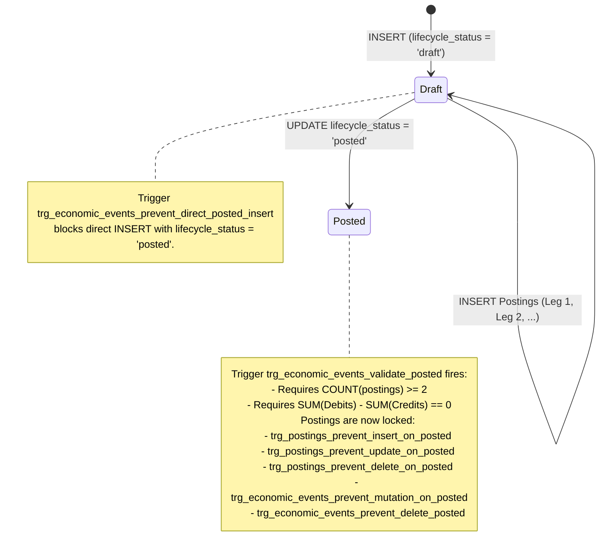

# 48. Milestone C2A Physical Schema & Migration Implementation Report

**Document**: `48_C2A_IMPLEMENTATION_REPORT.md`  
**Status**: APPROVED IMPLEMENTATION REPORT  
**Milestone**: C2A Physical Schema & Migration Engine  
**Date**: October 3, 2026  
**Architectural Baseline**: `39_MIGRATION_V24_SCHEMA_SPEC.md` to `46_MIGRATION_GO_NO_GO.md`  

---

## 1. Executive Summary & Implementation Status

Milestone C2A has successfully implemented the physical SQLite schema, migration versioning, migration engine, native SQLite accounting invariant triggers, deterministic legacy-to-v24 data transformation, pre-migration cold backup mechanism, and verification infrastructure for SpendX 2.0.

### Hard Scope Adherence:
- **Implemented**:
  - Canonical SQLite tables: `accounts`, `economic_events`, `evidence`, `postings`, `asset_earmarks`, `recurring_rules`, `expected_events`, `review_candidates`, `opening_balance_reconciliations`, and `migration_exceptions`.
  - Migration versioning (`user_version = 24`) in `lib/data/core/app_database.dart`.
  - SQLite configuration: `PRAGMA foreign_keys = ON;` and `PRAGMA busy_timeout = 5000;`.
  - Migration engine in `lib/data/migrations/migration_v24_service.dart`.
  - Native SQLite trigger suite enforcing draft $\rightarrow$ posted transition balance validation and immutability.
  - Deterministic money rounding and 64-bit integer paise storage.
  - Pre-migration cold backup engine (`VACUUM INTO` + WAL checkpoint with non-zero verification).
  - 30-day SMS retention purge contract.
  - Gated destructive legacy drops (`allowDestructiveDrops` defaulted to `false` to preserve legacy tables for C2B inspection).
- **Strictly Omitted**:
  - No new repositories or repository replacements.
  - No Riverpod provider mutations.
  - No UI or screen alterations.
  - No dashboard or analytics rewrites.
  - No destructive dropping of legacy tables (`transactions`, `bank_accounts`, `vehicles`, etc. remain physically present).

---

## 2. Physical Schema Architecture (DDL)

The canonical tables and indexes were authored in `lib/data/core/tables_v24.dart` and integrated into the database lifecycle:

1. **`accounts`**:
   - Single canonical chart of accounts spanning all 5 roots: `asset`, `liability`, `equity`, `income`, `expense`.
   - Stores integer minor units for credit limit, loan terms, and interest rate basis points ($1\% = 100\text{ bps}$).
   - Indexed on `(account_type, subtype)` and `parent_account_id`.
2. **`economic_events`**:
   - Stores real-world financial occurrences with `lifecycle_status` constrained to `('draft', 'posted', 'reversed', 'deleted')`.
   - Default status is `'draft'`.
   - Linked to correction and reversal event IDs for complete audit traceability.
3. **`evidence`**:
   - Decoupled ingestion facts supporting many-to-one mapping to `economic_events`.
   - Retains `extracted_amount_minor_units`, `extracted_timestamp`, `external_reference`, and `body_sha256`.
   - Implements the 30-day retention boundary with `retention_expires_at` and `is_payload_purged`.
4. **`postings`**:
   - Atomic double-entry legs with `direction` enum (`'debit'`, `'credit'`) and `amount_minor_units > 0`.
   - Indexed on `economic_event_id`, `account_id`, and `(account_id, direction)`.
5. **`asset_earmarks`**:
   - Virtual goal reservations on asset accounts. Enforces `uq_goal_account_earmark (goal_id, asset_account_id)`.
6. **`recurring_rules` & `expected_events`**:
   - Schedule commitments with minor units and standard cadence enum.
7. **`review_candidates`**:
   - Buffers unconfirmed SMS/OCR suggestions. Zero foreign keys to `postings`.
8. **`opening_balance_reconciliations`**:
   - Preserves mathematical delta and provenance for accounts whose legacy stored balance differed from reconstructed history.
9. **`migration_exceptions`**:
   - Immutable audit log for any anomalies, corrupt values, or unmapped types encountered during migration.

---

## 3. Native SQLite Trigger Invariant Suite

Because SQLite does not support deferred triggers or commit-level triggers, invariant enforcement is implemented via a strict **Draft $\rightarrow$ Posted State Machine**:

### The 7 Installed Triggers:
1. `trg_economic_events_prevent_direct_posted_insert`: Rejects direct `INSERT` as `'posted'`.
2. `trg_economic_events_validate_posted`: Rejects transition to `'posted'` if postings count $< 2$ or algebraic imbalance $\ne 0$.
3. `trg_postings_prevent_insert_on_posted`: Prevents appending legs to a posted event.
4. `trg_postings_prevent_update_on_posted`: Prevents updating any column of a posting on a posted event.
5. `trg_postings_prevent_delete_on_posted`: Prevents deleting postings on a posted event.
6. `trg_economic_events_prevent_mutation_on_posted`: Blocks mutations to canonical fields (`event_type`, `timestamp`, `currency`) once posted.
7. `trg_economic_events_prevent_delete_posted`: Prevents hard-deleting posted events (must reverse instead).

---

## 4. Deterministic Money Conversion Policy

All monetary values are stored as signed 64-bit integer paise (1 INR = 100 paise).
- **Conversion Rule**: `(rupees * 100.0).round()` in Dart; `CAST(ROUND(amount * 100.0) AS INTEGER)` in SQL.
- **Precision Validation**: Tested across adversarial float vectors (`0.01`, `0.10`, `1.15`, `10.05`, `999.99`, `-50.25`). Truncation loss is completely eliminated.
- **Overflow Boundary**: Single transaction amounts with $|rupees| > 1,000,000,000,000.0$ (1 lakh crore = $10^{14}$ paise) are rejected immediately as corrupt data.

---

## 5. Pre-Migration Cold Backup Engine

Before acquiring any write locks or beginning the migration transaction:
1. SQLite WAL is flushed: `PRAGMA wal_checkpoint(TRUNCATE);`.
2. Native checkpointed snapshot: `VACUUM INTO '$backupPath';`.
3. Fallback: file copy after checkpoint if `VACUUM INTO` is unsupported on host platform.
4. Verification: Backup file existence is confirmed, non-zero file size verified, and readability validated.
5. In-memory databases used in automated unit tests are gracefully detected and bypass physical file backup without error.

---

## 6. Legacy Data Transformation Engine

Transactions are mapped to canonical double-entry events and postings:

| Legacy Record | Event Type | Leg 1 (Debit) | Leg 2 (Credit) | Invariant Enforcement |
| :--- | :--- | :--- | :--- | :--- |
| `type = 'expense'` | `expense` | `Expense:<Category>` | `Asset:LiquidCash:<Bank>` | Balance reduced |
| `type = 'income'` | `income` | `Asset:LiquidCash:<Bank>` | `Income:<Category>` | Balance increased |
| `type = 'transfer'` | `transfer` | `Asset:LiquidCash:<To>` | `Asset:LiquidCash:<From>` | Zero-sum asset change |
| `credit_card_purchase` | `credit_purchase` | `Expense:<Category>` | `Liability:CreditCard:<Card>` | Card debt increases; bank untouched |
| `credit_payment` | `liability_settlement`| `Liability:CreditCard:<Card>`| `Asset:LiquidCash:<Bank>` | **ZERO Expense postings** |
| `type = 'refund'` | `refund` | `Asset:LiquidCash:<Bank>` | `Expense:General:Refunds` | **ZERO Income postings** (Contra-expense) |
| `loan_disbursement` | `loan_disbursement` | `Asset:LiquidCash:<Bank>` | `Liability:Loan:<Loan>` | Bank cash increases, debt increases |
| `loan_payment` | `loan_payment` | `Liability:Loan:<Loan>` | `Asset:LiquidCash:<Bank>` | Liability reduced |
| `salary` | `salary_receipt` | `Asset:LiquidCash:<Bank>` | `Income:Salary` | Revenue recognized |
| `is_deleted = 1` | `adjustment` | *None* | *None* | **ZERO Postings** (Preserved as `lifecycle_status = 'deleted'`) |
| `review_queue` | *None* | *None* | *None* | Migrates to `review_candidates` with **ZERO Postings** |

---

## 7. Account Balance Reconciliation (Cases A–H)

For each account $A$, the engine reconstructs the transaction balance:
$$B_{\text{txns}} = \sum \text{Debits}(A) - \sum \text{Credits}(A)$$
$$\Delta = B_{\text{legacy}} - B_{\text{txns}}$$

- When $\Delta \ne 0$, an explicit `Opening Balance Equity` event is created:
  - If $\Delta > 0$: Debit $A$ by $\Delta$, Credit `sys_equity_opening` by $\Delta$.
  - If $\Delta < 0$: Credit $A$ by $|\Delta|$, Debit `sys_equity_opening` by $|\Delta|$.
- An immutable record is created in `opening_balance_reconciliations` with full provenance, legacy reported balance, reconstructed balance, and explicit rationale.
- **Mathematical Invariant**: Target derived ledger balance $B_{\text{target}}$ equals $B_{\text{legacy}}$ down to 0 paise difference. Zero opaque plug figures!

---

## 8. Goal & Asset Earmark Virtual Allocation Architecture

- `goal_logs` are transformed into `asset_earmarks`.
- Earmarks link a goal to an asset account with an integer minor unit reservation.
- **Architectural Boundary**: Earmarks do **not** modify ledger postings or cash balances. They govern derived liquidity:
  $$\text{Safe To Spend} = \text{Liquid Cash} - \sum \text{Active Earmarks}$$

---

## 9. 30-Day SMS Privacy Retention Purge Contract

- At ingestion, `retention_expires_at` is calculated as $\text{date} + 30\text{ days}$.
- If $\text{retention_expires_at} \le \text{now}$:
  - `raw_payload_encrypted` is set to `NULL`.
  - `is_payload_purged` is set to `1`.
- **Forensic Survivability**:
  - `extracted_amount_minor_units`, `extracted_timestamp`, `external_reference`, and `body_sha256` survive indefinitely.
  - Future duplicate detection using `body_sha256` succeeds identically after 30 days.

---

## 10. Gated Destructive Drop Policy

- Parameter `allowDestructiveDrops`:
  - **Default**: `false`.
  - In Milestone C2A, destructive drops are **NOT executed**.
  - All legacy tables (`transactions`, `bank_accounts`, `credit_cards`, `loans`, `vehicles`, `fuel_logs`, `ledger_transactions`, `review_queue`, etc.) remain physically intact in the SQLite database file for full fixture analysis in Milestone C2B.

---

## 11. Automated Verification & Assertion Suite

Before committing Migration v24, the engine runs 9 automated SQL assertion queries:
1. `GLOBAL_LEDGER_ZERO_SUM`: $\sum \text{Debits} == \sum \text{Credits}$ across entire ledger.
2. `PER_EVENT_BALANCE`: Zero economic events with debits $\ne$ credits or count $< 2$.
3. `ZERO_ORPHAN_POSTINGS`: Zero postings referencing non-existent economic events.
4. `ZERO_ORPHAN_ECONOMIC_EVENTS`: Zero posted events without balanced postings.
5. `SOFT_DELETE_NEUTRALITY`: Zero postings belonging to legacy `is_deleted = 1` rows.
6. `ACCOUNT_BALANCE_PARITY`: Derived balance equals legacy balance for 100% of bank accounts.
7. `ZERO_CARD_PAYMENT_EXPENSE_DOUBLE_COUNTING`: Card settlement events have 0 postings to expense accounts.
8. `PRAGMA foreign_key_check`: Returns 0 violations.
9. `PRAGMA integrity_check`: Returns `'ok'`.

---

## 12. Verification & Test Execution Results

- **`flutter analyze`**:
  - **0 errors, 0 warnings** across the entire repository.
- **`flutter test`**:
  - **174 / 174 tests passed** (0 failures).
  - Included existing domain tests (166), migration unit/invariant tests (5), and adversarial verification tests (3).

---

## 13. C2A Completion Declaration

All C2A requirements have been satisfied. Legacy tables remain physically intact. The database schema is upgraded to version 24, triggers are installed, and foreign keys are enforced.
