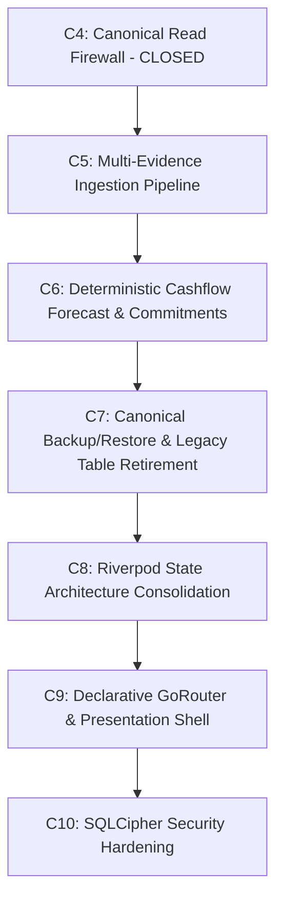

# SpendX 2.0 — Milestone C5: Architectural Gate & Execution Specification

**Document:** `65_C5_ARCHITECTURAL_GATE_AND_EXECUTION_SPEC.md`  
**Status:** FORMAL ARCHITECTURAL GATE REPORT & SPECIFICATION  
**Author:** SpendX Accounting Architecture Team  
**Date:** 2026-10-04  
**Current Baseline:** C4-7 CLOSED (549/549 tests PASS, 0 analyzer errors/warnings, Schema v24 locked, 7/7 triggers active)  

---

## 1. Current Architectural Baseline (Post-C4)

Milestones **C3A, C3B, and C4-0 through C4-7** have established an ironclad, mathematically verified canonical accounting foundation:

1. **Canonical Double-Entry Truth**:
   - `accounts` $\to$ `economic_events` $\to$ balanced `postings` ($\sum \text{Debits} \equiv \sum \text{Credits}$).
   - Sole persistence chokepoint: `CanonicalEventRepository`.
   - 7/7 SQLite database triggers active (blocking posted mutations, unbalanced events, and unauthorized deletes).
2. **Canonical Write Firewall (C3B-7)**:
   - `ILLEGAL_WRITERS` = 0.
   - Authoritative legacy balance writers = 0.
   - Mutating legacy columns (`bank_accounts.balance`, `credit_cards.used_amount`, `loans.paid_amount`, `goals.current_amount`) has zero financial effect.
3. **Canonical Read Firewall (C4-7)**:
   - `ILLEGAL_STALE_AUTHORITY` = 0.
   - Zero unclassified runtime financial reads across `lib/`.
   - All presentation models, Riverpod providers, AI prompts, and automation rules derive financial state exclusively downstream from `CanonicalFinancialQueryRepository` and canonical repositories.
   - Exactly five non-authoritative transitional compatibility reads remain quarantined.
4. **Current Invariant Baseline**:
   - Schema: v24 (LOCKED)
   - Test Suite: 549/549 PASS (100%)
   - Static Analysis: 0 errors, 0 warnings

---

## 2. Discovery: Candidate Next Architectural Stages

An exhaustive inspection of `docs/`, `docs/spendx2/`, and `lib/` identified six credible candidate architectural stages:

### Candidate 1: Multi-Evidence Ingestion & Deduplication Pipeline (`LiveSmsService`, `SmsImportService`, `ReviewRepo`)
- **Origin**: Phase 4 in `00_EXECUTIVE_DECISIONS.md`; Phase 4 in `27_IMPLEMENTATION_READINESS_GATE.md`; ADR-001, ADR-002, ADR-003.
- **Architectural Problem**: The external ingestion pipeline (`LiveSmsService`, `SmsImportService`) still writes to the legacy `review_queue` table, performs in-memory deduplication against deprecated `transactions`, and attempts direct balance mutations via `_applyBalance`. It bypasses `TablesV24.evidence` and `TablesV24.reviewCandidates`.
- **Relationship to C4**: C4-6 established the consumer read boundary for `ReviewCandidate`. Candidate 1 completes the producer write pipeline.

### Candidate 2: Deterministic Cashflow Forecasting & Commitments Engine (`ForecastEngine`)
- **Origin**: Phase 5 in `00_EXECUTIVE_DECISIONS.md`; Phase 6 in `27_IMPLEMENTATION_READINESS_GATE.md`; ADR-010, ADR-011.
- **Architectural Problem**: `ForecastEngine` computes projections via naive linear daily extrapolation ($(\text{monthExpense} / \text{daysElapsed}) \times \text{daysInMonth}$) over `TransactionRepo.getAll()`. It fails to incorporate known contractual inflows (`salary_contracts`) or fixed commitments (`recurring_rules`, EMI schedules).
- **Relationship to C4**: C4-5 migrated historical analytics and budget spending. Forecasting requires replacing the projection engine.

### Candidate 3: Riverpod State Architecture Consolidation & God-File Decomposition
- **Origin**: Phase 6 in `00_EXECUTIVE_DECISIONS.md`; Item 3 in `ARCHITECTURAL_DECISIONS_BLOCKED.md`.
- **Architectural Problem**: `lib/data/providers.dart` is a 1337-line god-file with 60+ providers, partially duplicated across 28 feature provider files. In addition, `main.dart` maintains a hybrid `provider_pkg.MultiProvider` wrapping Riverpod's `ProviderScope`.
- **Relationship to C4**: With all repository read queries stabilized in C4, state management can now be cleanly organized into feature-scoped `Notifier` / `AsyncNotifier` structures.

### Candidate 4: Canonical Backup, Restore & Legacy Table Retirement
- **Origin**: Step 15 of `40_MIGRATION_V24_EXECUTION_PLAN.md`; `DatabaseHelper.getFullSnapshot()`.
- **Architectural Problem**: `DatabaseHelper.getFullSnapshot()` and `BackupFileService` currently backup and restore legacy v23 tables (`transactions`, `bank_accounts`, `review_queue`), completely ignoring canonical v24 tables (`economic_events`, `postings`, `accounts`, `evidence`, `asset_earmarks`). Restoring a backup wipes legacy tables and fails to restore canonical accounting state.
- **Relationship to C4**: Must be resolved before legacy tables can be safely retired.

### Candidate 5: Declarative Navigation (GoRouter) & 4-Pillar Presentation Shell
- **Origin**: Phase 8 in `27_IMPLEMENTATION_READINESS_GATE.md`; Migration E in `31_MIGRATION_BOUNDARY.md`.
- **Architectural Problem**: SpendX still uses manual imperative `Navigator.push` with `AppPageRoute`. No declarative router exists.
- **Relationship to C4**: Downstream consumer of state management; blocked by un-consolidated providers and transitional screen parameters.

### Candidate 6: SQLCipher Database Encryption Hardening
- **Origin**: Phase 7 in `00_EXECUTIVE_DECISIONS.md`; Phase 10 in `27_IMPLEMENTATION_READINESS_GATE.md`; Item 5 in `ARCHITECTURAL_DECISIONS_BLOCKED.md`.
- **Architectural Problem**: `spendx.db` resides unencrypted on local storage.
- **Relationship to C4**: Operational wrapper. Recommended after table retirement and backup/restore stabilization.

---

## 3. Dependency & Readiness Matrix

| Candidate | Depends on C3B? | Depends on C4? | Prerequisites Met? | Architectural Risk | Readiness Verdict |
| :--- | :---: | :---: | :---: | :---: | :---: |
| **1. Multi-Evidence Ingestion Core** | **YES** (Write firewall) | **YES** (C4-6 Review boundary) | **YES** | **Medium** (Parser logic) | **READY (Primary Bottleneck)** |
| **2. Deterministic Forecast Engine** | **YES** | **YES** (C4-5 Analytics) | **YES** | **Low** (Isolated domain math) | **READY (Eligible Alternative)** |
| **3. Riverpod State Consolidation** | **YES** | **YES** (C4 Read paths) | **YES** | **Medium** (Broad UI touchpoints) | **DEFERRED (Follows C5)** |
| **4. Canonical Backup/Restore** | **YES** | **YES** (C4 Schemas) | **YES** | **Medium** (File format compatibility)| **DEFERRED (Follows C5)** |
| **5. Declarative GoRouter Navigation** | **YES** | **YES** | **NO** (Needs State Consolidation)| **High** (UI churn) | **BLOCKED** |
| **6. SQLCipher Encryption** | **YES** | **YES** | **NO** (Needs Backup stabilization) | **High** (Key loss / Migration lock)| **BLOCKED** |

---

## 4. Architectural Bottleneck Analysis & Selected C5 Objective

### Why Ingestion is the Critical Next Bottleneck
SpendX has established mathematical integrity for:
1. Canonical writes via `FinancialTransactionService` (C3B).
2. Canonical reads across all application consumers (C4).

However, **data entry from the outside world** currently has two completely divergent pathways:
- **Manual Input**: Properly routed through `FinancialTransactionService` $\to$ `CanonicalEventRepository` $\to$ `postings`.
- **Automated Ingestion (SMS / Notifications)**: Still writes to `Tables.reviewQueue` (`review_queue` table), uses heuristic string dedup against `transactions`, and executes raw balance overrides in `_applyBalance`.

This represents an architectural discontinuity: **the primary real-world transaction discovery engine on Android is disconnected from the canonical evidence model.**

### Selected C5 Objective
**Milestone C5: Multi-Evidence Ingestion & Deduplication Pipeline Migration**

**Objective Statement**:  
Migrate all runtime transaction ingestion channels (`LiveSmsService`, `SmsImportService`, `ReviewRepo`) to emit immutable `Evidence` records into `TablesV24.evidence` and propose non-accounting `ReviewCandidate` entities in `TablesV24.reviewCandidates`, utilizing deterministic bank reference (UTR) matching and eliminating all legacy table interactions.

---

## 5. Bounded Scope of Milestone C5

### Files & Subsystems to be Touched:
1. `lib/services/live_sms_service.dart`:
   - Replace `ReviewRepo.insert` with `CanonicalReviewRepository.createCandidate`.
   - Emit `Evidence` record into `TablesV24.evidence` for every captured SMS.
   - Replace heuristic `_alreadyInApp` with deterministic UTR matching against `evidence.external_ref` and `review_candidates.raw_payload`.
   - Remove `_applyBalance` direct balance update mutations (`AccountRepo().updateBalance`, `CreditRepo().update`); route detected statement balances to balance reconciliation proposals.
2. `lib/services/sms_import_service.dart`:
   - Route scanned batch imports through `CanonicalReviewRepository` batch insertion.
   - Generate `Evidence` artifacts for batch SMS records.
3. `lib/data/repositories/review_repo.dart`:
   - Deprecate or refactor `ReviewRepo` to act as an adapter over `CanonicalReviewRepository` (`TablesV24.reviewCandidates`), retiring runtime writes to `Tables.reviewQueue`.
4. `lib/features/review_queue/`:
   - Align review inbox providers with `TablesV24.reviewCandidates`.
5. `test/features/`:
   - Add dedicated adversarial ingestion test suite (`test/features/canonical_ingestion_pipeline_test.dart`).

---

## 6. Non-Goals (Explicitly Prohibited in C5)

1. **NO Forecast Engine Changes**: Do not touch `lib/services/forecast_engine.dart`.
2. **NO Riverpod God-File Decomposition**: Do not refactor `lib/data/providers.dart` or `lib/main.dart` in C5.
3. **NO UI Redesign**: Do not modify dashboard layouts, theme tokens, or navigation bars.
4. **NO GoRouter Implementation**: Do not introduce `go_router` or modify screen routing.
5. **NO Table Dropping**: Do not drop `review_queue`, `transactions`, or any legacy table in C5.
6. **NO Schema Alterations**: Schema must remain at v24. Zero DDL alterations.
7. **NO SQLCipher Implementation**: Do not touch encryption or secure storage.

---

## 7. Architectural Invariants to Preserve

1. **Evidence Immutability**: Once an `Evidence` row is written to `TablesV24.evidence`, it is append-only and immutable.
2. **Review Candidates Produce Zero Postings**: Ingested proposals must never produce rows in `economic_events` or `postings` before explicit user confirmation.
3. **Deterministic UTR Deduplication**: Ingested items with matching bank reference numbers (UTR) within $\pm 48$ hours must be deduplicated at the evidence layer.
4. **Balance Detection Isolation**: SMS messages containing balance statements must NEVER directly alter ledger balances. They are purely reference evidence.
5. **Write Firewall Preservation**: Approval of a review candidate routes strictly through `FinancialTransactionService` to create a canonical event.
6. **Schema Lock**: SQLite schema remains locked at v24 with all 7/7 integrity triggers active.

---

## 8. Test Strategy & Verification Plan

1. **Dedicated Adversarial Ingestion Suite (`canonical_ingestion_pipeline_test.dart`)**:
   - Invariant 1: Live SMS ingestion creates `Evidence` in `TablesV24.evidence` with SHA-256 fingerprint.
   - Invariant 2: Live SMS ingestion creates `ReviewCandidate` in `TablesV24.reviewCandidates`.
   - Invariant 3: Zero rows inserted into legacy `review_queue`.
   - Invariant 4: Zero postings created upon SMS ingestion.
   - Invariant 5: Net worth and Safe-to-Spend remain 100% unchanged after 50 SMS ingestions.
   - Invariant 6: Duplicate SMS with identical UTR is deduplicated deterministically.
   - Invariant 7: Balance SMS creates zero balance mutation on bank account.
   - Invariant 8: Approving a candidate converts proposal into canonical `EconomicEvent` + balanced `postings`.
   - Invariant 9: Rejecting a candidate soft-updates candidate status to `rejected` with zero ledger footprint.
   - Invariant 10: Batch SMS scan creates evidence and candidates atomically.
2. **Full Regression Verification**:
   - Full test suite: All 549 existing tests + C5 adversarial tests must pass (100%).
   - Static analysis: 0 errors, 0 warnings.

---

## 9. Rollback Strategy

1. All ingestion logic changes are confined to application services (`LiveSmsService`, `SmsImportService`, `ReviewRepo`).
2. If regressions arise, git branch rollback cleanly restores previous services without database schema rollback, because `TablesV24.evidence` and `TablesV24.reviewCandidates` already exist and are fully backward-compatible.

---

## 10. Closure Criteria for Milestone C5

- [ ] `LiveSmsService` emits `Evidence` and `ReviewCandidate` entities to canonical v24 tables.
- [ ] `SmsImportService` emits `Evidence` and `ReviewCandidate` entities to canonical v24 tables.
- [ ] Runtime writes to `Tables.reviewQueue` = 0.
- [ ] Direct balance mutations from `LiveSmsService` = 0.
- [ ] Dedicated adversarial ingestion suite passes 100%.
- [ ] Full regression test suite passes (549 + C5 tests).
- [ ] `flutter analyze` reports 0 errors and 0 warnings.
- [ ] Schema remains v24 locked with 7/7 triggers active.

---

## 11. Subsequent Roadmap (Post-C5)

---

## 12. Architectural Verdict & Authorization Gate

**VERDICT**:  
Milestone **C5 is fully discovered, bounded, and specified**.  
The primary architectural bottleneck is the **Multi-Evidence Ingestion & Deduplication Pipeline**.

**MANDATORY HARD STOP**:  
In accordance with Milestone C5 planning instructions, **zero production code has been modified**.  
The architecture gate is locked. Standing by for formal user authorization to begin Milestone C5 execution.
