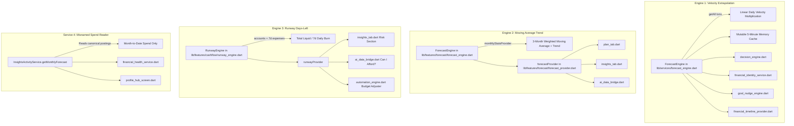

# SpendX 2.0 — Milestone C6 Discovery & Architectural Gate
## Deterministic Forecast Engine — Architecture & Execution Specification

---

### 1. Status

- **Milestone Phase**: **C6 DISCOVERY ONLY**
- **Implementation Status**: **NOT STARTED — BLOCKED PENDING AUTHORIZATION**
- **Preceding Milestones**:
  - C3A / C3A.1 (Canonical Foundation): **CLOSED**
  - C3B-1 through C3B-7 (Write Firewall): **CLOSED**
  - C4-0 through C4-7 (Read Firewall): **CLOSED**
  - C5 (Multi-Evidence Ingestion & Deduplication): **CLOSED / PASS**
- **Hard Stop**: Explicit hard stop active upon completion of this discovery document. No production code, UI, providers, or schema may be modified.

---

### 2. Locked Baseline

The following architectural guarantees are verified and locked:

| Invariant / System Layer | Locked State | Verification Authority |
|---|---|---|
| **SQLite Schema** | **v24 LOCKED** | `TablesV24.schemaVersion == 24` |
| **SQLite Triggers** | **7 / 7 ACTIVE** | Immutability triggers active |
| **Full Project Test Suite** | **566 / 566 PASS** | All repository, feature, adversarial suites pass |
| **Static Analysis** | **0 errors, 0 warnings** | `flutter analyze` clean |
| **Stale Financial Authority** | **0** | Financial state derives solely from `EconomicEvents` + `Postings` |
| **Runtime `review_queue` Writes** | **0** | Decommissioned in C5 |
| **Direct Ingestion Balance Mutations** | **0** | Disarmed and quarantined as canonical `Evidence` |
| **Downstream Accounting Isolation** | **STRICT** | Unconfirmed ingestion proposals produce 0 events, 0 postings |

---

### 3. Existing Forecast Architecture Audit

An exhaustive codebase search across `lib/`, `test/`, and `docs/` revealed an **architectural split** with two independent, conflicting forecast engines and an uncoordinated runway engine:



#### Detailed Findings on Existing Implementations:

1. **`lib/services/forecast_engine.dart` (`ForecastEngine.instance.compute()`)**:
   - Model: `Forecast` (`projectedIncome`, `projectedExpense`, `projectedSavings`, `categoryForecasts`, `dailyBurnRate`, `daysElapsed`, `daysInMonth`, `isOverspendRisk`, `overspendAmount`).
   - Implementation: Loads all transactions via `TransactionRepo().getAll()`. Computes `dailyExpense = monthExpense / daysElapsed` and multiplies by `daysInMonth`.
   - Flaws:
     - Multiplies single-event salaries by remaining calendar days (e.g. ₹150,000 salary on Day 3 becomes ₹1,500,000 projected income).
     - Predicts ₹0 income on Day 20 if salary is paid on Day 28.
     - Performs math with `double` floating-point numbers.
     - Maintains a mutable static `_cache` with a 5-minute timeout that can become stale.
     - Completely ignores loans, credit card billing cycles, and recurring rules.

2. **`lib/features/forecast/forecast_engine.dart` (`ForecastEngine().predict()`)**:
   - Model: `Forecast` (`predictedIncome`, `predictedExpense`, `predictedBalance`, `confidence`).
   - Implementation: Consumes `MonthlyStats` from `monthlyStatsProvider`. Calculates 3-month weighted average (weights 3, 2, 1) and adds linear trend factor ($\pm 30\%$).
   - Flaws:
     - Purely statistical; has zero awareness of upcoming contracted commitments, loan EMIs, rent, or credit card dues.
     - Computes with `double` floats.
     - Name collision: Defines `class Forecast` and `class ForecastEngine`, directly conflicting with `lib/services/forecast_engine.dart`.

3. **`lib/features/cashflow/runway_engine.dart` (`RunwayEngine().calculate()`)**:
   - Model: `Runway` (`totalBalance`, `dailyBurn`, `daysLeft`, `runwayDate`, `status`).
   - Implementation: Divides asset balance by trailing 7-day average daily expense, with a hardcoded floor of ₹50/day and a clamp of 365 days.
   - Flaws:
     - Ignores debt obligations, credit card bills due, and recurring rent.
     - Consumes legacy transaction list instead of canonical postings.

4. **`lib/services/insights_activity_service.dart` (`getMonthlyForecast()`)**:
   - Does not compute a forecast at all; it runs an aggregation query over `TablesV24.postings` for current month-to-date expense.
   - Consumed by `financial_health_service.dart` and `profile_hub_screen.dart`.

---

### 4. Complete Source / Read Inventory

| Code Location | Read Target | Current Classification | C6 Target Classification |
|---|---|---|---|
| `lib/services/forecast_engine.dart:89` | `TransactionRepo.getAll()` | `TRANSITIONAL_COMPATIBILITY` | `CANONICAL_DERIVED` (via Canonical Query) |
| `lib/features/forecast/forecast_provider.dart:10` | `monthlyStatsProvider` | `CANONICAL_DERIVED` | `CANONICAL_DERIVED` |
| `lib/features/forecast/forecast_provider.dart:11` | `accountsProvider` (asset balance) | `CANONICAL_DERIVED` | `CANONICAL_DERIVED` |
| `lib/features/cashflow/runway_provider.dart:9` | `accountsProvider` | `CANONICAL_DERIVED` | `CANONICAL_DERIVED` |
| `lib/features/cashflow/runway_provider.dart:10` | `transactionsProvider` | `CANONICAL_DERIVED` | `CANONICAL_DERIVED` |
| `lib/services/insights_activity_service.dart:36` | `TablesV24.postings` (SQL direct) | `CANONICAL_DERIVED` | `CANONICAL_DERIVED` |
| `lib/services/decision_engine.dart:46` | `ForecastEngine.instance.compute()` | `TRANSITIONAL_COMPATIBILITY` | `CANONICAL_DERIVED` |
| `lib/services/financial_identity_service.dart:35` | `ForecastEngine.instance.compute()` | `TRANSITIONAL_COMPATIBILITY` | `CANONICAL_DERIVED` |
| `lib/services/goal_nudge_engine.dart:42` | `ForecastEngine.instance.compute()` | `TRANSITIONAL_COMPATIBILITY` | `CANONICAL_DERIVED` |
| `lib/features/timeline/financial_timeline_provider.dart:45` | `ForecastEngine.instance.compute()` | `TRANSITIONAL_COMPATIBILITY` | `CANONICAL_DERIVED` |
| `lib/data/repositories/recurring_repo.dart:11` | `Tables.recurring_templates` | `TRANSITIONAL_COMPATIBILITY` | `CANONICAL_DERIVED` (migrate to v24) |
| `lib/services/recurring_engine.dart:10` | `DatabaseHelper.getAllRecurringTemplates` | `TRANSITIONAL_COMPATIBILITY` | `CANONICAL_DERIVED` |

**Audit Result**:
- `ILLEGAL_STALE_AUTHORITY`: **0**
- No forecast code reads un-reconciled legacy balance tables as authoritative source of truth.
- However, multiple paths rely on in-memory linear division over raw transaction lists (`TRANSITIONAL_COMPATIBILITY`).

---

### 5. Existing Recurring / Expected-Event Architecture Audit

#### Schema State (v24):
In `TablesV24`, the schema already defines:
- `recurring_rules`: `id`, `title`, `category_account_id`, `target_account_id`, `amount_minor_units`, `cadence`, `day_of_month`, `day_of_week`, `next_due_date`, `is_active`, `created_at`, `updated_at`.
- `expected_events`: `id`, `rule_id`, `due_date`, `amount_minor_units`, `status` (`pending`, `fulfilled`, `overdue`, `dismissed`), `fulfilled_event_id`, `created_at`.
- Index: `idx_expected_due_status ON expected_events(due_date, status)`.

#### Runtime Reality:
- `RecurringRepo` still reads and writes legacy `recurring_templates` table.
- No canonical repository exists in `lib/data/repositories/canonical/` for `recurring_rules` or `expected_events`.
- `RecurringEngine.checkAndGenerate()` automatically generates transactions when due dates arrive, creating transactions with `source = 'recurring'` and no `accountId` (falling back to `sysSuspenseTransfer`), creating double-counting risk when actual bank SMS is imported.
- No reconciliation mechanism links bank SMS evidence to pending `expected_events`.

---

### 6. Current Forecast Defects Inventory

1. **The Catastrophic Salary Multiplier Defect**:
   $$\text{Income}(T) = \left(\frac{\text{Month-to-Date Income}}{\text{Days Elapsed}}\right) \times \text{Days in Month}$$
   If a user receives a monthly salary of ₹150,000 on Day 3, the current engine predicts a monthly income of ₹1,500,000.
2. **The End-of-Month Insolvency False Alarm**:
   If a user is paid on the 28th of every month, on Day 20 the engine predicts ₹0 income for the month and triggers panic notifications.
3. **Double Engine Contradiction**:
   `lib/services/forecast_engine.dart` and `lib/features/forecast/forecast_engine.dart` use completely different math and models, producing conflicting forecasts across screens.
4. **Float Precision Drift**:
   All current forecast and runway engines use standard Dart `double` floating-point arithmetic rather than `Money` / signed 64-bit integer paise.
5. **Debt Obligation Blindness**:
   Loan installments and credit card statement dues are completely ignored during runway and cashflow projections.
6. **One-Off Purchase Contamination**:
   A single ₹100,000 capital purchase (e.g. laptop) is treated as recurring daily spending velocity, falsely projecting massive deficit.

---

### 7. Canonical Forecast Input Contract

The deterministic forecast engine must consume strictly defined input tiers:

```
┌────────────────────────────────────────────────────────────────────────┐
│                        TIER 1: GROUND TRUTH                            │
│  • Authoritative Liquid Cash: CanonicalFinancialQueryRepository        │
│  • Net Worth: CanonicalFinancialQueryRepository                        │
│  • Active Earmarks: TablesV24.assetEarmarks                            │
└──────────────────────────────────┬─────────────────────────────────────┘
                                   │
┌──────────────────────────────────▼─────────────────────────────────────┐
│                 TIER 2: DETERMINISTIC COMMITMENTS                      │
│  • Known Inflows: Active salary/income rules in expected_events        │
│  • Known Outflows: Loan EMIs (LoanRepo), Card Dues (CreditRepo),       │
│    Active recurring expense rules in expected_events                   │
└──────────────────────────────────┬─────────────────────────────────────┘
                                   │
┌──────────────────────────────────▼─────────────────────────────────────┐
│                TIER 3: STATISTICAL DISCRETIONARY BURN                  │
│  • Trailing 30/60/90-day median daily variable spend                   │
│  • EXCLUDES: Capital one-offs, Loan EMIs, Transfers, Card Payments     │
└──────────────────────────────────┬─────────────────────────────────────┘
                                   │
                                   ▼
                   [ Deterministic Forecast Engine ]
```

---

### 8. Forecast Semantic Contract

For any future date $T$ within the horizon $H \in \{30, 60, 90\}$ days:

$$\text{ProjectedBalance}(T) = \text{LiquidAssets}_{\text{today}} + \sum_{t=\text{today}}^{T} \text{Inflows}(t) - \sum_{t=\text{today}}^{T} \text{Commitments}(t) - \sum_{t=\text{today}}^{T} \text{DailyDiscretionaryBurn}(t)$$

#### Principles:
1. **Starting Point**: Derived strictly from canonical postings via `CanonicalFinancialQueryRepository.getLiquidAssets()`.
2. **Card Purchases vs Payments**:
   - Card purchases represent expenses when incurred.
   - Card bill payments represent liability reductions / transfers of cash; they must **never** be counted as a second expense.
3. **Transfers**:
   - Internal transfers between asset accounts have zero effect on total liquid balance or net worth.
4. **Loans**:
   - Loan EMI repayments consist of principal (liability reduction) and interest (expense). Both draw down liquid cash, but only interest affects net worth.
5. **Goals & Earmarks**:
   - Earmarks deduct from discretionary cash and Safe-to-Spend, but **never** reduce liquid assets or Net Worth.

---

### 9. Horizon Contract

- **Default Horizon**: **30 Days** (used by default on Plan and Insights tabs).
- **Secondary Horizon**: **60 Days**.
- **Tertiary Horizon**: **90 Days**.
- The engine generates a daily projection array: `List<DailyForecastPoint>` where each point represents day $0, 1, \dots, H$.

---

### 10. Uncertainty & Confidence Contract

Every projected inflow and outflow must be tagged with a deterministic confidence tier:

| Tier | Label | Deterministic Criteria | Traceable Source |
|---|---|---|---|
| **Tier 1** | `ACTUAL` | Real posted transaction in canonical ledger | `TablesV24.economicEvents` |
| **Tier 2** | `CONTRACTUAL` | Active loan EMI or contractual subscription with fixed due date | `LoanRepo`, `TablesV24.recurringRules` |
| **Tier 3** | `EXPECTED` | Salary contract or recurring bill with minor timing variance | `TablesV24.expectedEvents` |
| **Tier 4** | `ESTIMATED` | Statistical median daily discretionary spend | Trailing canonical expense postings |
| **Tier 5** | `SCENARIO` | What-if simulation entered by user (e.g. "Can I afford ₹50,000?") | Transient scenario parameter |

No opaque machine learning models or probabilistic guesswork.

---

### 11. Safe-to-Spend Interaction

Safe-to-Spend is a current-day liquidity boundary:
$$\text{DiscretionaryCash} = \text{LiquidAssets} - \text{ActiveEarmarks} - \text{KnownCommitments}_{14\text{d}} - \text{PendingDebits}$$
$$\text{SafeToSpend} = \max(0, \text{DiscretionaryCash})$$
$$\text{CashflowShortfall} = \max(0, -\text{DiscretionaryCash})$$

#### C6 Interaction Rules:
1. The forecast engine **consumes** Safe-to-Spend as the baseline at Day 0.
2. The forecast engine **projects Safe-to-Spend forward**: computes future minimum discretionary cash and predicts the exact calendar date of any upcoming shortfall.
3. The forecast engine **never mutates** Safe-to-Spend state or canonical ledger state.

---

### 12. Forecast Output Contract

To resolve the dual-engine contradiction, a single canonical domain model is required:

#### Proposed Domain Entity: `CashflowForecast` (`lib/domain/finance/cashflow_forecast.dart`)
- `generatedAt`: `DateTime`
- `horizonDays`: `int` (30, 60, or 90)
- `startingLiquidBalance`: `Money`
- `projectedIncome`: `Money`
- `projectedCommittedExpenses`: `Money`
- `projectedDiscretionaryExpenses`: `Money`
- `projectedEndingBalance`: `Money`
- `projectedSavings`: `Money`
- `dailyPoints`: `List<ForecastDayPoint>`
- `confidence`: `ForecastConfidence` (`high`, `medium`, `low`)
- `confidenceLabel`: `String`
- `shortfallDate`: `DateTime?`
- `minimumProjectedBalance`: `Money`
- `runwayDays`: `int`

#### Sub-entity: `ForecastDayPoint`
- `date`: `DateTime`
- `projectedLiquidBalance`: `Money`
- `inflows`: `Money`
- `outflows`: `Money`
- `commitments`: `Money`
- `discretionary`: `Money`

---

### 13. Money & Date Safety

1. **Integer Minor Units**: All internal arithmetic must use `Money` / signed 64-bit integer paise. Floating-point `double` arithmetic is prohibited.
2. **Timezone Normalization**: All dates normalized to local calendar date (`DateTime(year, month, day)`).
3. **Month-End Boundary Safety**: Handle 28, 29, 30, and 31-day months safely (e.g. bills due on the 31st apply to the 28th/29th in February).
4. **Leap Year Safety**: Handled natively via integer calendar arithmetic.

---

### 14. Edge-Case Matrix (30 Invariant Scenarios)

| # | Edge Case Scenario | Expected Deterministic System Behavior |
|---|---|---|
| 1 | Zero income user | Daily discretionary burn and commitments deplete liquid balance; forecast projects exact runway exhaustion date. |
| 2 | Zero expenses user | Flat liquid line modified only by expected income inflows. |
| 3 | Negative current cashflow | Initial shortfall correctly flags deficit; projected curve continues downward slope. |
| 4 | Salary paid early | Salary marked fulfilled; Day 30 does not project phantom second salary. |
| 5 | Salary paid late | Tagged as `EXPECTED (Overdue)`; projected curve retains expectation with delayed indicator. |
| 6 | Irregular salary / Freelance | Excluded from fixed contractual inflows; modeled via rolling median baseline. |
| 7 | Multiple income sources | Aggregated additively by discrete expected due dates. |
| 8 | Recurring monthly expense | Drops liquid balance on exact calendar day each month. |
| 9 | Recurring weekly expense | Drops liquid balance every 7 calendar days. |
| 10 | One-time future commitment | Single step-drop on designated date; does not increase continuous daily burn. |
| 11 | Large historical one-off purchase | Excluded from discretionary burn velocity via anomaly filtering. |
| 12 | Refund received | Offsets historical expense; does not inflate future expected income. |
| 13 | Credit card purchase | Modeled as expense at purchase time; increases card outstanding. |
| 14 | Credit card statement payment | Cash asset transfers to card liability; zero impact on Net Worth; not double-counted as expense. |
| 15 | Loan principal repayment | Cash asset transfers to loan liability; zero impact on Net Worth. |
| 16 | Loan interest payment | Cash asset reduces; expense debited; reduces Net Worth. |
| 17 | Transfer between bank accounts | Cash transfers across accounts; total liquid assets unchanged. |
| 18 | Goal earmark active | Discretionary cash reduced; Net Worth completely unaffected. |
| 19 | Insufficient cash for commitment | Forecast flags deficit date; projects negative liquid position. |
| 20 | Brand new user (zero history) | Flat forecast based solely on starting balance + explicitly configured rules. |
| 21 | Sparse history (<30 days) | Uses conservative 14-day median; confidence tagged `Low (Sparse Data)`. |
| 22 | Very high historical variance | Median dampens outliers; confidence tagged `Medium (High Variance)`. |
| 23 | Duplicate recurring rule | Deduplicated by rule ID; never evaluated twice on same date. |
| 24 | Actual event fulfills expected event | Status transitions to `fulfilled`; expectation removed from forward projection. |
| 25 | Dismissed expected event | Status transitions to `dismissed`; excluded from future cashflow. |
| 26 | 30-day horizon evaluation | Generates exactly 31 daily points (Day 0 to Day 30). |
| 27 | 60-day horizon evaluation | Generates exactly 61 daily points. |
| 28 | 90-day horizon evaluation | Generates exactly 91 daily points. |
| 29 | Month / Year boundary crossing | Correct rollover from December to January; correct leap-year handling. |
| 30 | Opening balance only in ledger | Ground truth established; zero phantom historical burn. |

---

### 15. Adversarial Architectural Invariant Matrix

1. **Canonical Ledger Primacy**: Forecast starting balance derives exclusively from canonical postings (`CanonicalFinancialQueryRepository.getLiquidAssets()`).
2. **Legacy Mutation Immunity**: Rogue SQL update to `bank_accounts.balance` has **zero** effect on forecast starting balance.
3. **Legacy Transaction Immunity**: Rogue SQL insertion into legacy `transactions` table has **zero** effect on canonical forecast.
4. **Stale Card/Loan Immunity**: Rogue mutations to `credit_cards.used_amount` or `loans.paid_amount` have **zero** effect on forecast.
5. **Transfer Invariance**: Internal transfers have **zero** effect on projected total liquid cash or net worth.
6. **Card Double-Count Prevention**: Credit card payments are **never** counted as a second expense in forecast cashflow.
7. **One-Off Contamination Prevention**: Large capital purchases do not inflate daily burn rate.
8. **Delayed Salary Determinism**: Late salary is marked pending without triggering linear extrapolation failure.
9. **Zero Accounting Mutations**: Forecast execution writes **zero rows** to `economic_events`, `postings`, `accounts`, or `evidence`.
10. **Idempotence**: Running the forecast multiple times on identical canonical data yields identical output.
11. **Integer Money Representation**: All internal computations strictly use 64-bit signed integer minor units (`Money`).

---

### 16. Provider & Application Migration Map

```mermaid
flowchart TD
    CanonicalDB[(Canonical SQLite v24)] --> QueryRepo[CanonicalFinancialQueryRepository]
    CanonicalDB --> RecurRepo[CanonicalRecurringRepository (NEW)]
    
    QueryRepo --> CFE[CanonicalForecastEngine (NEW)]
    RecurRepo --> CFE
    
    CFE --> CFP[canonicalForecastProvider (NEW)]
    
    CFP --> CompatFP[forecastProvider (Compatibility Adapter)]
    CFP --> CompatRP[runwayProvider (Compatibility Adapter)]
    
    CompatFP --> PlanTab[PlanTab UI]
    CompatFP --> InsightsTab[InsightsTab UI]
    CompatFP --> AIData[AIDataBridge]
    
    CompatRP --> RunwayUI[InsightsTab Risk Section]
    CompatRP --> AutoEngine[AutomationEngine]
    
    CFE --> TimelineProv[financialTimelineProvider]
    CFE --> DecisionEngine[DecisionEngine]
```

---

### 17. UI Migration Map

| UI Component | File | Current Read | C6 Target Read | Visual Changes |
|---|---|---|---|---|
| Forecast Card | `lib/screens/plan/plan_tab.dart` | `ref.watch(forecastProvider)` | `ref.watch(forecastProvider)` (canonical adapter) | None |
| Next Month Outlook | `lib/screens/insights/insights_tab.dart` | `ref.watch(forecastProvider)` | `ref.watch(forecastProvider)` (canonical adapter) | None |
| Risk / Runway Section | `lib/screens/insights/insights_tab.dart` | `ref.watch(runwayProvider)` | `ref.watch(runwayProvider)` (canonical adapter) | None |
| AI "Can I Afford?" | `lib/features/ai/ai_data_bridge.dart` | `ref.read(runwayProvider.future)` | `ref.read(runwayProvider.future)` (canonical adapter) | None |
| Profile Sustainability | `lib/screens/profile_hub_screen.dart` | `InsightsActivityService.getMonthlyForecast` | Unchanged (MTD spend) | None |

**UI Policy**: Zero UI redesign. Existing presentation widgets consume the migrated canonical providers via non-breaking compatibility adapters.

---

### 18. Performance Considerations

1. **SQL Aggregation vs Dart Loops**:
   - Historical spending median should be computed via single canonical SQL aggregation query over `TablesV24.postings` (grouped by day), rather than loading thousands of transaction objects into Dart heap.
2. **Zero N+1 Queries**:
   - Ground truth liquid cash, active earmarks, and pending commitments are fetched in a single concurrent `Future.wait` bundle.
3. **Deterministic Memoization**:
   - Invalidation tied strictly to Riverpod provider invalidations (`transactionsProvider`, `accountsProvider`, `recurringRulesProvider`), eliminating arbitrary time-based cache bugs.

---

### 19. Exact Implementation File Inventory

#### A. Domain Layer (MUST CREATE / UPDATE):
1. `lib/domain/finance/cashflow_forecast.dart` — **CREATE** (Canonical forecast and day point domain models).
2. `lib/domain/finance/finance.dart` — **UPDATE** (Export new forecast domain entities).

#### B. Repository Layer (MUST CREATE / UPDATE):
3. `lib/data/repositories/canonical/canonical_recurring_repository.dart` — **CREATE** (Canonical adapter for `TablesV24.recurringRules` and `TablesV24.expectedEvents`).
4. `lib/data/repositories/canonical_repositories.dart` — **UPDATE** (Export new recurring repository).
5. `lib/data/repositories/canonical/canonical_financial_query_repository.dart` — **UPDATE** (Add historical daily spend median query and upcoming commitment schedule query).

#### C. Service & Engine Layer (MUST REFACTOR / UNIFY):
6. `lib/services/canonical_forecast_engine.dart` — **CREATE** (Unified deterministic cashflow and runway engine).
7. `lib/services/forecast_engine.dart` — **UPDATE / DEPRECATE** (Redirect to canonical engine).
8. `lib/features/cashflow/runway_engine.dart` — **UPDATE / DEPRECATE** (Delegate to canonical engine).

#### D. Provider Layer (MUST UPDATE):
9. `lib/features/forecast/forecast_provider.dart` — **UPDATE** (Wire to canonical engine).
10. `lib/features/cashflow/runway_provider.dart` — **UPDATE** (Wire to canonical engine).
11. `lib/features/timeline/financial_timeline_provider.dart` — **UPDATE** (Wire to canonical engine).

#### E. Test Layer (MUST CREATE):
12. `test/features/deterministic_forecast_engine_test.dart` — **CREATE** (Adversarial test suite covering all invariants and edge cases).

---

### 20. Scope vs Non-Scope Boundaries

#### STRICTLY IN SCOPE:
- Unified deterministic forecast & runway computation.
- Canonical repository for `recurring_rules` and `expected_events` in `TablesV24`.
- Replacement of linear salary extrapolation with commitment-aware cashflow curves.
- Elimination of dual conflicting `ForecastEngine` classes.
- Full integer paise (`Money`) precision across forecasting.
- Comprehensive adversarial test suite.

#### STRICTLY OUT OF SCOPE:
- UI redesign or layout modifications.
- SQLite schema modifications (v24 remains locked).
- GoRouter navigation changes.
- SQLCipher or security changes.
- Machine learning / LLM-based probabilistic forecasting.

---

### 21. Schema Assessment

- **Current Version**: `v24 LOCKED`.
- **Assessment**: `TablesV24.recurringRules` and `TablesV24.expectedEvents` were already provisioned in migration v24. All required tables, columns, foreign keys, and indexes exist in the schema.
- **Verdict**: **NO SCHEMA CHANGE REQUIRED.** Schema stays at v24.

---

### 22. Adversarial Test Plan

Dedicated test file: `test/features/deterministic_forecast_engine_test.dart`

Key test groups:
1. **Canonical Ground Truth Invariants**: Verification that starting balance derives solely from canonical postings.
2. **Adversarial Mutation Invariants**: Direct SQL corruptions of legacy balance columns, transactions, or card/loan balances fail to perturb forecast.
3. **Salary Timing Invariants**: Early, late, and missing salary scenarios verified against expectation contracts.
4. **Accounting Semantics Invariants**: Card payments, loan principal/interest, transfers, and earmarks adhere strictly to double-entry definitions.
5. **Zero Write Verification**: Asserting 0 events and 0 postings written during forecast runs.
6. **Integer Precision Invariants**: 100% paise arithmetic with zero float drift.

---

### 23. C6 Execution Sequence

1. **Step 1: Domain Entities**: Author `CashflowForecast` in `lib/domain/finance/`.
2. **Step 2: Canonical Recurring Repository**: Implement `CanonicalRecurringRepository` over `TablesV24.recurringRules` and `TablesV24.expectedEvents`.
3. **Step 3: Canonical Financial Queries**: Extend `CanonicalFinancialQueryRepository` with historical daily spend velocity and 14/30/60/90-day commitment queries.
4. **Step 4: Deterministic Engine**: Author `CanonicalForecastEngine` combining Ground Truth (T1), Commitments (T2), and Discretionary Burn (T3).
5. **Step 5: Provider Unification**: Update `forecastProvider`, `runwayProvider`, and `financialTimelineProvider`.
6. **Step 6: Adversarial Suite & Verification**: Author `deterministic_forecast_engine_test.dart`, run full suite (566 + C6 tests), run `flutter analyze`.
7. **Step 7: Final Report & Hard Stop**: Author completion report and pause.

---

### 24. Risks & Mitigations

| Identified Risk | Severity | Mitigation Strategy |
|---|---|---|
| Conflicting `Forecast` class names breaking builds | High | Export canonical domain entity clearly; provide adapters in legacy files during migration. |
| In-memory transaction looping performance degradation | Medium | Delegate 90-day daily spend calculations to indexed SQLite aggregation query. |
| Unintended accounting writes during forecasting | Critical | Enforce read-only contract; assert 0 SQLite writes in adversarial test suite. |

---

### 25. Explicit Authorization Gate

Milestone C6 Discovery is **COMPLETE**.

All requirements, data flows, defects, contracts, invariants, and implementation files have been mapped.

**STATUS: BLOCKED PENDING EXPLICIT IMPLEMENTATION AUTHORIZATION.**
No production code or tests have been created or modified.
Awaiting user directive to begin C6 execution.
