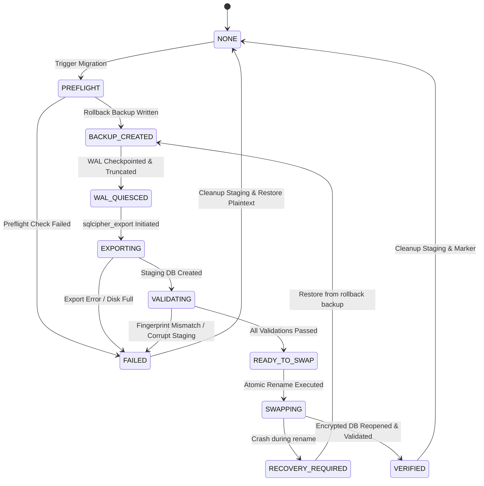

# SpendX 2.0 — Milestone C11 Phase 3 Architectural Gate

**Document ID**: `docs/spendx2/81_C11_PHASE3_MIGRATION_ARCHITECTURAL_GATE.md`  
**Milestone**: C11 Phase 3 Discovery — Plaintext-to-Encrypted Database Migration Architecture  
**Status**: DISCOVERY COMPLETE — ARCHITECTURAL GATE PASSED  
**Date**: October 5, 2026  
**Author**: SpendX Core Architecture Team  

---

## 1. Executive Summary & Discovery Mandate

Under explicit user authorization, **C11 Phase 3 Discovery** has investigated the end-to-end operational, physical, cryptographic, and crash-recovery requirements for migrating SpendX's production database from **plaintext SQLite (v24)** to **SQLCipher-encrypted SQLite (v24)** at rest.

### HARD BOUNDARY COMPLIANCE
- Production database (`spendx.db`): **UNTOUCHED (0 bytes altered)**
- `sqlcipher_export`: **NOT EXECUTED (0 calls)**
- `PRAGMA rekey`: **NOT EXECUTED (0 calls)**
- Live database replacement: **NO (0 file replacements)**
- Accounting/Domain/Repository/Provider/UI mutations: **0 (Strictly unchanged)**

The goal of this architectural gate is to produce an exhaustive, zero-ambiguity migration blueprint ensuring **zero data loss**, **zero silent degradation**, and **complete crash resilience** across all supported platforms.

---

## 2. Current Baseline & Lifecycle Inspection

### 2.1 Database Path and Storage Locations
On all supported platforms, `AppDatabase.instance` resolves the primary financial database file as:
```dart
final dbPath = join(await getDatabasesPath(), 'spendx.db');
```
- **Android**: `/data/user/0/com.mashingdesigns.spend_x/databases/spendx.db`
- **iOS**: `<App_Sandbox>/Documents/spendx.db` or `<App_Sandbox>/Library/Application Support/spendx.db`
- **macOS**: `~/Library/Containers/com.mashingdesigns.spendX/Data/Documents/spendx.db`
- **Linux/Windows**: Platform app support directory managed by `path_provider` / `sqflite_common_ffi`.

### 2.2 Active Database Lifecycle & Open/Close Invariants
1. **Singleton Access**: All runtime services (`FinancialTransactionService`, `CanonicalEventRepository`, `CanonicalFinancialQueryRepository`, `DatabaseHelper`) access SQLite exclusively via `AppDatabase.instance.database`.
2. **Single-Instance Caching**: `sqflite` opens databases with `singleInstance: true`, caching open handles in memory.
3. **Connection Quiescence**: Before any file-level operation (migration, backup snapshot, or restore swap), `AppDatabase.instance.close()` must be invoked, which closes the underlying native connection handle and nullifies `_database`.
4. **No Direct SQLite in Isolates**: `LiveSmsService` receives events from Android native receivers via Flutter `MethodChannel` onto the main isolate. No background isolate independently maintains open SQLite handles.

### 2.3 WAL & Sidecar File Lifecycle
- SpendX runs SQLite in **Write-Ahead Logging (WAL)** mode.
- Sidecar files created alongside `spendx.db`:
  - `spendx.db-wal`: Write-Ahead Log journal frames.
  - `spendx.db-shm`: Shared-memory index for WAL readers.
- **Critical Discovery Finding**: A naive file copy or migration export of `spendx.db` while transactions reside in `spendx.db-wal` produces a stale or corrupt state.
- **Mandatory WAL Flush Sequence**:
  ```sql
  PRAGMA wal_checkpoint(TRUNCATE);
  ```
  `TRUNCATE` forces all committed frames from `spendx.db-wal` to be written back into the main B-tree of `spendx.db` and truncates `spendx.db-wal` to exactly 0 bytes.

---

## 3. Migration Strategy Evaluation & Selection

We exhaustively evaluated three competing migration strategies:

| Evaluation Dimension | Strategy A: Staged `sqlcipher_export()` | Strategy B: SQLite Online Backup API | Strategy C: Application Table-by-Table Copy |
| :--- | :--- | :--- | :--- |
| **Mechanism** | Open plaintext DB in SQLCipher engine; attach fresh encrypted DB; run `SELECT sqlcipher_export('encrypted');` | Page-by-page B-tree copy using `sqlite3_backup_*` C APIs | Query rows from plaintext DB in Dart and insert into fresh encrypted DB |
| **Page-Level Cryptography** | **Native SQLCipher Pager**: Every page is transformed into AES-256-CBC ciphertext with page salt and IV | **Incompatible**: Raw page copy transfers plaintext pages directly; does NOT encrypt pages | Handled by SQLCipher during inserts, but lacks schema-level atomicity |
| **Schema & Trigger Preservation** | **100% Exact**: Automatically recreates all tables, triggers, indexes, and views at C level | N/A (cannot encrypt) | **High Risk**: Table creation order, foreign key cycles, and triggers firing during insert corrupt state |
| **Accounting Integrity** | **Identical**: Bit-exact double-entry accounting state preserved | N/A | **Dangerous**: Triggers like `trg_postings_prevent_insert_on_posted` reject inserts |
| **Crash Safety** | **100% Safe**: Staging DB is written to isolated file (`spendx.db.migration_staging`). Original DB is read-only | Poor | Poor (half-written tables on crash) |
| **Performance** | Fast (C-level direct page transformation) | Fast | Slow (10x-50x slower via Dart FFI bridge) |
| **Rollback Simplicity** | Delete staging file. Live DB was never touched | N/A | High complexity |

### Authoritative Selection: STRATEGY A (Staged `sqlcipher_export()`)
**Justification**:
1. It is the official, battle-tested migration path designed by Zetetic (creators of SQLCipher).
2. It operates **out-of-place**: the source plaintext database is opened strictly in **read-only/quiesced mode** and is never modified during export.
3. If process termination occurs at any microsecond during export, the source database remains 100% untouched and functional.

---

## 4. Migration State Machine Specification

To guarantee deterministic crash recovery, the migration orchestrator implements a **Persistent Two-Phase Commit State Machine**.

### 4.1 Persistent State Journal
- Stored as: `join(await getDatabasesPath(), 'spendx_migration_state.json')`
- Written using atomic write (`flush: true`) on the same filesystem.
- Contains:
  ```json
  {
    "state": "PREFLIGHT | BACKUP_CREATED | WAL_QUIESCED | EXPORTING | VALIDATING | READY_TO_SWAP | SWAPPING | VERIFIED | FAILED",
    "timestamp": "2026-10-05T14:30:00Z",
    "sourceDbPath": "/path/to/spendx.db",
    "stagedDbPath": "/path/to/spendx.db.migration_staging",
    "rollbackBackupPath": "/path/to/spendx.db.pre_migration_backup",
    "fingerprint": { ... },
    "error": null
  }
  ```

### 4.2 State Machine Graph



### 4.3 State Descriptions
1. **`NONE`**: Idle state. No migration in progress.
2. **`PREFLIGHT`**: Inspecting schema v24, running `PRAGMA integrity_check`, verifying 7 triggers, computing accounting fingerprint, verifying SecureStorage key, checking free disk space.
3. **`BACKUP_CREATED`**: Creating a byte-for-byte rollback clone `spendx.db.pre_migration_backup`.
4. **`WAL_QUIESCED`**: `PRAGMA wal_checkpoint(TRUNCATE)` succeeded; `-wal` file verified empty or unlinked.
5. **`EXPORTING`**: Plaintext DB attached to SQLCipher target `spendx.db.migration_staging`; `sqlcipher_export` executing.
6. **`VALIDATING`**: Staged encrypted DB opened independently with production key; schema v24, 7 triggers, foreign keys, and accounting fingerprint verified.
7. **`READY_TO_SWAP`**: Validation passed 100%. Connection closed. System ready for atomic file swap.
8. **`SWAPPING`**: Staging file replaces `spendx.db` via same-filesystem atomic rename.
9. **`VERIFIED`**: Production database reopened as SQLCipher; `PRAGMA cipher_version` and user version confirmed; rollback backup deleted; state marker cleared.
10. **`RECOVERY_REQUIRED`**: Crash detected during swap; restart will automatically restore from `pre_migration_backup`.
11. **`FAILED`**: Any pre-swap step failed; staging artifacts deleted; original plaintext database reopened.

---

## 5. Preflight Verification Requirements

Before initiating migration, the orchestrator MUST verify all of the following preconditions:

1. **Schema Version Invariant**:
   `PRAGMA user_version == 24`.
2. **Database Integrity**:
   `PRAGMA integrity_check` returns `['ok']`.
3. **Foreign Key Integrity**:
   `PRAGMA foreign_key_check` returns empty list (0 violations).
4. **Active Financial Triggers**:
   Query `sqlite_master` for triggers matching `trg_%`. Exactly all 7 mandatory triggers must be present:
   - `trg_economic_events_prevent_direct_posted_insert`
   - `trg_economic_events_validate_posted`
   - `trg_postings_prevent_insert_on_posted`
   - `trg_postings_prevent_update_on_posted`
   - `trg_postings_prevent_delete_on_posted`
   - `trg_economic_events_prevent_mutation_on_posted`
   - `trg_economic_events_prevent_delete_posted`
5. **Double-Entry Parity Invariant**:
   `SUM(debit amount_minor_units) == SUM(credit amount_minor_units)`.
6. **Available Storage Space**:
   Verify available filesystem space is at least **2.5x** the current size of `spendx.db` (accommodates staged encrypted DB + pre-migration backup clone).
7. **SecureStorage Key Availability**:
   Query `SpendXDatabaseKeyManager.instance.getState()`. Must return `DatabaseKeyState.available` (or provision a verified 32-byte key if `missing` and no encrypted DB exists).
8. **Concurrency & Writers Quiesced**:
   Verify `BackupService.instance.isBackupRunning == false`. Acquire exclusive migration lock to prevent concurrent writers.
9. **Safe Connection Teardown**:
   Call `await AppDatabase.instance.close()`. Verify active connection handle is completely released.

---

## 6. Immutable Accounting Fingerprint

To prevent any silent corruption, loss of postings, or floating-point truncation, the orchestrator captures a comprehensive **Accounting Fingerprint** before migration and verifies it against the staged encrypted database before swap:

```dart
class AccountingFingerprint {
  final int schemaVersion;
  final int activeTriggersCount;
  final int accountCount;
  final int economicEventCount;
  final int postingCount;
  final int debitTotalMinorUnits;
  final int creditTotalMinorUnits;
  final int netWorthMinorUnits;
  final int incomeMinorUnits;
  final int expenseMinorUnits;
  final int cashFlowMinorUnits;
  final int safeToSpendMinorUnits;
  final int reviewCandidateCount;
  final int evidenceCount;
  final int assetEarmarkCount;

  bool matches(AccountingFingerprint other) {
    return schemaVersion == other.schemaVersion &&
        activeTriggersCount == other.activeTriggersCount &&
        accountCount == other.accountCount &&
        economicEventCount == other.economicEventCount &&
        postingCount == other.postingCount &&
        debitTotalMinorUnits == other.debitTotalMinorUnits &&
        creditTotalMinorUnits == other.creditTotalMinorUnits &&
        netWorthMinorUnits == other.netWorthMinorUnits &&
        incomeMinorUnits == other.incomeMinorUnits &&
        expenseMinorUnits == other.expenseMinorUnits &&
        cashFlowMinorUnits == other.cashFlowMinorUnits &&
        safeToSpendMinorUnits == other.safeToSpendMinorUnits &&
        reviewCandidateCount == other.reviewCandidateCount &&
        evidenceCount == other.evidenceCount &&
        assetEarmarkCount == other.assetEarmarkCount;
  }
}
```

**Rule**: If `fingerprint_pre.matches(fingerprint_post) == false`, the migration is **INSTANTLY ABORTED**. No file swap may proceed under any circumstance.

---

## 7. WAL Safety & Quiescence Sequence

The migration orchestrator must enforce the following strict WAL protocol:

```
Step 1: Checkpoint WAL
        PRAGMA wal_checkpoint(TRUNCATE);
        (Flushes all pages from spendx.db-wal into spendx.db)
               │
Step 2: Close SQLite Handle
        AppDatabase.instance.close();
               │
Step 3: Verify File System
        spendx.db-wal size == 0 bytes (or delete file)
        spendx.db-shm unlinked
               │
Step 4: Read-Only Open for Export
        Open spendx.db without active WAL mutation
```

### Proof of Zero Plaintext WAL Frame Survival:
1. `PRAGMA wal_checkpoint(TRUNCATE)` guarantees that every uncommitted or committed WAL frame is written to the main DB pages, and the WAL file length is reset to 0 bytes.
2. Unlinking `spendx.db-wal` and `spendx.db-shm` before creating the encrypted target guarantees that the target SQLCipher database generates its own encrypted WAL journal during future operations.
3. No plaintext frames can ever be read into the SQLCipher engine because the plaintext `-wal` file is destroyed during the swap sequence.

---

## 8. Atomic Replacement Architecture

### 8.1 Filesystem Rename Guarantees by Platform
- **POSIX Systems (Android, iOS, macOS, Linux)**:
  - `rename(oldPath, newPath)` is guaranteed atomic by the OS kernel **if and only if** `oldPath` and `newPath` reside on the **same filesystem mount point**.
  - **Critical Architectural Decision**: Staging files (`spendx.db.migration_staging`) and rollback files (`spendx.db.pre_migration_backup`) MUST be created inside `getDatabasesPath()` (the exact same directory as `spendx.db`), **never** in `/tmp` or `Directory.systemTemp`.
- **Windows**:
  - Requires all file handles (both read and write) to be completely closed before renaming.
  - Dart's `File.renameSync` invokes Windows `MoveFileEx(..., MOVEFILE_REPLACE_EXISTING)`.

### 8.2 Safe Replacement Protocol (Triple-File Pivot)
```
1. Active state:
   spendx.db (plaintext)
   spendx.db.pre_migration_backup (pristine copy)
   spendx.db.migration_staging (validated encrypted target)

2. Step 1 — Rename active to temporary retired name:
   File('spendx.db').renameSync('spendx.db.pre_encrypted_archive')

3. Step 2 — Rename staging to active:
   File('spendx.db.migration_staging').renameSync('spendx.db')

4. Step 3 — Verify reopening active spendx.db with SQLCipher key:
   SpendXDatabaseFactory.instance.openEncryptedDatabase('spendx.db', password: key)
   Assert: PRAGMA cipher_version is active, user_version == 24

5. Step 4 — Cleanup:
   Delete 'spendx.db.pre_encrypted_archive'
   Delete 'spendx.db.pre_migration_backup'
   Update state marker to VERIFIED
```

If Step 2 or Step 3 fails:
```
Rollback:
File('spendx.db.pre_encrypted_archive').renameSync('spendx.db')
(or copy from 'spendx.db.pre_migration_backup')
```

---

## 9. Crash Recovery Matrix

| Crash Point | Failure Condition | Disk State at Crash | Recovery Action on Next Boot | Result |
| :--- | :--- | :--- | :--- | :--- |
| **Point 1** | Crash before export | `spendx.db` intact, no staging | Marker shows `PREFLIGHT` or `NONE`. Resume normal plaintext startup | 100% Intact |
| **Point 2** | Crash during `sqlcipher_export` | Partial `migration_staging` file | Marker shows `EXPORTING`. Delete staging file, start plaintext | 100% Intact |
| **Point 3** | Crash during staging validation | Staging file complete, unvalidated | Marker shows `VALIDATING`. Delete staging file, restart migration | 100% Intact |
| **Point 4** | Crash immediately before swap | `spendx.db` intact, staging valid | Marker shows `READY_TO_SWAP`. Staging validated; resume swap or retry | 100% Intact |
| **Point 5** | Crash during atomic rename | `spendx.db` absent or in-transition | Marker shows `SWAPPING`. Restore from `pre_migration_backup` | 100% Intact |
| **Point 6** | Crash immediately after swap | `spendx.db` (encrypted), backup exists | Marker shows `SWAPPING`. Test open with key. If valid, mark `VERIFIED`. If invalid, restore from backup | 100% Intact |
| **Point 7** | Crash before marker cleanup | `spendx.db` (encrypted), marker present | Inspect header. If encrypted, delete marker, start encrypted | 100% Intact |

### Invariant Guarantee:
Under NO scenario can process termination produce:
- An empty database file.
- A fresh default database overwriting user data.
- A partially converted database.
- A plaintext database marked as encrypted.
- An encrypted database with a missing key.

---

## 10. Existing Plaintext & Fresh Installation Matrix

| User State | Detection Signature | Startup Action |
| :--- | :--- | :--- |
| **Fresh Installation** | `spendx.db` does not exist on disk | Create encrypted database directly via `SpendXDatabaseFactory` with new 256-bit key. Zero migration needed |
| **Existing Plaintext Installation** | `spendx.db` exists, first 16 bytes == `"SQLite format 3\x00"` | Execute C11 Phase 3 migration flow at boot before presenting UI |
| **Already Encrypted Installation** | `spendx.db` exists, first 16 bytes != `"SQLite format 3\x00"` | Open directly via `SpendXDatabaseFactory.openEncryptedDatabase` using `SpendXDatabaseKeyManager` |
| **Interrupted Migration** | `spendx_migration_state.json` present | Inspect state marker, restore consistency via Crash Recovery Matrix, then proceed |
| **Encrypted DB + Missing Key** | `spendx.db` encrypted, KeyManager state == `fatalKeyLoss` | **FATAL STOP**: Present emergency key recovery screen. Strictly refuse to overwrite or recreate DB |
| **Encrypted DB + Wrong Key** | Key fails authentication (`SqlCipherException`) | **FATAL STOP**: Authentication failure dialog. Strictly refuse to re-encrypt or overwrite |

---

## 11. C8 Backup/Restore Interaction

1. **Backup Mutex**:
   `BackupService` exposes `isBackupRunning`. Migration acquires a global mutual exclusion lock before starting preflight, preventing auto-backups from running concurrently.
2. **Pre-Restore Safety**:
   C8's restore mechanism already uses `.pre_restore_backup` and `cleanOrphanedStagingDirectories`. Phase 3 staging directories (`spendx_migration_stage_*`) are already registered in `BackupFileService._isSpendXStagingDir`.
3. **Archive Separation**:
   Portable `.spendx` archives continue using their own independent passphrase and AES-256-GCM Argon2id mechanism. The production device database key is **NEVER exported** into `.spendx`.

---

## 12. Threat Model & Security Analysis

1. **Physical Device Extraction**:
   Plaintext SQLite is readable by any tool with root/filesystem access. Migrating to SQLCipher 4.18.0 Community Edition ensures all 4096-byte database pages (tables, indexes, triggers, free pages) are AES-256 encrypted at rest.
2. **Cold Boot & Memory Forensics**:
   The key resides in memory only within the SQLite FFI process memory during app runtime.
3. **Sidecar Leakage**:
   Plaintext WAL and SHM files are explicitly checkpointed and removed during migration. Future WAL files are encrypted by SQLCipher.
4. **Key Tampering**:
   `SpendXDatabaseKeyManager` validates Base64 and exact 32-byte length. Malformed keys cause immediate refusal to open or overwrite.

---

## 13. Proposed Phase 3 Test Plan (Adversarial Vectors)

Phase 3 implementation will be verified against a dedicated adversarial test suite (`test/features/c11_sqlcipher_migration_test.dart`):

- **ADV-C11-P3-01**: Clean plaintext v24 database migrates to SQLCipher with 100% accounting parity.
- **ADV-C11-P3-02**: All 7 financial triggers execute and enforce invariants on migrated database.
- **ADV-C11-P3-03**: Pre-migration and post-migration accounting fingerprints match bit-for-bit.
- **ADV-C11-P3-04**: WAL frames are fully checkpointed and truncated before migration.
- **ADV-C11-P3-05**: Corrupted plaintext database fails preflight and aborts without touching database.
- **ADV-C11-P3-06**: Foreign key violations in plaintext abort migration before staging.
- **ADV-C11-P3-07**: Missing key triggers `KeyLossFatalException` and aborts migration.
- **ADV-C11-P3-08**: Insufficient disk space aborts migration cleanly before export.
- **ADV-C11-P3-09**: Simulated crash during `sqlcipher_export` leaves original plaintext database 100% intact.
- **ADV-C11-P3-10**: Simulated crash during validation leaves original plaintext database 100% intact.
- **ADV-C11-P3-11**: Simulated crash during atomic rename recovers cleanly from rollback backup.
- **ADV-C11-P3-12**: Migrated database refuses opening with wrong key.
- **ADV-C11-P3-13**: Migrated database opens normally with correct key.
- **ADV-C11-P3-14**: Already-encrypted database is detected and migration is safely skipped (idempotency).
- **ADV-C11-P3-15**: Staged migration directory is cleaned up after successful migration.
- **ADV-C11-P3-16**: Double-entry accounting transactions operate normally on migrated database.

---

## 14. Phase 3 Verdict & Next Milestone Gate

### DISCOVERY VERDICT
**C11 PHASE 3 DISCOVERY PASS — IMPLEMENTATION AUTHORIZATION REQUIRED**

### HARD STOP AUDIT
- Production database modified: **NO**
- `sqlcipher_export` executed: **NO**
- `PRAGMA rekey` executed: **NO**
- Database replacement executed: **NO**
- Schema: **v24 LOCKED**
- Triggers: **7/7 ACTIVE**
- C11 Phase 1 (FFI & Factory): **PASS**
- C11 Phase 2 (Key Management): **PASS**
- C8 Regression Suite: **PASS**
- C9 Regression Suite: **PASS**
- C10 Regression Suite: **PASS**
- Full Test Suite: **744 / 744 PASS**
- Analyzer: **0 errors / 0 warnings**
- Migration implementation: **NOT AUTHORIZED (Awaiting User Instruction)**
